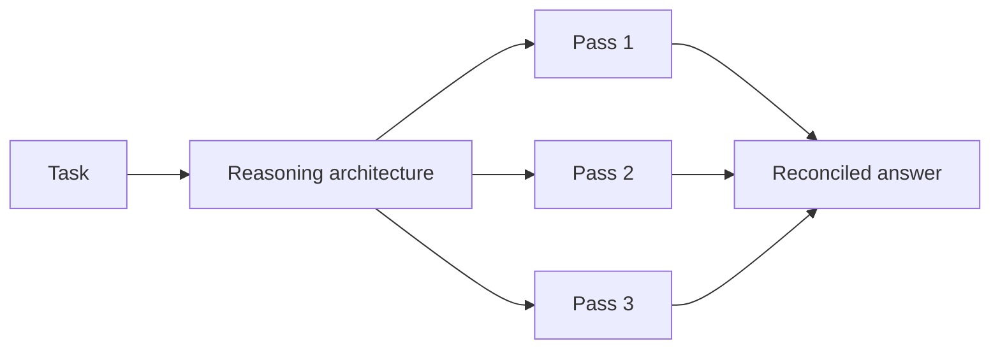

The Reasoning Agent Completions endpoint (`/v1/reasoning-agent/completions`) runs a single task through a specialized reasoning architecture rather than a plain agent loop. Instead of one model call producing one answer, a reasoning agent decomposes, samples, critiques, or debates its way to a result — trading cost and latency for reliability on problems where a single pass is often wrong.

<Warning>
**Premium tier required.** This endpoint is restricted to Pro, Ultra, and Premium subscribers. Free-tier keys receive a `403` with upgrade instructions. See [Premium Endpoints](/docs/documentation/resources/premium-endpoints).
</Warning>

## Endpoint

| Property | Value |
|----------|-------|
| **Method** | `POST` |
| **Path** | `/v1/reasoning-agent/completions` |
| **Base URL** | `https://api.swarms.world` |
| **Authentication** | `x-api-key` header (required) |
| **Tier** | Pro, Ultra, Premium |

## Architecture



The exact internals depend on `swarm_type` — some architectures sample independently and reconcile, others critique and revise in sequence. What they share is that one request produces multiple internal reasoning passes before returning.

## ReasoningAgentSpec

The request body is a single `ReasoningAgentSpec` object.

| Parameter | Type | Required | Default | Description |
|-----------|------|----------|---------|-------------|
| `task` | `string` | No* | `null` | The task to be completed by the reasoning agent. Not enforced by the schema, but the run has nothing to do without it — always send it |
| `agent_name` | `string` | No | `"reasoning-agent"` | Unique name assigned to the reasoning agent |
| `description` | `string` | No | `"A reasoning agent that can answer questions and help with tasks."` | Explanation of the agent's purpose and capabilities |
| `model_name` | `string` | No | `"claude-sonnet-4-20250514"` | The AI model backing the reasoning agent |
| `system_prompt` | `string` | No | `null` | Initial instruction or context provided to the agent |
| `max_loops` | `integer` | No | `1` | Maximum times the agent repeats its task. Between 1 and 50 |
| `swarm_type` | `string` | No | `"reasoning_duo"` | The reasoning architecture to use — see [Reasoning Types](#reasoning-types) |
| `num_samples` | `integer` | No | `1` | Number of samples to generate. Drives the vote count for consensus architectures |
| `output_type` | `string` | No | `"dict-all-except-first"` | Output format — see [Output Types](#output-types) |
| `num_knowledge_items` | `integer` | No | `null` | Number of knowledge items to use |
| `memory_capacity` | `integer` | No | `null` | Memory capacity for the reasoning agent |

### Reasoning Types

`swarm_type` accepts the following values:

| Value | Description |
|-------|-------------|
| `reasoning-duo` | Two internal agents per call: a reasoning/critique pass (fixed to `gpt-4o`) and a main answering pass on your requested `model_name` |
| `reasoning-agent` | Alias for `reasoning-duo` — identical two-agent architecture |
| `self-consistency` | Samples multiple independent answers (`num_samples`) and reconciles them into one result |
| `consistency-agent` | Alias for `self-consistency` |
| `ire` | Iterative Reflective Expansion — expands and revises a solution over repeated passes, driven by `num_samples` rather than `max_loops` |
| `ire-agent` | Alias for `ire` |
| `ReflexionAgent` | Attempts the task, evaluates its own output, and revises using a short/long-term memory of prior attempts |
| `GKPAgent` | Generates supporting background knowledge first, then reasons from it to answer |
| `AgentJudge` | Reviews and critiques a candidate output rather than generating a fresh answer from scratch |

<Note>
The default is `reasoning_duo` (underscore), while the enum lists `reasoning-duo` (hyphen). Pass one of the enumerated values explicitly rather than relying on the default. Call [`GET /v1/reasoning-agent/types`](/docs/examples/examples/reasoning-agent-types) for the live list.
</Note>

Two more implementation details, grounded in the `swarms` package's `ReasoningAgentRouter` (the router this endpoint delegates to) and not visible from the table above:

- For `ire`/`ire-agent`, this endpoint does not forward `max_loops` to the router at all — that architecture uses `num_samples` as its loop count instead.
- For `GKPAgent`, `max_loops` has no effect: its underlying implementation doesn't accept a loop count.

### Output Types

`output_type` controls the shape of `outputs`: `list`, `dict`, `dictionary`, `string`, `str`, `final`, `last`, `json`, `all`, `yaml`, `xml`, `dict-all-except-first`, `str-all-except-first`, `basemodel`, `dict-final`, `list-final`.

Use `final` or `last` when you want only the answer. Use the default `dict-all-except-first` when you want the reasoning trace alongside it.

## Quick Start

<Tabs>
  <Tab title="Python">
    ```python
    import os
    import json
    import requests
    from dotenv import load_dotenv

    load_dotenv()

    API_KEY = os.getenv("SWARMS_API_KEY")
    BASE_URL = "https://api.swarms.world"

    headers = {
        "x-api-key": API_KEY,
        "Content-Type": "application/json",
    }

    payload = {
        "agent_name": "Valuation Reasoner",
        "description": "Works through multi-step valuation problems",
        "model_name": "claude-sonnet-5",
        "swarm_type": "self-consistency",
        "num_samples": 3,
        "max_loops": 1,
        "output_type": "dict-all-except-first",
        "task": (
            "A SaaS company has $12M ARR growing 40% YoY, 80% gross margin, "
            "and burns $500K/month. At a 6x forward revenue multiple, what is "
            "the implied valuation, and how many months of runway remain on a "
            "$20M cash balance? Show your reasoning."
        ),
    }

    def run_reasoning_agent() -> dict | None:
        resp = requests.post(
            f"{BASE_URL}/v1/reasoning-agent/completions",
            headers=headers,
            json=payload,
            timeout=600,
        )

        if resp.status_code == 200:
            return resp.json()

        print(f"Error: {resp.status_code} - {resp.text}")
        return None

    if __name__ == "__main__":
        data = run_reasoning_agent()
        if data:
            print(f"✅ Job {data['job_id']} ({data['agent_type']})")
            print(json.dumps(data["outputs"], indent=2))
            print(f"Tokens: {data['usage'].get('total_tokens')}")
    ```
  </Tab>
  <Tab title="JavaScript">
    ```javascript
    const API_KEY = process.env.SWARMS_API_KEY;
    const BASE_URL = "https://api.swarms.world";

    const headers = {
        "x-api-key": API_KEY,
        "Content-Type": "application/json"
    };

    const payload = {
        agent_name: "Valuation Reasoner",
        description: "Works through multi-step valuation problems",
        model_name: "claude-sonnet-5",
        swarm_type: "self-consistency",
        num_samples: 3,
        max_loops: 1,
        output_type: "dict-all-except-first",
        task: "A SaaS company has $12M ARR growing 40% YoY, 80% gross margin, and burns $500K/month. At a 6x forward revenue multiple, what is the implied valuation, and how many months of runway remain on a $20M cash balance? Show your reasoning."
    };

    async function runReasoningAgent() {
        const response = await fetch(`${BASE_URL}/v1/reasoning-agent/completions`, {
            method: 'POST',
            headers: headers,
            body: JSON.stringify(payload)
        });

        if (!response.ok) {
            throw new Error(`HTTP ${response.status}: ${await response.text()}`);
        }

        const data = await response.json();
        console.log(`✅ Job ${data.job_id} (${data.agent_type})`);
        console.log(JSON.stringify(data.outputs, null, 2));
        return data;
    }

    runReasoningAgent();
    ```
  </Tab>
  <Tab title="Shell (curl)">
    ```bash
    curl -X POST "https://api.swarms.world/v1/reasoning-agent/completions" \
      -H "x-api-key: $SWARMS_API_KEY" \
      -H "Content-Type: application/json" \
      -d '{
        "agent_name": "Valuation Reasoner",
        "description": "Works through multi-step valuation problems",
        "model_name": "claude-sonnet-5",
        "swarm_type": "self-consistency",
        "num_samples": 3,
        "max_loops": 1,
        "output_type": "dict-all-except-first",
        "task": "A SaaS company has $12M ARR growing 40% YoY, 80% gross margin, and burns $500K/month. At a 6x forward revenue multiple, what is the implied valuation, and how many months of runway remain on a $20M cash balance? Show your reasoning."
      }'
    ```
  </Tab>
</Tabs>

## Response

```json
{
  "job_id": "reasoning-agent-7f3a2b1c",
  "status": "success",
  "outputs": [
    {
      "role": "Valuation Reasoner",
      "content": "Implied valuation: $12M ARR x 1.40 = $16.8M forward revenue, x 6 = $100.8M. Runway: $20M / $0.5M per month = 40 months."
    }
  ],
  "timestamp": "2026-08-24T18:00:00.000000+00:00",
  "agent_name": "Valuation Reasoner",
  "agent_type": "self-consistency",
  "agent_id": "agent-4d9e1f22",
  "usage": {
    "input_tokens": 180,
    "output_tokens": 940,
    "total_tokens": 1120,
    "total_cost": 0.019345
  }
}
```

### Response Schema

| Field | Type | Description |
|-------|------|-------------|
| `job_id` | `string` | Unique identifier for the reasoning agent run |
| `status` | `string` | Status of the run. Defaults to `"success"` |
| `outputs` | `any` | The generated output. **Shape varies by reasoning type** and `output_type` |
| `timestamp` | `string` | ISO-formatted timestamp of when the run executed |
| `agent_name` | `string` | Name of the agent |
| `agent_type` | `string` | The reasoning architecture that ran (the `swarm_type`) |
| `agent_id` | `string` | Unique identifier for the agent instance |
| `usage` | `object` | `input_tokens`, `output_tokens`, `total_tokens` (integers), plus `total_cost` (a float — the credits charged for this run) |

<Warning>
`outputs` is deliberately untyped in the schema: a `self-consistency` run and a `reasoning-duo` run return different structures, and `output_type` changes it again. Do not assume a fixed shape — branch on `agent_type`, or pin `output_type` to `final` when you only need the answer string.
</Warning>

### Status Codes

| Code | Meaning |
|------|---------|
| `200` | Completion returned successfully |
| `400` | API key present but not recognized — rejected before the request reaches the route handler |
| `401` | Missing `x-api-key` (and no `Authorization: Bearer` fallback) |
| `402` | Credit balance at or below $1.00 |
| `403` | Free tier — premium subscription required |
| `422` | Malformed request body (e.g. invalid `swarm_type`, or `max_loops` outside 1–50) |
| `429` | Rate limit exceeded |

<Note>
This endpoint is both premium-only and billable, so a request is checked, in order, for: API key presence (401), API key validity (400), credit balance (402), and premium tier (403) — all before the reasoning agent runs. Every error from this pre-flight check is returned in the shape `{"error": {"type": ..., "message": ..., "detail": ..., "status_code": ...}}`.
</Note>

## When to Use a Reasoning Agent

Reasoning agents cost more than a plain agent call — multiple internal passes means multiple sets of billed tokens. They earn that cost on problems where a single pass is unreliable:

| Use it for | Use a plain agent for |
|------------|----------------------|
| Multi-step quantitative problems where an arithmetic slip invalidates the answer | Summarization, extraction, rewriting |
| Questions with a verifiable right answer worth double-checking | Open-ended generation with no single correct output |
| High-stakes classification where a wrong call is expensive | High-volume, low-stakes classification |
| Problems where you want the reasoning trace as an artifact | Cases where only the final text matters |

Raise `num_samples` to increase consensus strength on `self-consistency`; raise `max_loops` to give reflective architectures more revision rounds. Both multiply cost roughly linearly.

## Related Resources

<CardGroup cols={2}>
<Card title="Reasoning Agent Types" icon="list" href="/docs/examples/examples/reasoning-agent-types">
Fetch the live list of reasoning architectures
</Card>
<Card title="Reasoning Agents Tutorial" icon="brain" href="/docs/examples/examples/reasoning-agents-tutorial">
Worked example on a hard analytical problem
</Card>
<Card title="Agent Completions" icon="robot" href="/docs/documentation/capabilities/agent">
The standard single-agent endpoint
</Card>
<Card title="Premium Endpoints" icon="star" href="/docs/documentation/resources/premium-endpoints">
Tier requirements and the 403 error shape
</Card>
</CardGroup>
