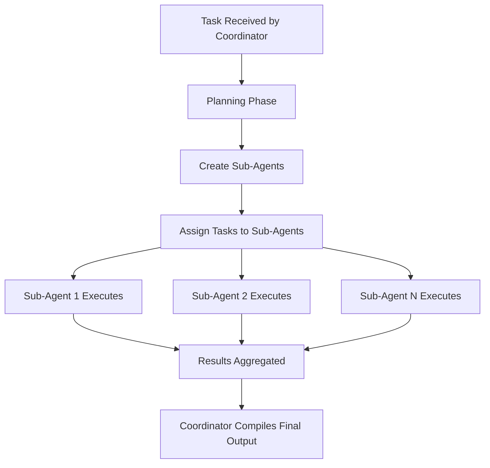

Sub-agent delegation allows a single coordinator agent to **dynamically spawn specialized child agents** and distribute tasks across them for parallel execution. The coordinator analyzes the main task, creates purpose-built sub-agents, assigns work, and aggregates results — all autonomously.

This capability is built on top of the [autonomous agent mode](/docs/examples/api_examples/autonomous_agent_tutorial) (`max_loops="auto"`) and uses two internal tools: `create_sub_agent` and `assign_task`.

## How It Works



1. **Planning** — The coordinator agent analyzes the task and determines what specialized sub-agents are needed
2. **Creation** — The coordinator calls `create_sub_agent` to spawn agents with specific names, descriptions, and system prompts
3. **Delegation** — The coordinator calls `assign_task` to distribute work to sub-agents, which execute concurrently
4. **Aggregation** — Results from all sub-agents are collected and the coordinator synthesizes a final response

## Enabling Sub-Agents

Sub-agent delegation requires two configuration settings on your agent:

| Parameter | Value | Purpose |
|-----------|-------|---------|
| `max_loops` | `"auto"` | Enables the autonomous agent loop with tool access |
| `selected_tools` | `"all"` or include `"create_sub_agent"` and `"assign_task"` | Grants the agent access to sub-agent tools |

<Info>
When `max_loops="auto"` is set without specifying `selected_tools`, all safe default tools are enabled including sub-agent tools.
</Info>

## Available Tools

### `create_sub_agent`

Creates and caches one or more specialized sub-agents on the coordinator.

| Parameter | Type | Required | Description |
|-----------|------|----------|-------------|
| `agents` | `array` | Yes | List of sub-agent specifications |
| `agents[].agent_name` | `string` | Yes | Unique identifier for the sub-agent |
| `agents[].agent_description` | `string` | Yes | Role and capabilities description |
| `agents[].system_prompt` | `string` | No | Custom instructions for the sub-agent. Defaults to a description-based prompt |

Each sub-agent receives a unique ID in the format `sub-agent-{uuid}` (e.g., `sub-agent-a1b2c3d4`) and is stored in the coordinator's internal cache for reuse.

### `assign_task`

Distributes tasks to previously created sub-agents for concurrent execution.

| Parameter | Type | Required | Description |
|-----------|------|----------|-------------|
| `assignments` | `array` | Yes | List of task assignments |
| `assignments[].agent_id` | `string` | Yes | Target sub-agent ID from creation step |
| `assignments[].task` | `string` | Yes | Task description to delegate |
| `assignments[].task_id` | `string` | No | Assignment identifier. Defaults to `task-{index}` |
| `wait_for_completion` | `boolean` | No | If `true` (default), waits for all results. If `false`, fire-and-forget dispatch |

Sub-agent tasks run concurrently using asynchronous execution, so multiple sub-agents work in parallel.

## API Usage

Sub-agents are used through the standard `/v1/agent/completions` endpoint. The coordinator agent autonomously invokes the sub-agent tools during its execution loop.

### Basic Example

<Tabs>
<Tab title="Python (requests)">
```python
import requests
import os

API_BASE_URL = "https://api.swarms.world"
API_KEY = os.environ.get("SWARMS_API_KEY", "your_api_key_here")

headers = {
    "x-api-key": API_KEY,
    "Content-Type": "application/json"
}

payload = {
    "agent_config": {
        "agent_name": "Research-Coordinator",
        "description": "Coordinates parallel research across multiple domains",
        "system_prompt": (
            "You are a research coordinator. Break down complex research tasks "
            "by creating specialized sub-agents for each domain, then delegate "
            "research tasks to them and compile a comprehensive report from their findings."
        ),
        "model_name": "gpt-4.1",
        "max_loops": "auto",
        "max_tokens": 8192,
        "temperature": 0.3
    },
    "task": (
        "Research the current state of quantum computing. Cover three areas in parallel: "
        "1) Hardware advances (superconducting qubits, trapped ions, photonic systems), "
        "2) Software and algorithms (error correction, quantum advantage demonstrations), "
        "3) Commercial applications (finance, pharma, logistics). "
        "Create a sub-agent for each area, assign research tasks, and compile a summary."
    )
}

response = requests.post(
    f"{API_BASE_URL}/v1/agent/completions",
    headers=headers,
    json=payload,
    timeout=300
)

result = response.json()
print(result)
```
</Tab>

<Tab title="Python (SDK)">
```python
import os
from dotenv import load_dotenv
import json
from swarms_client import SwarmsClient

load_dotenv()

client = SwarmsClient(
    api_key=os.getenv("SWARMS_API_KEY"),
    base_url="https://api.swarms.world",
    timeout=300,
)

result = client.agent.run(
    agent_config={
        "agent_name": "Research-Coordinator",
        "description": "Coordinates parallel research across multiple domains",
        "system_prompt": (
            "You are a research coordinator. Break down complex research tasks "
            "by creating specialized sub-agents for each domain, then delegate "
            "research tasks to them and compile a comprehensive report from their findings."
        ),
        "model_name": "gpt-4.1",
        "max_loops": "auto",
        "max_tokens": 8192,
        "temperature": 0.3,
    },
    task=(
        "Research the current state of quantum computing. Cover three areas in parallel: "
        "1) Hardware advances (superconducting qubits, trapped ions, photonic systems), "
        "2) Software and algorithms (error correction, quantum advantage demonstrations), "
        "3) Commercial applications (finance, pharma, logistics). "
        "Create a sub-agent for each area, assign research tasks, and compile a summary."
    ),
)

print(json.dumps(result, indent=4))
```
</Tab>

<Tab title="TypeScript">
```typescript
const API_KEY = process.env.SWARMS_API_KEY;
const BASE_URL = "https://api.swarms.world";

const payload = {
    agent_config: {
        agent_name: "Research-Coordinator",
        description: "Coordinates parallel research across multiple domains",
        system_prompt:
            "You are a research coordinator. Break down complex research tasks " +
            "by creating specialized sub-agents for each domain, then delegate " +
            "research tasks to them and compile a comprehensive report from their findings.",
        model_name: "gpt-4.1",
        max_loops: "auto",
        max_tokens: 8192,
        temperature: 0.3,
    },
    task:
        "Research the current state of quantum computing. Cover three areas in parallel: " +
        "1) Hardware advances (superconducting qubits, trapped ions, photonic systems), " +
        "2) Software and algorithms (error correction, quantum advantage demonstrations), " +
        "3) Commercial applications (finance, pharma, logistics). " +
        "Create a sub-agent for each area, assign research tasks, and compile a summary.",
};

const response = await fetch(`${BASE_URL}/v1/agent/completions`, {
    method: "POST",
    headers: {
        "Content-Type": "application/json",
        "x-api-key": API_KEY,
    },
    body: JSON.stringify(payload),
});

const result = await response.json();
console.log(JSON.stringify(result, null, 2));
```
</Tab>

<Tab title="Shell (curl)">
```bash
curl -X POST "https://api.swarms.world/v1/agent/completions" \
  -H "x-api-key: $SWARMS_API_KEY" \
  -H "Content-Type: application/json" \
  -d '{
    "agent_config": {
      "agent_name": "Research-Coordinator",
      "description": "Coordinates parallel research across multiple domains",
      "system_prompt": "You are a research coordinator. Break down complex research tasks by creating specialized sub-agents for each domain, then delegate research tasks to them and compile a comprehensive report from their findings.",
      "model_name": "gpt-4.1",
      "max_loops": "auto",
      "max_tokens": 8192,
      "temperature": 0.3
    },
    "task": "Research the current state of quantum computing. Cover three areas in parallel: 1) Hardware advances, 2) Software and algorithms, 3) Commercial applications. Create a sub-agent for each area, assign research tasks, and compile a summary."
  }'
```
</Tab>
</Tabs>

### Restricting Sub-Agent Tools

You can use `selected_tools` to control exactly which tools the coordinator can access:

```python
payload = {
    "agent_config": {
        "agent_name": "Coordinator",
        "model_name": "gpt-4.1",
        "max_loops": "auto",
        "selected_tools": [
            "create_plan",
            "think",
            "create_sub_agent",
            "assign_task",
            "subtask_done",
            "complete_task"
        ]
    },
    "task": "Your task here"
}
```

<Note>
The full list of available tools for autonomous agents: `create_plan`, `think`, `subtask_done`, `complete_task`, `respond_to_user`, `create_file`, `update_file`, `read_file`, `list_directory`, `delete_file`, `create_sub_agent`, `assign_task`. The `run_bash` tool is not permitted.
</Note>

## Sub-Agents vs Other Multi-Agent Patterns

| Feature | Sub-Agent Delegation | Multi-Agent Swarms |
|---------|---------------------|--------------------|
| **Agent creation** | Dynamic at runtime | Pre-defined in request |
| **Endpoint** | `/v1/agent/completions` | `/v1/swarm/completions` |
| **Coordination** | Single coordinator decides | Swarm architecture rules |
| **When to use** | Unknown number of agents needed, adaptive task decomposition | Known team structure, fixed workflows |
| **Agent count** | Determined by the coordinator at runtime | Specified upfront in the `agents` array |

## Best Practices

- **Clear coordinator prompts** — Tell the coordinator explicitly that it should create sub-agents and delegate work. Include guidance on what types of specialists to create.
- **3-5 sub-agents** for standard tasks, 5-10 for complex multi-domain projects. More than 10 increases coordination overhead.
- **Specific sub-agent descriptions** — The more specific the `agent_description`, the better the sub-agent performs its specialized task.
- **Use `wait_for_completion: true`** (default) when the coordinator needs to synthesize results. Use `false` only for fire-and-forget scenarios.
- **Set appropriate timeouts** — Sub-agent workflows take longer than single-agent calls since multiple agents run sequentially or in parallel. Use a timeout of 300+ seconds for complex tasks.

## Cost Considerations

Sub-agent delegation uses more tokens than a single agent call because:

- The coordinator agent uses tokens for planning and synthesis
- Each sub-agent uses tokens for its specialized task
- Tool calls (create/assign) consume additional tokens

For cost-sensitive workloads, consider using a multi-agent swarm with pre-defined agents instead, which avoids the overhead of dynamic agent creation.
