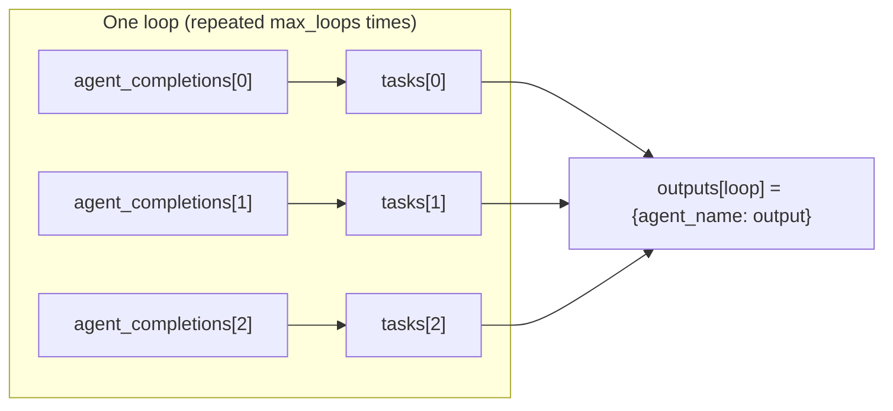

**Swarm Type**: `BatchedGridWorkflow`

<Warning>
**Premium Tier Required**: The `/v1/batched-grid-workflow/completions` endpoint is restricted to Pro, Ultra, and Premium plan subscribers. Free tier users will receive a 403 error. [Upgrade your account](https://swarms.world/platform/account) to access batched grid workflow capabilities.
</Warning>

## Overview

BatchedGridWorkflow pairs each agent in `agent_completions` with the task at the same index in `tasks` — `agent_completions[0]` runs `tasks[0]`, `agent_completions[1]` runs `tasks[1]`, and so on. All pairs run concurrently. This is **not** a full agent × task matrix: an agent never sees any task other than the one at its own index.

<Warning>
`agent_completions` and `tasks` must be the **same length**. A request where the two arrays differ in length fails with a `400` before any agent runs. Both arrays also accept at most 50 entries (the same limit used by `/v1/swarm/batch/completions`).
</Warning>

To have several agents look at the *same* input — the "multiple experts review one thing" use case — repeat the identical task string once per agent in `tasks`. That's what the example below does: three analysts, three identical task strings, one shared subject.

`max_loops` reruns the same agent/task pairs for that many iterations, reusing the same agent instances across loops. Because each agent keeps its own conversation memory between calls, later loops can build on what that agent said earlier — this is how iterative refinement works here, not a larger grid.

Key features:
- **Index-paired execution**: agent *i* always runs task *i*, never another agent's task
- **Concurrent execution**: all pairs for a given loop run in parallel
- **Iterative refinement**: `max_loops > 1` reruns the same pairs, and agents retain memory across loops
- **One result set per loop**: the response's `outputs` is a list with one entry per loop, each entry mapping every agent's name to its output for that loop

## Architecture



Each agent only ever runs the task paired with it by index. Repeating the same task string across every entry in `tasks` is what makes multiple agents analyze the same subject.

## Use Cases

- Multiple independent agent/task jobs dispatched and billed as one request (same idea as `/v1/agent/batch/completions`, but with built-in support for repeated, memory-carrying refinement loops)
- Multi-perspective analysis: several specialist agents reviewing the same input (repeat the task string per agent)
- Iterative refinement: one agent revising its own answer to the same task over several loops, using its own memory of earlier loops
- A/B testing different agent configurations against identical input

## API Usage

### Basic BatchedGridWorkflow Example

Three analysts, each paired with the *same* task string, so every agent reviews the same subject from its own angle.

<Tabs>
<Tab title="Shell (curl)">
```bash
curl -X POST "https://api.swarms.world/v1/batched-grid-workflow/completions" \
  -H "x-api-key: $SWARMS_API_KEY" \
  -H "Content-Type: application/json" \
  -d '{
    "name": "Product Review Analysis",
    "description": "Three analysts reviewing the same product category",
    "agent_completions": [
      {
        "agent_name": "Technical Analyst",
        "description": "Focuses on technical specifications and performance",
        "system_prompt": "You are a technical analyst. Evaluate products based on specifications, performance metrics, build quality, and technical innovation.",
        "model_name": "gpt-4.1",
        "max_loops": 1,
        "temperature": 0.3
      },
      {
        "agent_name": "User Experience Analyst",
        "description": "Focuses on usability and user satisfaction",
        "system_prompt": "You are a UX analyst. Evaluate products based on ease of use, user interface, customer satisfaction, and overall user experience.",
        "model_name": "gpt-4.1",
        "max_loops": 1,
        "temperature": 0.4
      },
      {
        "agent_name": "Value Analyst",
        "description": "Focuses on pricing and value proposition",
        "system_prompt": "You are a value analyst. Evaluate products based on pricing, cost-effectiveness, ROI, and overall value for money.",
        "model_name": "gpt-4.1",
        "max_loops": 1,
        "temperature": 0.3
      }
    ],
    "tasks": [
      "Analyze the smartphone market segment and top products",
      "Analyze the smartphone market segment and top products",
      "Analyze the smartphone market segment and top products"
    ],
    "max_loops": 1
  }'
```
</Tab>

<Tab title="Python (requests)">
```python
import os
import requests

API_BASE_URL = "https://api.swarms.world"
API_KEY = os.getenv("SWARMS_API_KEY")

headers = {
    "x-api-key": API_KEY,
    "Content-Type": "application/json"
}

# Same task string repeated once per agent — each agent is paired with the
# task at its own index, so this is how you get three agents reviewing one
# subject rather than three agents reviewing three different subjects.
same_task = "Analyze the smartphone market segment and top products"

workflow_config = {
    "name": "Product Review Analysis",
    "description": "Three analysts reviewing the same product category",
    "agent_completions": [
        {
            "agent_name": "Technical Analyst",
            "description": "Focuses on technical specifications and performance",
            "system_prompt": "You are a technical analyst. Evaluate products based on specifications, performance metrics, build quality, and technical innovation.",
            "model_name": "gpt-4.1",
            "max_loops": 1,
            "temperature": 0.3
        },
        {
            "agent_name": "User Experience Analyst",
            "description": "Focuses on usability and user satisfaction",
            "system_prompt": "You are a UX analyst. Evaluate products based on ease of use, user interface, customer satisfaction, and overall user experience.",
            "model_name": "gpt-4.1",
            "max_loops": 1,
            "temperature": 0.4
        },
        {
            "agent_name": "Value Analyst",
            "description": "Focuses on pricing and value proposition",
            "system_prompt": "You are a value analyst. Evaluate products based on pricing, cost-effectiveness, ROI, and overall value for money.",
            "model_name": "gpt-4.1",
            "max_loops": 1,
            "temperature": 0.3
        }
    ],
    "tasks": [same_task, same_task, same_task],
    "max_loops": 1
}

response = requests.post(
    f"{API_BASE_URL}/v1/batched-grid-workflow/completions",
    headers=headers,
    json=workflow_config,
    timeout=600,
)

if response.status_code == 200:
    result = response.json()
    print("BatchedGridWorkflow completed successfully!")
    print(f"Job ID: {result['job_id']}")
    print(f"Total cost: ${result['usage']['total_cost']}")
    print(f"Output tokens: {result['usage']['output_tokens']}")

    # outputs is a list with one entry per loop (max_loops == 1 here), each
    # entry mapping every agent's name to its output for that loop.
    for loop_idx, loop_results in enumerate(result["outputs"]):
        print(f"\nLoop {loop_idx + 1} results:")
        for agent_name, output in loop_results.items():
            print(f"  {agent_name}: {output[:100]}...")
else:
    print(f"Error: {response.status_code} - {response.text}")
```
</Tab>

<Tab title="JavaScript (fetch)">
```javascript
const API_BASE_URL = "https://api.swarms.world";
const API_KEY = process.env.SWARMS_API_KEY;

const headers = {
    "x-api-key": API_KEY,
    "Content-Type": "application/json"
};

// Same task string repeated once per agent — each agent is paired with the
// task at its own index, so this is how three agents end up reviewing one
// shared subject instead of three different subjects.
const sameTask = "Analyze the smartphone market segment and top products";

const workflowConfig = {
    name: "Product Review Analysis",
    description: "Three analysts reviewing the same product category",
    agent_completions: [
        {
            agent_name: "Technical Analyst",
            description: "Focuses on technical specifications and performance",
            system_prompt: "You are a technical analyst. Evaluate products based on specifications, performance metrics, build quality, and technical innovation.",
            model_name: "gpt-4.1",
            max_loops: 1,
            temperature: 0.3
        },
        {
            agent_name: "User Experience Analyst",
            description: "Focuses on usability and user satisfaction",
            system_prompt: "You are a UX analyst. Evaluate products based on ease of use, user interface, customer satisfaction, and overall user experience.",
            model_name: "gpt-4.1",
            max_loops: 1,
            temperature: 0.4
        },
        {
            agent_name: "Value Analyst",
            description: "Focuses on pricing and value proposition",
            system_prompt: "You are a value analyst. Evaluate products based on pricing, cost-effectiveness, ROI, and overall value for money.",
            model_name: "gpt-4.1",
            max_loops: 1,
            temperature: 0.3
        }
    ],
    tasks: [sameTask, sameTask, sameTask],
    max_loops: 1
};

fetch(`${API_BASE_URL}/v1/batched-grid-workflow/completions`, {
    method: "POST",
    headers: headers,
    body: JSON.stringify(workflowConfig)
})
.then(response => response.json())
.then(result => {
    if (result.status === "success") {
        console.log("BatchedGridWorkflow completed successfully!");
        console.log(`Job ID: ${result.job_id}`);
        console.log(`Total cost: $${result.usage.total_cost}`);
        console.log(`Output tokens: ${result.usage.output_tokens}`);

        // outputs is a list with one entry per loop; each entry maps every
        // agent's name to its output for that loop.
        result.outputs.forEach((loopResults, loopIdx) => {
            console.log(`\nLoop ${loopIdx + 1} results:`);
            for (const [agentName, output] of Object.entries(loopResults)) {
                console.log(`  ${agentName}: ${output.substring(0, 100)}...`);
            }
        });
    }
})
.catch(error => console.error("Error:", error));
```
</Tab>

<Tab title="Go">
```go
package main

import (
    "bytes"
    "encoding/json"
    "fmt"
    "io/ioutil"
    "net/http"
    "os"
)

type AgentSpec struct {
    AgentName    string  `json:"agent_name"`
    Description  string  `json:"description"`
    SystemPrompt string  `json:"system_prompt"`
    ModelName    string  `json:"model_name"`
    MaxLoops     int     `json:"max_loops"`
    Temperature  float64 `json:"temperature"`
}

type WorkflowConfig struct {
    Name             string      `json:"name"`
    Description      string      `json:"description"`
    AgentCompletions []AgentSpec `json:"agent_completions"`
    Tasks            []string    `json:"tasks"`
    MaxLoops         int         `json:"max_loops"`
}

func main() {
    apiBaseURL := "https://api.swarms.world"
    apiKey := os.Getenv("SWARMS_API_KEY")

    // Same task string repeated once per agent — agents are paired with
    // tasks by index, so this is how three agents review one subject.
    sameTask := "Analyze the smartphone market segment and top products"

    workflowConfig := WorkflowConfig{
        Name:        "Product Review Analysis",
        Description: "Three analysts reviewing the same product category",
        AgentCompletions: []AgentSpec{
            {
                AgentName:    "Technical Analyst",
                Description:  "Focuses on technical specifications and performance",
                SystemPrompt: "You are a technical analyst. Evaluate products based on specifications, performance metrics, build quality, and technical innovation.",
                ModelName:    "gpt-4.1",
                MaxLoops:     1,
                Temperature:  0.3,
            },
            {
                AgentName:    "User Experience Analyst",
                Description:  "Focuses on usability and user satisfaction",
                SystemPrompt: "You are a UX analyst. Evaluate products based on ease of use, user interface, customer satisfaction, and overall user experience.",
                ModelName:    "gpt-4.1",
                MaxLoops:     1,
                Temperature:  0.4,
            },
            {
                AgentName:    "Value Analyst",
                Description:  "Focuses on pricing and value proposition",
                SystemPrompt: "You are a value analyst. Evaluate products based on pricing, cost-effectiveness, ROI, and overall value for money.",
                ModelName:    "gpt-4.1",
                MaxLoops:     1,
                Temperature:  0.3,
            },
        },
        Tasks:    []string{sameTask, sameTask, sameTask},
        MaxLoops: 1,
    }

    jsonData, _ := json.Marshal(workflowConfig)

    req, _ := http.NewRequest("POST", apiBaseURL+"/v1/batched-grid-workflow/completions", bytes.NewBuffer(jsonData))
    req.Header.Set("x-api-key", apiKey)
    req.Header.Set("Content-Type", "application/json")

    client := &http.Client{}
    resp, err := client.Do(req)
    if err != nil {
        fmt.Printf("Error: %v\n", err)
        return
    }
    defer resp.Body.Close()

    body, _ := ioutil.ReadAll(resp.Body)
    fmt.Printf("Response: %s\n", string(body))
}
```
</Tab>

<Tab title="Rust">
```rust
use reqwest::Client;
use serde_json::{json, Value};
use std::env;
use std::error::Error;

#[tokio::main]
async fn main() -> Result<(), Box<dyn Error>> {
    let api_base_url = "https://api.swarms.world";
    let api_key = env::var("SWARMS_API_KEY").expect("SWARMS_API_KEY environment variable is required");

    // Same task string repeated once per agent — agents are paired with
    // tasks by index, so this is how three agents review one subject.
    let same_task = "Analyze the smartphone market segment and top products";

    let workflow_config = json!({
        "name": "Product Review Analysis",
        "description": "Three analysts reviewing the same product category",
        "agent_completions": [
            {
                "agent_name": "Technical Analyst",
                "description": "Focuses on technical specifications and performance",
                "system_prompt": "You are a technical analyst. Evaluate products based on specifications, performance metrics, build quality, and technical innovation.",
                "model_name": "gpt-4.1",
                "max_loops": 1,
                "temperature": 0.3
            },
            {
                "agent_name": "User Experience Analyst",
                "description": "Focuses on usability and user satisfaction",
                "system_prompt": "You are a UX analyst. Evaluate products based on ease of use, user interface, customer satisfaction, and overall user experience.",
                "model_name": "gpt-4.1",
                "max_loops": 1,
                "temperature": 0.4
            },
            {
                "agent_name": "Value Analyst",
                "description": "Focuses on pricing and value proposition",
                "system_prompt": "You are a value analyst. Evaluate products based on pricing, cost-effectiveness, ROI, and overall value for money.",
                "model_name": "gpt-4.1",
                "max_loops": 1,
                "temperature": 0.3
            }
        ],
        "tasks": [same_task, same_task, same_task],
        "max_loops": 1
    });

    let client = Client::new();
    let response = client
        .post(&format!("{}/v1/batched-grid-workflow/completions", api_base_url))
        .header("x-api-key", api_key)
        .header("Content-Type", "application/json")
        .json(&workflow_config)
        .send()
        .await?;

    if response.status().is_success() {
        let result: Value = response.json().await?;
        println!("BatchedGridWorkflow completed successfully!");
        println!("Response: {:?}", result);
    } else {
        println!("Error: {}", response.status());
    }

    Ok(())
}
```
</Tab>
</Tabs>

**Example Response** (one entry in `outputs` because `max_loops` is 1; all three agents reviewed the same repeated task string):
```json
{
    "job_id": "batched-grid-workflow-XyZ123AbC456",
    "name": "Product Review Analysis",
    "description": "Three analysts reviewing the same product category",
    "status": "success",
    "outputs": [
        {
            "Technical Analyst": "Smartphone Market Analysis: The current smartphone market is dominated by flagship devices with advanced processors, high refresh rate displays, and improved camera systems with computational photography...",
            "User Experience Analyst": "Smartphone Market Analysis: Modern smartphones excel in user experience with intuitive interfaces, gesture navigation, and seamless ecosystem integration...",
            "Value Analyst": "Smartphone Market Analysis: The smartphone market offers varied value propositions. Flagship devices provide premium features but face strong competition from mid-range options..."
        }
    ],
    "usage": {
        "input_tokens": 450,
        "output_tokens": 2100,
        "total_tokens": 2550,
        "total_cost": 0.06765,
        "cost_per_agent": 0.03
    },
    "timestamp": "2026-09-14T10:30:45.123456Z"
}
```

## Advanced Example: Multi-Loop Refinement

Same agent, same task, run for three loops. Because the agent instance is reused across loops and keeps its own conversation memory, each loop can build on what it wrote before.

<Tabs>
<Tab title="Python">
```python
import os
import requests

API_BASE_URL = "https://api.swarms.world"
API_KEY = os.getenv("SWARMS_API_KEY")

headers = {
    "x-api-key": API_KEY,
    "Content-Type": "application/json"
}

# One task, repeated per agent, run across 3 refinement loops.
essay_task = "Write about the impact of artificial intelligence on society. In each loop, revise and strengthen the previous draft."

workflow_config = {
    "name": "Essay Draft Refinement",
    "description": "Three writers refining the same essay over multiple loops",
    "agent_completions": [
        {
            "agent_name": "Technical Writer",
            "description": "Clear, precise technical writing",
            "system_prompt": "You are a technical writer. Write clearly and precisely, focusing on accuracy and comprehensibility.",
            "model_name": "gpt-4.1",
            "max_loops": 1,
            "temperature": 0.4
        },
        {
            "agent_name": "Creative Writer",
            "description": "Engaging, narrative-driven writing",
            "system_prompt": "You are a creative writer. Write engagingly with vivid descriptions and narrative flow.",
            "model_name": "gpt-4.1",
            "max_loops": 1,
            "temperature": 0.7
        },
        {
            "agent_name": "Academic Writer",
            "description": "Formal, research-oriented writing",
            "system_prompt": "You are an academic writer. Write formally with evidence-based arguments and a scholarly tone.",
            "model_name": "gpt-4.1",
            "max_loops": 1,
            "temperature": 0.3
        }
    ],
    "tasks": [essay_task, essay_task, essay_task],
    "max_loops": 3
}

response = requests.post(
    f"{API_BASE_URL}/v1/batched-grid-workflow/completions",
    headers=headers,
    json=workflow_config,
    timeout=600,
)

if response.status_code == 200:
    result = response.json()
    print(f"Workflow completed with {workflow_config['max_loops']} refinement loops")
    print(f"Total tokens: {result['usage']['total_tokens']}")
    print(f"Total cost: ${result['usage']['total_cost']:.4f}")

    # One entry per loop, each mapping agent name -> that loop's output.
    for loop_idx, loop_results in enumerate(result["outputs"]):
        print(f"\n{'='*60}")
        print(f"Loop {loop_idx + 1}")
        print("=" * 60)
        for agent_name, output in loop_results.items():
            print(f"\n{agent_name}:")
            print(output[:200] + "...")
else:
    print(f"Error: {response.status_code} - {response.text}")
```
</Tab>
</Tabs>

<Note>
To refine several *different* topics in parallel, issue one request per topic (looping client-side), repeating that topic's task string across every agent in the request. A single request only ever pairs each agent with one task per loop.
</Note>

## Request Schema

### BatchedGridWorkflowInput

| Field | Type | Required | Description |
|-------|------|----------|-------------|
| `name` | string | No | The name of the batched grid workflow |
| `description` | string | No | A description of what the workflow does |
| `agent_completions` | array | No | List of agent configurations (see AgentSpec below). Paired 1:1 by index with `tasks`. At most 50 entries |
| `tasks` | array | No | List of task strings, one per agent, matched by index to `agent_completions`. At most 50 entries. Must be the same length as `agent_completions` — a mismatch returns a `400` before any agent runs |
| `max_loops` | integer | No | Number of times to rerun the same agent/task pairs, reusing the same agent instances (default: 1). Must be between 1 and 50 — values outside that range are rejected with a `422` validation error |
| `imgs` | array | No | Accepted for forward compatibility, but not currently used in execution — passing images here has no effect on the run |

### AgentSpec

| Field | Type | Required | Description |
|-------|------|----------|-------------|
| `agent_name` | string | No | Unique name for the agent |
| `description` | string | No | Description of the agent's role |
| `system_prompt` | string | No | System prompt defining agent behavior |
| `model_name` | string | No | Model to use (e.g., "gpt-4.1", "claude-sonnet-4-20250514"); defaults to `claude-sonnet-5` |
| `max_loops` | integer or string | No | Max internal loops for this single agent's own run, or `"auto"` (default: 1). Independent of the workflow-level `max_loops` above |
| `max_tokens` | integer | No | Maximum tokens the agent can generate (default: 16000); values below 1 are rejected with a 422 validation error |
| `temperature` | float | No | Sampling temperature; if omitted, the provider's own default applies |
| `role` | string | No | Agent's role within the swarm (default: "worker") |

## Response Schema

### BatchedGridWorkflowOutput

| Field | Type | Description |
|-------|------|-------------|
| `job_id` | string | Unique identifier for the workflow execution |
| `name` | string | Name of the workflow |
| `description` | string | Description of the workflow |
| `status` | string | Execution status ("success"; a failed run returns a `400` instead of a `status: "error"` body — see Error Handling) |
| `outputs` | array | One entry per loop (length == `max_loops`); each entry maps every agent's name to its output for that loop |
| `usage` | object | Token usage and cost information |
| `timestamp` | string | ISO 8601 timestamp of completion |

### Usage Object

| Field | Type | Description |
|-------|------|-------------|
| `input_tokens` | integer | Total input tokens consumed building the agents |
| `output_tokens` | integer | Total output tokens across all loops and agents |
| `total_tokens` | integer | Sum of input and output tokens |
| `total_cost` | float | Total credits charged for the run: token costs plus `cost_per_agent` |
| `cost_per_agent` | float | `0.01` credits per agent in `agent_completions` (charged once per request, not per loop) |

## Pricing

BatchedGridWorkflow uses unified pricing with agent costs. For detailed pricing information, see the <a href="/docs/documentation/resources/pricing">Pricing</a> page.

## Partial Failures

This endpoint does **not** report partial failures the way `/v1/agent/batch/completions` and `/v1/swarm/batch/completions` do. Those two return `200` with per-item `success`/`status` fields even when some items fail. BatchedGridWorkflow is all-or-nothing at the request level:

- If `agent_completions` and `tasks` differ in length, or agent construction fails, the whole request fails with a single `400` and no `outputs` are returned.
- If the workflow run itself raises, the whole request fails with a `400` whose `detail` starts with `"BatchedGridWorkflowCompletionError: "` followed by the underlying error.
- Nothing is charged for a request that fails outright — billing only happens after a successful run.

Because of this, don't rely on this endpoint for large fan-outs where you expect some items to fail independently — use `/v1/agent/batch/completions` for that instead, and reserve BatchedGridWorkflow for cases where you want index-paired agents/tasks with shared, memory-carrying refinement loops.

## Best Practices

### When to Use BatchedGridWorkflow

- **Multi-perspective analysis**: several specialist agents reviewing the same input (repeat the task string per agent)
- **Iterative refinement**: `max_loops > 1` when an agent should revise its own answer using memory of earlier loops
- **A/B testing**: comparing different agent configurations against identical input
- **Paired dispatch**: N independent agent/task jobs in one request, when you don't need per-item failure isolation

### When to Use Other Endpoints

- **Independent jobs where some may fail**: use [Batch Agent Completions](/docs/examples/examples/batch-processing) — failures are reported per item instead of failing the whole request
- **Sequential dependencies**: use [SequentialWorkflow](/docs/documentation/multi-agent/sequential_workflow)
- **Independent parallel tasks within one swarm**: use [ConcurrentWorkflow](/docs/documentation/multi-agent/concurrent_workflow)
- **Task routing**: use [MultiAgentRouter](/docs/documentation/multi-agent/multi_agent_router)
- **Consensus decisions**: use [MajorityVoting](/docs/documentation/multi-agent/majority_voting)

### Design Recommendations

1. **Match array lengths first**: build `agent_completions` and `tasks` together so they never drift out of sync
2. **Repeat task strings deliberately**: duplicate a task string across every agent when you want a shared-subject comparison; use distinct strings when you want independent paired jobs
3. **Temperature Settings**: use lower temperatures (0.3-0.5) for analytical tasks, higher (0.6-0.8) for creative tasks
4. **Iterative Refinement**: use `max_loops > 1` when quality improvement from an agent revisiting its own memory is worth the added cost
5. **Result Processing**: iterate `outputs` by loop index, not by task index

### Cost Optimization

- Start with a small agent/task pair count to test your workflow before scaling to 50
- Use appropriate models (`claude-sonnet-4-20250514` or `gpt-4.1` for quality, a smaller model for cost-sensitive runs)
- Monitor token usage and adjust prompt verbosity
- Remember `max_loops` multiplies output tokens roughly linearly — a `max_loops=3` run costs about 3x the output tokens of `max_loops=1`

## Error Handling

The API returns standard HTTP status codes:

- **200**: Success
- **400**: Bad request — `agent_completions`/`tasks` length mismatch, invalid agent configuration, or a failure during workflow execution
- **401**: Unauthorized (invalid API key)
- **402**: Payment required (insufficient credits)
- **403**: Forbidden (account is not on a premium tier)
- **422**: Validation error — `agent_completions` or `tasks` has more than 50 entries, or `max_loops` is outside 1-50
- **500**: Server error

Example error response for a length mismatch:
```json
{
    "detail": "BatchedGridWorkflowCompletionError: The number of agents must match the number of tasks."
}
```

## Related Workflows

- [Batch Agent Completions](/docs/examples/examples/batch-processing) - For independent jobs with per-item failure reporting
- [SequentialWorkflow](/docs/documentation/multi-agent/sequential_workflow) - For step-by-step processing
- [ConcurrentWorkflow](/docs/documentation/multi-agent/concurrent_workflow) - For parallel independent tasks
- [MixtureOfAgents](/docs/documentation/multi-agent/mixture_of_agents) - For combining diverse specialists
- [MajorityVoting](/docs/documentation/multi-agent/majority_voting) - For consensus-based decisions
