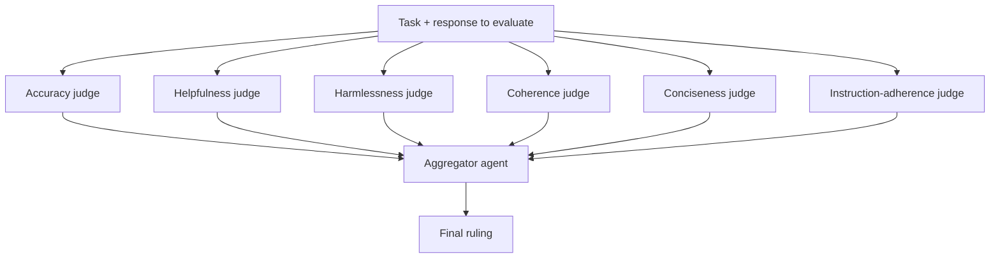

**Swarm Type**: `CouncilAsAJudge`

## Overview

`CouncilAsAJudge` evaluates a candidate response rather than producing one. It spins up six specialized judge agents — one per evaluation dimension — that each score and critique the response in parallel, then an aggregator agent combines their rationales into a single, comprehensive verdict. Use it when you need structured, multi-criteria quality assessment of an LLM output: grading, review, or QA gates in a larger pipeline.

The six evaluation dimensions are fixed and always run together:

- **Accuracy** — factual correctness, up-to-date claims, internal consistency
- **Helpfulness** — practical value, feasibility, completeness for the user's actual question
- **Harmlessness** — safety, bias, appropriateness
- **Coherence** — structure, logical flow, clarity of argument
- **Conciseness** — redundancy, verbosity, information density
- **Instruction Adherence** — whether the response followed the prompt's explicit requirements

<Note>
`CouncilAsAJudge` builds its own judge agents and aggregator internally — it does not run the agents you supply. The request must still include at least one entry in `agents` (every swarm type except `HeavySwarm` requires a non-empty `agents` list), but that entry is not executed. A single lightweight placeholder agent is sufficient.
</Note>

## Architecture



All six judges evaluate the same input in parallel, each producing a detailed rationale for
its dimension. The aggregator reads every rationale and writes the final verdict.

## Task Format

Because the council evaluates a response, not a request for new work, `task` must contain **both** the original task/prompt **and** the response you want scored — not just a question. A typical shape is:

```text
Task: <the original prompt given to the model being evaluated>

Response: <the model's answer to evaluate>
```

## CouncilAsAJudge-Specific Parameters

| Parameter | Type | Default | Description |
|-----------|------|---------|-------------|
| `council_judge_model_name` | `string` | `"gpt-5.4"` | The model used by the judge that delivers the final ruling. |

## Use Cases

- Automated grading and scoring of LLM outputs against a rubric
- Quality assurance gates before publishing generated content
- Comparing candidate responses from different models or prompts
- Red-teaming and safety review of model outputs
- Building an evaluation harness for prompt or model regression testing

## API Usage

<Tabs>
<Tab title="Shell (curl)">
```bash
curl -X POST "https://api.swarms.world/v1/swarm/completions" \
  -H "x-api-key: $SWARMS_API_KEY" \
  -H "Content-Type: application/json" \
  -d '{
    "name": "Support Reply Review",
    "description": "Evaluate a draft customer support reply across quality dimensions",
    "swarm_type": "CouncilAsAJudge",
    "council_judge_model_name": "gpt-5.4",
    "task": "Task: A customer asks how to get a refund for an order placed 40 days ago, outside the 30-day window. Write a helpful, policy-compliant reply.\n\nResponse: \"Unfortunately our policy only allows refunds within 30 days, so there is nothing we can do. Please contact the manufacturer directly.\"",
    "agents": [
      {
        "agent_name": "placeholder",
        "description": "Required by the API but not executed by CouncilAsAJudge",
        "model_name": "gpt-4.1",
        "max_loops": 1
      }
    ],
    "max_loops": 1
  }'
```
</Tab>

<Tab title="Python (requests)">
```python
import os
import requests

API_BASE_URL = "https://api.swarms.world"
API_KEY = os.getenv("SWARMS_API_KEY")

headers = {
    "x-api-key": API_KEY,
    "Content-Type": "application/json"
}

swarm_config = {
    "name": "Support Reply Review",
    "description": "Evaluate a draft customer support reply across quality dimensions",
    "swarm_type": "CouncilAsAJudge",
    "council_judge_model_name": "gpt-5.4",
    "task": (
        "Task: A customer asks how to get a refund for an order placed 40 days ago, "
        "outside the 30-day window. Write a helpful, policy-compliant reply.\n\n"
        "Response: \"Unfortunately our policy only allows refunds within 30 days, so "
        "there is nothing we can do. Please contact the manufacturer directly.\""
    ),
    "agents": [
        {
            "agent_name": "placeholder",
            "description": "Required by the API but not executed by CouncilAsAJudge",
            "model_name": "gpt-4.1",
            "max_loops": 1
        }
    ],
    "max_loops": 1
}

response = requests.post(
    f"{API_BASE_URL}/v1/swarm/completions",
    headers=headers,
    json=swarm_config
)

if response.status_code == 200:
    result = response.json()
    print(result["output"])
else:
    print(f"Error: {response.status_code} - {response.text}")
```
</Tab>

<Tab title="JavaScript (fetch)">
```javascript
const API_BASE_URL = "https://api.swarms.world";
const API_KEY = "your_api_key_here";

const headers = {
    "x-api-key": API_KEY,
    "Content-Type": "application/json"
};

const swarmConfig = {
    name: "Support Reply Review",
    description: "Evaluate a draft customer support reply across quality dimensions",
    swarm_type: "CouncilAsAJudge",
    council_judge_model_name: "gpt-5.4",
    task: "Task: A customer asks how to get a refund for an order placed 40 days ago, outside the 30-day window. Write a helpful, policy-compliant reply.\n\nResponse: \"Unfortunately our policy only allows refunds within 30 days, so there is nothing we can do. Please contact the manufacturer directly.\"",
    agents: [
        {
            agent_name: "placeholder",
            description: "Required by the API but not executed by CouncilAsAJudge",
            model_name: "gpt-4.1",
            max_loops: 1
        }
    ],
    max_loops: 1
};

fetch(`${API_BASE_URL}/v1/swarm/completions`, {
    method: "POST",
    headers: headers,
    body: JSON.stringify(swarmConfig)
})
.then(response => response.json())
.then(result => {
    if (result.status === "success") {
        console.log("CouncilAsAJudge evaluation complete!");
        console.log("Output:", result.output);
    }
})
.catch(error => console.error("Error:", error));
```
</Tab>
</Tabs>

**Example Response**:
```json
{
    "job_id": "swarms-C93kLFDesmLHxCRoeyF3NVYvPaXk",
    "status": "success",
    "swarm_name": "Support Reply Review",
    "description": "Evaluate a draft customer support reply across quality dimensions",
    "swarm_type": "CouncilAsAJudge",
    "output": [
        {
            "role": "User",
            "content": "Task: A customer asks how to get a refund for an order placed 40 days ago, outside the 30-day window. Write a helpful, policy-compliant reply.\n\nResponse: \"Unfortunately our policy only allows refunds within 30 days, so there is nothing we can do. Please contact the manufacturer directly.\""
        },
        {
            "role": "accuracy_judge",
            "content": "The response accurately states the 30-day policy but does not verify whether exceptions (store credit, goodwill gesture) exist, which may be an incomplete representation of available options..."
        },
        {
            "role": "helpfulness_judge",
            "content": "Low helpfulness: the reply closes the conversation without offering alternatives such as store credit, a partial refund, or escalation, leaving the customer with no path forward..."
        },
        {
            "role": "harmlessness_judge",
            "content": "No safety issues, but the tone is curt and could damage the customer relationship..."
        },
        {
            "role": "coherence_judge",
            "content": "The response is short and grammatically clear, but lacks the structure of a complete support reply (no greeting, no next steps)..."
        },
        {
            "role": "conciseness_judge",
            "content": "Appropriately concise, though the brevity comes at the cost of helpfulness..."
        },
        {
            "role": "instruction_adherence_judge",
            "content": "Partially follows instructions: it is policy-compliant but not helpful, so it only satisfies half of the prompt's requirement..."
        },
        {
            "role": "aggregator_agent",
            "content": "Overall assessment: the response is policy-compliant and concise but fails the 'helpful' requirement. Recommended revision: acknowledge the policy, then offer a concrete alternative (store credit or manager escalation) and a clear next step for the customer."
        }
    ],
    "number_of_agents": 1,
    "execution_time": 18.9,
    "usage": {
        "input_tokens": 62,
        "output_tokens": 2100,
        "total_tokens": 2162,
        "billing_info": {
            "cost_breakdown": {
                "agent_cost": 0.01,
                "input_token_cost": 0.000403,
                "output_token_cost": 0.03885,
                "token_counts": {
                    "total_input_tokens": 62,
                    "total_output_tokens": 2100,
                    "total_tokens": 2162
                },
                "num_agents": 1,
                "night_time_discount_applied": false
            },
            "total_cost": 0.049253,
            "discount_active": false,
            "discount_type": "none",
            "discount_percentage": 0
        }
    }
}
```

## Best Practices

- Always include both the original task and the candidate response inside `task` — evaluating a bare question with no response to grade produces a meaningless ruling
- Use a strong `council_judge_model_name` — it drives the final synthesis that most consumers of the output will actually read
- Pair `CouncilAsAJudge` with another swarm call: generate a response first, then post it (plus the original task) through `CouncilAsAJudge` as a quality gate
- Keep the required placeholder `agents` entry minimal and cheap — it is billed but never executed
- Best for scoring and review workflows, not for generating original content
