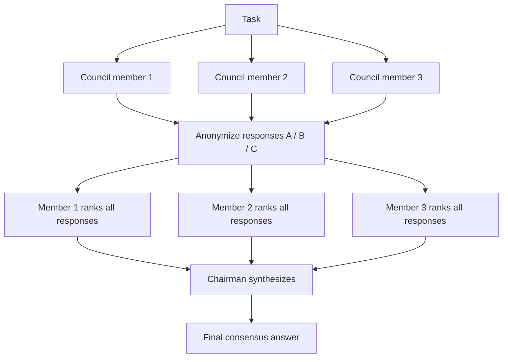

**Swarm Type**: `LLMCouncil`

## Overview

`LLMCouncil` runs your agents as a deliberative panel instead of a single pipeline. Each council member answers the task independently, the responses are anonymized and every member ranks and critiques all of them, and finally a chairman agent reads the original responses plus every peer review and synthesizes one consensus answer. This surfaces disagreement between members before it gets hidden in a single response, which makes it well suited to high-stakes or ambiguous questions where a single model's answer is not enough.

The workflow runs in three phases:

1. **Independent responses** — every council member answers the task in parallel, with no visibility into the others' answers
2. **Anonymous peer review** — responses are relabeled `A`, `B`, `C`... and every member ranks and critiques all of them, so evaluation is not biased by knowing who wrote what
3. **Chairman synthesis** — the chairman agent reads the original responses and every peer evaluation, then writes the final answer

<Note>
Unlike `HeavySwarm`, `LLMCouncil` is not exempt from the API's "at least one agent" requirement, so your request must include at least one entry in `agents` — those agents become the council members. Give each one a distinct model and a distinct perspective (e.g. one optimizing for rigor, one for creativity) to get the most value out of the peer-review step.
</Note>

## Architecture



Every member both answers and evaluates. The chairman never answers the task directly — it
only synthesizes from what the council produced.

## LLMCouncil-Specific Parameters

| Parameter | Type | Default | Description |
|-----------|------|---------|-------------|
| `chairman_model` | `string` | `"gpt-5.1"` | The model used by the chairman agent that synthesizes the council's responses and peer evaluations into the final answer. |

## Use Cases

- High-stakes decisions that benefit from multiple independent perspectives before converging
- Comparing how different models reason about the same ambiguous question
- Reducing single-model bias or blind spots by forcing peer critique
- Editorial or policy questions where disagreement itself is informative
- Building a "second opinion" layer on top of a primary model's answer

## API Usage

<Tabs>
<Tab title="Shell (curl)">
```bash
curl -X POST "https://api.swarms.world/v1/swarm/completions" \
  -H "x-api-key: $SWARMS_API_KEY" \
  -H "Content-Type: application/json" \
  -d '{
    "name": "Pricing Strategy Council",
    "description": "Council deliberation on a SaaS pricing model change",
    "swarm_type": "LLMCouncil",
    "chairman_model": "gpt-5.1",
    "task": "Should we switch our SaaS product from seat-based pricing to usage-based pricing? Weigh revenue predictability, customer trust, and competitive positioning.",
    "agents": [
      {
        "agent_name": "Rigorous-Analyst",
        "description": "Analytical, data-driven council member",
        "system_prompt": "You are a rigorous financial analyst. Ground your recommendation in unit economics, churn risk, and revenue predictability.",
        "model_name": "gpt-4.1",
        "max_loops": 1,
        "temperature": 0.3
      },
      {
        "agent_name": "Customer-Advocate",
        "description": "Customer-experience-focused council member",
        "system_prompt": "You represent the customer's perspective. Weigh trust, predictability of their own bills, and switching friction.",
        "model_name": "gpt-4.1",
        "max_loops": 1,
        "temperature": 0.5
      },
      {
        "agent_name": "Competitive-Strategist",
        "description": "Market-positioning-focused council member",
        "system_prompt": "You focus on competitive dynamics. Weigh how competitors price, and how this change affects deal velocity and positioning.",
        "model_name": "gpt-4.1",
        "max_loops": 1,
        "temperature": 0.5
      }
    ],
    "max_loops": 1
  }'
```
</Tab>

<Tab title="Python (requests)">
```python
import os
import requests

API_BASE_URL = "https://api.swarms.world"
API_KEY = os.getenv("SWARMS_API_KEY")

headers = {
    "x-api-key": API_KEY,
    "Content-Type": "application/json"
}

swarm_config = {
    "name": "Pricing Strategy Council",
    "description": "Council deliberation on a SaaS pricing model change",
    "swarm_type": "LLMCouncil",
    "chairman_model": "gpt-5.1",
    "task": (
        "Should we switch our SaaS product from seat-based pricing to usage-based "
        "pricing? Weigh revenue predictability, customer trust, and competitive positioning."
    ),
    "agents": [
        {
            "agent_name": "Rigorous-Analyst",
            "description": "Analytical, data-driven council member",
            "system_prompt": "You are a rigorous financial analyst. Ground your recommendation in unit economics, churn risk, and revenue predictability.",
            "model_name": "gpt-4.1",
            "max_loops": 1,
            "temperature": 0.3
        },
        {
            "agent_name": "Customer-Advocate",
            "description": "Customer-experience-focused council member",
            "system_prompt": "You represent the customer's perspective. Weigh trust, predictability of their own bills, and switching friction.",
            "model_name": "gpt-4.1",
            "max_loops": 1,
            "temperature": 0.5
        },
        {
            "agent_name": "Competitive-Strategist",
            "description": "Market-positioning-focused council member",
            "system_prompt": "You focus on competitive dynamics. Weigh how competitors price, and how this change affects deal velocity and positioning.",
            "model_name": "gpt-4.1",
            "max_loops": 1,
            "temperature": 0.5
        }
    ],
    "max_loops": 1
}

response = requests.post(
    f"{API_BASE_URL}/v1/swarm/completions",
    headers=headers,
    json=swarm_config
)

if response.status_code == 200:
    result = response.json()
    print(result["output"])
else:
    print(f"Error: {response.status_code} - {response.text}")
```
</Tab>

<Tab title="JavaScript (fetch)">
```javascript
const API_BASE_URL = "https://api.swarms.world";
const API_KEY = "your_api_key_here";

const headers = {
    "x-api-key": API_KEY,
    "Content-Type": "application/json"
};

const swarmConfig = {
    name: "Pricing Strategy Council",
    description: "Council deliberation on a SaaS pricing model change",
    swarm_type: "LLMCouncil",
    chairman_model: "gpt-5.1",
    task: "Should we switch our SaaS product from seat-based pricing to usage-based pricing? Weigh revenue predictability, customer trust, and competitive positioning.",
    agents: [
        {
            agent_name: "Rigorous-Analyst",
            description: "Analytical, data-driven council member",
            system_prompt: "You are a rigorous financial analyst. Ground your recommendation in unit economics, churn risk, and revenue predictability.",
            model_name: "gpt-4.1",
            max_loops: 1,
            temperature: 0.3
        },
        {
            agent_name: "Customer-Advocate",
            description: "Customer-experience-focused council member",
            system_prompt: "You represent the customer's perspective. Weigh trust, predictability of their own bills, and switching friction.",
            model_name: "gpt-4.1",
            max_loops: 1,
            temperature: 0.5
        },
        {
            agent_name: "Competitive-Strategist",
            description: "Market-positioning-focused council member",
            system_prompt: "You focus on competitive dynamics. Weigh how competitors price, and how this change affects deal velocity and positioning.",
            model_name: "gpt-4.1",
            max_loops: 1,
            temperature: 0.5
        }
    ],
    max_loops: 1
};

fetch(`${API_BASE_URL}/v1/swarm/completions`, {
    method: "POST",
    headers: headers,
    body: JSON.stringify(swarmConfig)
})
.then(response => response.json())
.then(result => {
    if (result.status === "success") {
        console.log("LLMCouncil deliberation complete!");
        console.log("Output:", result.output);
    }
})
.catch(error => console.error("Error:", error));
```
</Tab>
</Tabs>

**Example Response**:
```json
{
    "job_id": "swarms-L47kLFDesmLHxCRoeyF3NVYvPaXk",
    "status": "success",
    "swarm_name": "Pricing Strategy Council",
    "description": "Council deliberation on a SaaS pricing model change",
    "swarm_type": "LLMCouncil",
    "output": [
        {
            "role": "User",
            "content": "Should we switch our SaaS product from seat-based pricing to usage-based pricing? Weigh revenue predictability, customer trust, and competitive positioning."
        },
        {
            "role": "Rigorous-Analyst",
            "content": "From a unit-economics standpoint, usage-based pricing increases revenue volatility but can raise expansion revenue from high-usage accounts. Recommend a hybrid model with a base seat fee plus usage overage..."
        },
        {
            "role": "Customer-Advocate",
            "content": "Customers value predictable bills. A pure usage-based switch risks bill shock and churn among budget-conscious teams. A hybrid model with usage caps preserves trust..."
        },
        {
            "role": "Competitive-Strategist",
            "content": "Several competitors already offer usage-based tiers, so staying seat-only risks losing usage-heavy accounts to them. A hybrid rollout limited to new customers first reduces competitive and retention risk simultaneously..."
        },
        {
            "role": "Rigorous-Analyst-Evaluation",
            "content": "Ranking: B (Customer-Advocate) and C (Competitive-Strategist) both converge on a hybrid model, which strengthens that recommendation. My own response underweighted customer trust..."
        },
        {
            "role": "Customer-Advocate-Evaluation",
            "content": "A (Rigorous-Analyst) and C (Competitive-Strategist) both reach the same hybrid conclusion I did, from different angles — that convergence is a strong signal..."
        },
        {
            "role": "Competitive-Strategist-Evaluation",
            "content": "All three responses converge on a hybrid model; the analyst's usage-overage structure and the advocate's usage caps are complementary and should both be reflected in the final recommendation..."
        },
        {
            "role": "Chairman",
            "content": "Consensus recommendation: adopt a hybrid pricing model — a base seat fee plus metered usage with a soft cap and overage billing. Roll it out to new customers first to de-risk existing-account churn, and revisit pure usage-based pricing only after usage-cap data validates predictable spend patterns."
        }
    ],
    "number_of_agents": 3,
    "execution_time": 41.3,
    "usage": {
        "input_tokens": 58,
        "output_tokens": 4100,
        "total_tokens": 4158,
        "billing_info": {
            "cost_breakdown": {
                "agent_cost": 0.03,
                "input_token_cost": 0.000377,
                "output_token_cost": 0.07585,
                "token_counts": {
                    "total_input_tokens": 58,
                    "total_output_tokens": 4100,
                    "total_tokens": 4158
                },
                "num_agents": 3,
                "night_time_discount_applied": false
            },
            "total_cost": 0.106227,
            "discount_active": false,
            "discount_type": "none",
            "discount_percentage": 0
        }
    }
}
```

## Best Practices

- Use 3-5 council members with genuinely different system prompts or models — a council of near-identical agents produces near-identical answers and the peer-review step adds little
- Use a capable `chairman_model` — it never sees the raw task in isolation, only the council's work, so its synthesis quality is bounded by how well it can read and reconcile the panel
- Best for judgment calls with real trade-offs, not for tasks with one clearly correct answer
- Expect roughly `2N` agent calls per council member (one to answer, one to evaluate) plus one chairman call, so cost and latency scale faster than a single-pass swarm — keep the roster small for latency-sensitive use cases
