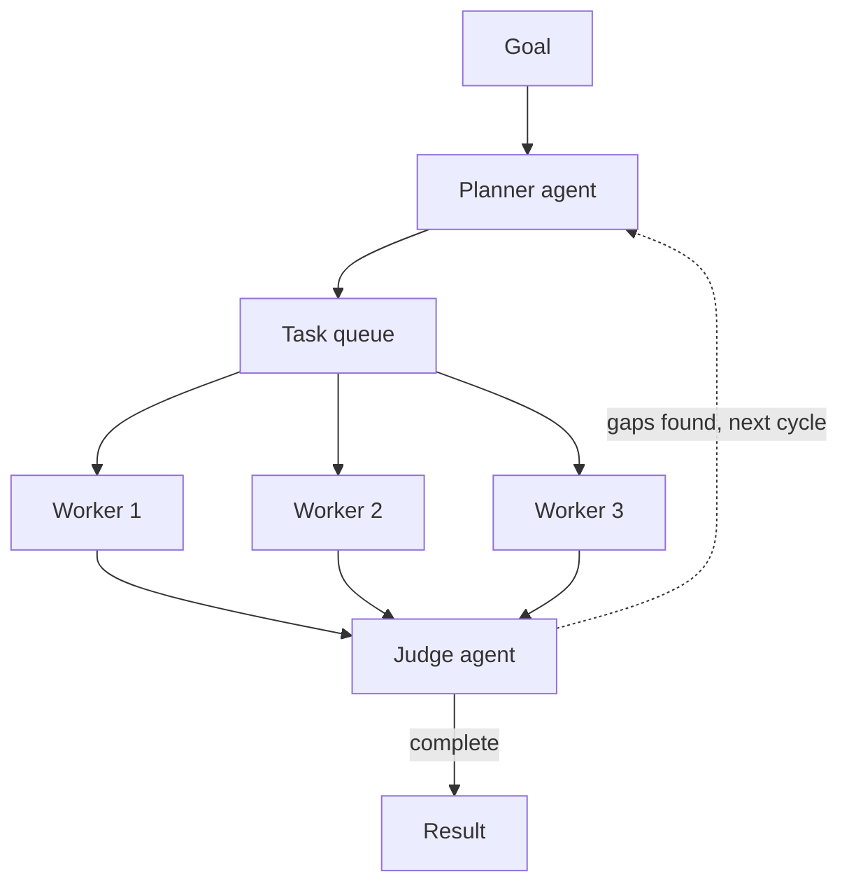

**Swarm Type**: `PlannerWorkerSwarm`

## Overview

`PlannerWorkerSwarm` implements the planner-worker pattern for long-running, multi-step tasks: planning and execution are handled by different agents so neither role has to do both. A planner agent decomposes the goal into a queue of sub-tasks, your worker agents claim and execute those sub-tasks concurrently (optimistic concurrency — no locks, each task is claimed atomically), and a judge agent evaluates the results after each cycle to decide whether the goal is complete, needs another round of targeted work, or has drifted enough to warrant a fresh start.

Each cycle runs in three phases:

1. **Plan** — a planner agent reads the goal (and, from the second cycle on, the judge's feedback) and writes a set of sub-tasks into a shared queue, with optional dependencies between them
2. **Execute** — your worker agents claim tasks from the queue and run them concurrently; workers do not coordinate with each other directly, they only interact with the queue
3. **Judge** — a judge agent reviews what the workers produced against the original goal and returns a verdict: complete, needs more work (with specific gaps and follow-up instructions), or needs a fresh start if the work has drifted off course

`max_loops` caps the number of planner-worker-judge cycles; the swarm stops early as soon as the judge marks the goal complete.

<Note>
The planner and judge agents are created internally by the swarm and are not configurable through `SwarmSpec` — there are no `PlannerWorkerSwarm`-specific tuning fields beyond the common `agents`, `task`, and `max_loops`. The agents you supply in `agents` become the **worker** pool; at least one worker agent is required.
</Note>

## Architecture



The planner only plans and the judge only evaluates — neither one executes tasks. Workers only
ever talk to the queue, never to each other or to the planner directly.

## Use Cases

- Long-running coding or research tasks that benefit from explicit planning before execution
- Workflows where you want an automatic "did we actually finish?" check instead of a single fixed-depth pass
- Decoupling decomposition from execution so the worker roster can be swapped without touching the planning logic
- Tasks prone to drift over multiple iterations, where a judge-triggered fresh start prevents compounding errors
- Queue-based parallel execution of many independent sub-tasks generated from one high-level goal

## API Usage

<Tabs>
<Tab title="Shell (curl)">
```bash
curl -X POST "https://api.swarms.world/v1/swarm/completions" \
  -H "x-api-key: $SWARMS_API_KEY" \
  -H "Content-Type: application/json" \
  -d '{
    "name": "Competitive Landscape Report",
    "description": "Plan and execute research into a competitive landscape",
    "swarm_type": "PlannerWorkerSwarm",
    "task": "Produce a competitive landscape report for AI code-review tools, covering at least 4 competitors, their pricing, and their key differentiators.",
    "agents": [
      {
        "agent_name": "Research-Worker",
        "description": "Executes research sub-tasks handed out by the planner",
        "system_prompt": "You are a research worker. Execute the specific sub-task you are given thoroughly and return concrete findings.",
        "model_name": "gpt-4.1",
        "max_loops": 1,
        "temperature": 0.3
      },
      {
        "agent_name": "Writing-Worker",
        "description": "Executes writing and formatting sub-tasks handed out by the planner",
        "system_prompt": "You are a writing worker. Execute the specific sub-task you are given, producing clear, well-structured prose or tables.",
        "model_name": "gpt-4.1",
        "max_loops": 1,
        "temperature": 0.4
      }
    ],
    "max_loops": 3
  }'
```
</Tab>

<Tab title="Python (requests)">
```python
import os
import requests

API_BASE_URL = "https://api.swarms.world"
API_KEY = os.getenv("SWARMS_API_KEY")

headers = {
    "x-api-key": API_KEY,
    "Content-Type": "application/json"
}

swarm_config = {
    "name": "Competitive Landscape Report",
    "description": "Plan and execute research into a competitive landscape",
    "swarm_type": "PlannerWorkerSwarm",
    "task": (
        "Produce a competitive landscape report for AI code-review tools, covering "
        "at least 4 competitors, their pricing, and their key differentiators."
    ),
    "agents": [
        {
            "agent_name": "Research-Worker",
            "description": "Executes research sub-tasks handed out by the planner",
            "system_prompt": "You are a research worker. Execute the specific sub-task you are given thoroughly and return concrete findings.",
            "model_name": "gpt-4.1",
            "max_loops": 1,
            "temperature": 0.3
        },
        {
            "agent_name": "Writing-Worker",
            "description": "Executes writing and formatting sub-tasks handed out by the planner",
            "system_prompt": "You are a writing worker. Execute the specific sub-task you are given, producing clear, well-structured prose or tables.",
            "model_name": "gpt-4.1",
            "max_loops": 1,
            "temperature": 0.4
        }
    ],
    "max_loops": 3
}

response = requests.post(
    f"{API_BASE_URL}/v1/swarm/completions",
    headers=headers,
    json=swarm_config
)

if response.status_code == 200:
    result = response.json()
    print(result["output"])
else:
    print(f"Error: {response.status_code} - {response.text}")
```
</Tab>

<Tab title="JavaScript (fetch)">
```javascript
const API_BASE_URL = "https://api.swarms.world";
const API_KEY = "your_api_key_here";

const headers = {
    "x-api-key": API_KEY,
    "Content-Type": "application/json"
};

const swarmConfig = {
    name: "Competitive Landscape Report",
    description: "Plan and execute research into a competitive landscape",
    swarm_type: "PlannerWorkerSwarm",
    task: "Produce a competitive landscape report for AI code-review tools, covering at least 4 competitors, their pricing, and their key differentiators.",
    agents: [
        {
            agent_name: "Research-Worker",
            description: "Executes research sub-tasks handed out by the planner",
            system_prompt: "You are a research worker. Execute the specific sub-task you are given thoroughly and return concrete findings.",
            model_name: "gpt-4.1",
            max_loops: 1,
            temperature: 0.3
        },
        {
            agent_name: "Writing-Worker",
            description: "Executes writing and formatting sub-tasks handed out by the planner",
            system_prompt: "You are a writing worker. Execute the specific sub-task you are given, producing clear, well-structured prose or tables.",
            model_name: "gpt-4.1",
            max_loops: 1,
            temperature: 0.4
        }
    ],
    max_loops: 3
};

fetch(`${API_BASE_URL}/v1/swarm/completions`, {
    method: "POST",
    headers: headers,
    body: JSON.stringify(swarmConfig)
})
.then(response => response.json())
.then(result => {
    if (result.status === "success") {
        console.log("PlannerWorkerSwarm run complete!");
        console.log("Output:", result.output);
    }
})
.catch(error => console.error("Error:", error));
```
</Tab>
</Tabs>

**Example Response**:
```json
{
    "job_id": "swarms-P61kLFDesmLHxCRoeyF3NVYvPaXk",
    "status": "success",
    "swarm_name": "Competitive Landscape Report",
    "description": "Plan and execute research into a competitive landscape",
    "swarm_type": "PlannerWorkerSwarm",
    "output": [
        {
            "role": "User",
            "content": "Produce a competitive landscape report for AI code-review tools, covering at least 4 competitors, their pricing, and their key differentiators."
        },
        {
            "role": "Planner",
            "content": "Plan: 1) Research GitHub Copilot, CodeRabbit, Codacy, and SonarQube's pricing and positioning. 2) Draft a comparison table. 3) Write a summary of key differentiators."
        },
        {
            "role": "Research-Worker",
            "content": "Findings: GitHub Copilot ($10-19/mo/seat) focuses on inline generation; CodeRabbit ($12-24/mo/seat) focuses on PR review automation; Codacy (custom pricing) focuses on static analysis and quality gates; SonarQube (free tier + paid) focuses on code quality and security scanning..."
        },
        {
            "role": "Writing-Worker",
            "content": "Comparison table and differentiator summary drafted: [table omitted]. Key differentiator: CodeRabbit and SonarQube compete most directly on PR-level review depth, while Copilot competes on generation speed..."
        },
        {
            "role": "CycleJudge",
            "content": "Quality: 8/10 | Complete: true\nAll four competitors covered with pricing and differentiators; report meets the goal."
        }
    ],
    "number_of_agents": 2,
    "execution_time": 47.5,
    "usage": {
        "input_tokens": 64,
        "output_tokens": 3600,
        "total_tokens": 3664,
        "billing_info": {
            "cost_breakdown": {
                "agent_cost": 0.02,
                "input_token_cost": 0.000416,
                "output_token_cost": 0.0666,
                "token_counts": {
                    "total_input_tokens": 64,
                    "total_output_tokens": 3600,
                    "total_tokens": 3664
                },
                "num_agents": 2,
                "night_time_discount_applied": false
            },
            "total_cost": 0.087016,
            "discount_active": false,
            "discount_type": "none",
            "discount_percentage": 0
        }
    }
}
```

## Best Practices

- Give worker agents narrow, execution-focused system prompts ("execute the sub-task you are given") rather than broad planning instructions — planning is the planner's job, not theirs
- Set `max_loops` high enough to allow at least one re-planning cycle (2-3) for non-trivial goals — the judge's first verdict is often "needs more work," and the swarm needs a second cycle to act on that feedback
- Use 2-4 worker agents with complementary skills (e.g. research vs. writing) so the planner has meaningfully different sub-task types to assign
- The swarm stops as soon as the judge marks the goal complete, so a low `max_loops` does not waste cycles on an already-finished task — the ceiling only matters when the goal is genuinely hard to satisfy
- Best for open-ended, multi-step goals; for a fixed, known sequence of steps a `SequentialWorkflow` is simpler and cheaper
