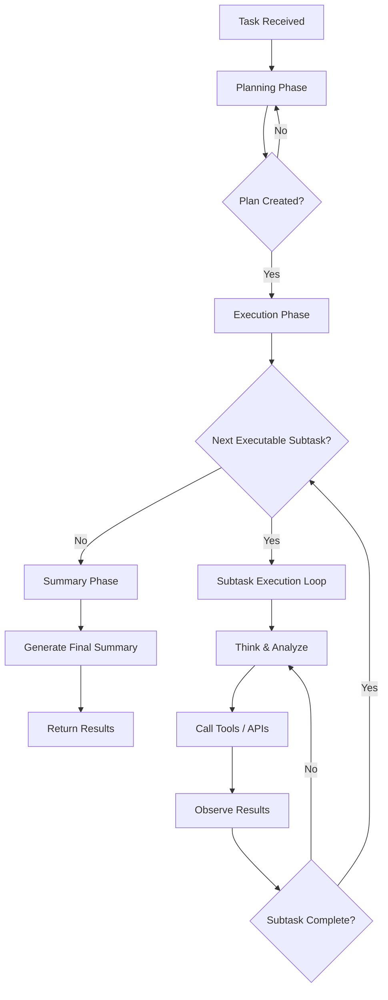

import { Tabs, Tab } from 'mintlify'

## Overview

The **autonomous agent mode** (`max_loops="auto"`) lets an agent **plan, execute, and summarize complex multi‑step tasks** without you having to manually specify the number of loops.

When `max_loops="auto"`, the agent:

- **Plans** the work as a set of structured subtasks
- **Executes** each subtask using tools (search, file I/O, etc.)
- **Summarizes** the results into a clear final answer

This page walks through a **fully autonomous medical diagnosis agent** that analyzes blood work results using the Swarms Python client.

## How Autonomous Mode Works



### Phase 1: Planning

- The agent analyzes the main task and calls an internal planning tool (e.g., `create_plan`)
- It produces a list of **subtasks** with:
  - `step_id`: unique identifier
  - `description`: what to do
  - `priority`: `critical`, `high`, `medium`, or `low`
  - `dependencies`: other steps that must complete first

### Phase 2: Execution

For each subtask, the agent loops through:

1. **Think**: Optional short reasoning step (e.g., with a `think` tool)
2. **Act**: Calls tools (search, file, APIs, etc.)
3. **Observe**: Reads tool outputs and updates its plan state
4. **Complete**: Marks the subtask done when satisfied (e.g., via `subtask_done`)

Dependencies are respected — subtasks only run when their prerequisites are complete.

### Phase 3: Summary

Once all subtasks are complete, the agent:

- Generates a **final structured summary**
- Optionally calls a completion tool (e.g., `complete_task`)
- Returns the final result to your application

## Complete Example: Autonomous Medical Diagnosis Agent

This example shows an autonomous agent that:

- Uses the **Swarms Python client** to call the Agent Completions API
- Analyzes **blood work results** as an expert doctor
- Runs until it decides the task is complete using `max_loops="auto"`

### Environment Setup

Create a `.env` file:

```bash
SWARMS_API_KEY=your_swarms_api_key_here
```

Install dependencies:

```bash
pip install swarms-client python-dotenv
```

### Code Example

<Tabs>
  <Tab title="Python">
    ```python
    import os
    from dotenv import load_dotenv
    import json
    from swarms_client import SwarmsClient

    load_dotenv()


    client = SwarmsClient(
        api_key=os.getenv("SWARMS_API_KEY"),
        base_url="https://api.swarms.world",
        timeout=1000,
    )


    result = client.agent.run(
        agent_config={
            "agent_name": "Bloodwork Diagnosis Expert",
            "description": "An expert doctor specializing in interpreting and diagnosing blood work results.",
            "system_prompt": (
                "You are an expert medical doctor specializing in the interpretation and diagnosis of blood work. "
                "Your expertise includes analyzing laboratory results, identifying abnormal values, "
                "explaining their clinical significance, and recommending next diagnostic or treatment steps. "
                "Provide clear, evidence-based explanations and consider differential diagnoses based on blood test findings."
            ),
            "model_name": "gpt-4.1",
            "max_loops": "auto",  # <— enables fully autonomous multi-step reasoning
            "max_tokens": 1000,
            "temperature": 0.5,
        },
        task=(
            "A patient presents with the following blood work results: "
            "Hemoglobin: 10.2 g/dL (low), WBC: 13,000 /µL (high), Platelets: 180,000 /µL (normal), "
            "ALT: 65 U/L (high), AST: 70 U/L (high). "
            "Please provide a detailed interpretation, possible diagnoses, and recommended next steps."
        ),
    )

    print(json.dumps(result, indent=4))
    ```
  </Tab>
  <Tab title="TypeScript">
    ```ts
    import 'dotenv/config'

    const API_KEY = process.env.SWARMS_API_KEY
    const BASE_URL = 'https://api.swarms.world'

    if (!API_KEY) {
      throw new Error('SWARMS_API_KEY is not set')
    }

    async function runAutonomousAgent() {
      const payload = {
        agent_config: {
          agent_name: 'Research-Report-Agent',
          description: 'Creates comprehensive research reports',
          system_prompt:
            'You are an expert research analyst. ' +
            'Create detailed, well-structured reports and save work to files when appropriate.',
          model_name: 'gpt-4.1',
          max_loops: 'auto', // enable autonomous loop mode
          autosave: true,
          dynamic_temperature_enabled: true,
        },
        task: `
          Create a comprehensive research report on quantum computing:
          1. Research current quantum computing technologies.
          2. Identify major companies and research institutions.
          3. Analyze recent breakthroughs.
          4. Predict future trends.
          5. Create a detailed markdown-style outline.
        `,
      }

      const res = await fetch(`${BASE_URL}/v1/agent/completions`, {
        method: 'POST',
        headers: {
          'Content-Type': 'application/json',
          'x-api-key': API_KEY,
        },
        body: JSON.stringify(payload),
      })

      if (!res.ok) {
        const text = await res.text()
        throw new Error(`HTTP ${res.status}: ${text}`)
      }

      const json = await res.json()
      console.log(JSON.stringify(json, null, 2))
    }

    void runAutonomousAgent().catch(console.error)
    ```
  </Tab>
  <Tab title="Rust">
    ```rust
    use std::env;

    use reqwest::blocking::Client;
    use serde_json::json;

    fn main() -> Result<(), Box<dyn std::error::Error>> {
        let api_key =
            env::var("SWARMS_API_KEY").expect("SWARMS_API_KEY environment variable is required");

        let client = Client::new();

        let payload = json!({
            "agent_config": {
                "agent_name": "Research-Report-Agent",
                "description": "Creates comprehensive research reports",
                "system_prompt": "You are an expert research analyst. \
                    Create detailed, well-structured reports and save work to files when appropriate.",
                "model_name": "gpt-4.1",
                "max_loops": "auto",
                "dynamic_temperature_enabled": true
            },
            "task": "\
                Create a comprehensive research report on quantum computing:\n\
                1. Research current quantum computing technologies.\n\
                2. Identify major companies and research institutions.\n\
                3. Analyze recent breakthroughs.\n\
                4. Predict future trends.\n\
                5. Create a detailed markdown-style outline.\n\
            "
        });

        let res = client
            .post("https://api.swarms.world/v1/agent/completions")
            .header("x-api-key", api_key)
            .header("Content-Type", "application/json")
            .json(&payload)
            .send()?;

        res.error_for_status_ref()?;

        let body = res.text()?;
        println!("{body}");

        Ok(())
    }
    ```
  </Tab>
</Tabs>

## Best Practices

- **Clear tasks**: Give specific, outcome‑oriented instructions (what to produce, how many steps)
- **Tooling**: Provide tools that match the work (search, scraping, file I/O, custom APIs)
- **Bounded scope**: Ask for a concrete deliverable (e.g., “single markdown report”, “CSV summary”)

## Key Takeaways

- Set **`max_loops="auto"`** to let the agent decide how many reasoning/action loops are required
- Combine **planning, tools, and file operations** to tackle complex research and analysis workflows
- Prefer **clear, structured tasks** so the planner can create good subtasks and dependencies

For a minimal REST‑only example using `/v1/agent/completions`, see **“Single Agent Completion (REST)”** in the examples section.

