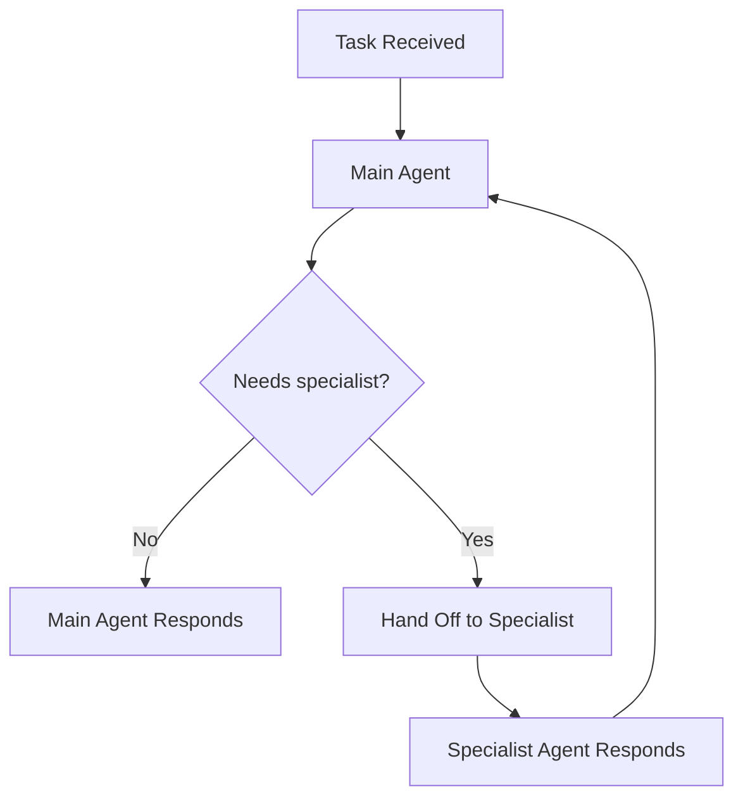

## Customer Support Escalation with Handoffs

This example demonstrates how to configure an agent with handoff agents — pre-defined specialist agents that the main agent can delegate to when a task requires specific expertise.

### What This Example Shows

- Defining handoff agents inline within the `agent_config`
- How the main agent decides when to hand off to a specialist
- Nested agent specifications with independent configurations
- Using handoffs through the `/v1/agent/completions` endpoint

### How Handoffs Work

Unlike [sub-agent delegation](/docs/examples/examples/sub-agent-delegation) where agents are created dynamically at runtime, handoffs are **pre-defined** in your request. You specify the specialist agents upfront, and the main agent can route tasks to them as needed.



### Step 1: Setup

```python
import requests
import os
import json

API_BASE_URL = "https://api.swarms.world"
API_KEY = os.environ.get("SWARMS_API_KEY", "your_api_key_here")

headers = {
    "x-api-key": API_KEY,
    "Content-Type": "application/json"
}
```

### Step 2: Define the Agent with Handoffs

The main agent gets a `handoffs` array containing fully configured specialist agents:

```python
def run_support_agent(customer_query: str) -> dict:
    """Route a customer query through a support agent with specialist handoffs."""

    payload = {
        "agent_config": {
            "agent_name": "Support-Triage-Agent",
            "description": "Front-line customer support agent that triages and routes queries",
            "system_prompt": (
                "You are a customer support triage agent. Assess each query and either:\n"
                "- Answer directly if it's a simple question\n"
                "- Hand off to Billing-Specialist for payment, invoicing, or subscription issues\n"
                "- Hand off to Technical-Support-Agent for bugs, errors, or integration problems\n"
                "- Hand off to Account-Manager for upgrades, cancellations, or enterprise inquiries\n\n"
                "Always acknowledge the customer's issue before routing."
            ),
            "model_name": "gpt-4.1",
            "max_loops": 1,
            "max_tokens": 4096,
            "temperature": 0.3,
            "handoffs": [
                {
                    "agent_name": "Billing-Specialist",
                    "description": "Handles billing, payment, and subscription inquiries",
                    "system_prompt": (
                        "You are a billing specialist. Help customers with:\n"
                        "- Invoice questions and payment history\n"
                        "- Subscription plan changes\n"
                        "- Refund requests and credit adjustments\n"
                        "- Payment method updates\n\n"
                        "Be precise with amounts and dates. Always confirm changes before applying."
                    ),
                    "model_name": "gpt-4o-mini",
                    "max_loops": 1,
                    "temperature": 0.2
                },
                {
                    "agent_name": "Technical-Support-Agent",
                    "description": "Resolves technical issues, bugs, and integration problems",
                    "system_prompt": (
                        "You are a technical support engineer. Help customers with:\n"
                        "- API errors and debugging\n"
                        "- Integration setup and configuration\n"
                        "- Performance issues and troubleshooting\n"
                        "- SDK and client library questions\n\n"
                        "Ask for error messages and logs when needed. Provide step-by-step solutions."
                    ),
                    "model_name": "gpt-4o-mini",
                    "max_loops": 1,
                    "temperature": 0.2
                },
                {
                    "agent_name": "Account-Manager",
                    "description": "Handles account upgrades, cancellations, and enterprise requests",
                    "system_prompt": (
                        "You are an account manager. Help customers with:\n"
                        "- Plan upgrades and downgrades\n"
                        "- Account cancellation and retention\n"
                        "- Enterprise plan inquiries\n"
                        "- Custom pricing and volume discounts\n\n"
                        "Focus on understanding the customer's needs and offering the best solution."
                    ),
                    "model_name": "gpt-4o-mini",
                    "max_loops": 1,
                    "temperature": 0.3
                }
            ]
        },
        "task": customer_query
    }

    response = requests.post(
        f"{API_BASE_URL}/v1/agent/completions",
        headers=headers,
        json=payload,
        timeout=120
    )

    return response.json()
```

### Step 3: Run It

```python
# Technical issue — should hand off to Technical-Support-Agent
result = run_support_agent(
    "I'm getting a 429 rate limit error when calling /v1/agent/completions. "
    "I'm on the free tier and only sending about 10 requests per minute. "
    "Can you help me debug this?"
)

print(json.dumps(result, indent=2))
```

**Expected Behavior:**

1. **Support-Triage-Agent** receives the query and identifies it as a technical issue
2. **Hands off** to Technical-Support-Agent
3. **Technical-Support-Agent** provides debugging steps for the rate limit error

### Step 4: Test Different Routes

```python
# Billing issue — should hand off to Billing-Specialist
result = run_support_agent(
    "I was charged twice for my Pro subscription this month. "
    "Can I get a refund for the duplicate charge?"
)

# Account inquiry — should hand off to Account-Manager
result = run_support_agent(
    "We're a team of 50 engineers and want to upgrade to an enterprise plan. "
    "What volume pricing do you offer?"
)
```

<Note>
Each handoff agent is a fully independent agent with its own model, system prompt, and configuration. The main agent decides which specialist to route to based on the task content.
</Note>

## Next Steps

- [Agent Completions Reference](/docs/documentation/capabilities/agent) — Full agent configuration parameters including `handoffs`
- [Sub-Agent Delegation](/docs/examples/examples/sub-agent-delegation) — Dynamic agent creation at runtime (vs pre-defined handoffs)
- [HierarchicalSwarm](/docs/documentation/multi-agent/hierarchical_swarm) — Multi-level agent coordination via the swarm endpoint
