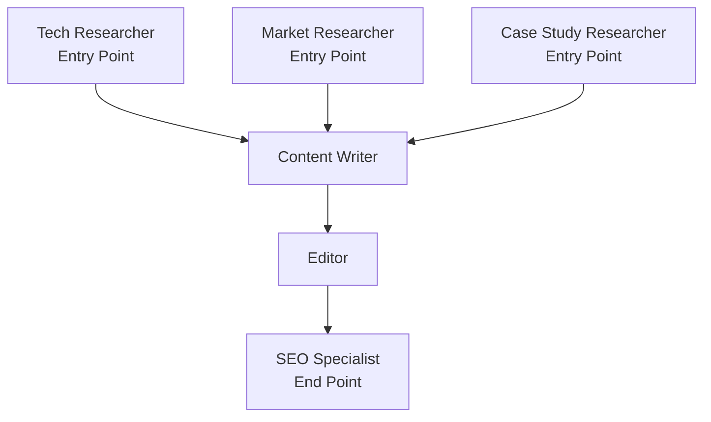

## Content Creation Pipeline with Graph Structure

This example demonstrates how to build a complex content workflow using a directed graph - perfect for workflows that need both parallel processing and sequential dependencies.

<Warning>
Premium: Graph Workflow is available only on Pro and Ultra plans. See [Pricing](/docs/documentation/resources/pricing).
</Warning>

### Step 1: Get Your API Key

1. Visit [https://swarms.world/platform/api-keys](https://swarms.world/platform/api-keys)
2. Sign in or create an account
3. Ensure you have a Pro or Ultra plan
4. Generate a new API key
5. Set it as an environment variable:

```bash
export SWARMS_API_KEY="your-api-key-here"
```

### Step 2: Setup

```python
import requests
import os

API_BASE_URL = "https://api.swarms.world"
API_KEY = os.environ.get("SWARMS_API_KEY", "your_api_key_here")

headers = {
    "x-api-key": API_KEY,
    "Content-Type": "application/json"
}
```

### Step 3: Define Your Graph Workflow

Create a content pipeline where research happens in parallel, then flows into writing, editing, and finally SEO:

```python
def create_blog_post(topic: str) -> dict:
    """
    Create a blog post using a graph workflow.

    Graph structure:
    [Research A] ──┐
    [Research B] ──┼──> [Writer] ──> [Editor] ──> [SEO Optimizer]
    [Research C] ──┘
    """

    workflow_config = {
        "name": "Blog Post Creation Pipeline",
        "description": "Graph workflow for creating SEO-optimized blog posts",
        "task": f"Create a comprehensive blog post about: {topic}",
        "agents": [
            {
                "agent_name": "Tech Researcher",
                "description": "Researches technical aspects",
                "system_prompt": "You are a technical researcher. Research technical details, innovations, and implementations related to the topic.",
                "model_name": "gpt-4o",
                "max_loops": 1,
                "temperature": 0.3
            },
            {
                "agent_name": "Market Researcher",
                "description": "Researches market trends",
                "system_prompt": "You are a market researcher. Research market trends, statistics, industry adoption, and business implications.",
                "model_name": "gpt-4o",
                "max_loops": 1,
                "temperature": 0.3
            },
            {
                "agent_name": "Case Study Researcher",
                "description": "Finds real-world examples",
                "system_prompt": "You are a case study researcher. Find real-world examples, success stories, and practical applications of the topic.",
                "model_name": "gpt-4o",
                "max_loops": 1,
                "temperature": 0.4
            },
            {
                "agent_name": "Content Writer",
                "description": "Writes the blog post",
                "system_prompt": "You are a content writer. Synthesize all research into an engaging, well-structured 1500-word blog post with clear sections and examples.",
                "model_name": "gpt-4o",
                "max_loops": 1,
                "temperature": 0.6
            },
            {
                "agent_name": "Editor",
                "description": "Edits and polishes content",
                "system_prompt": "You are an editor. Review for clarity, grammar, flow, and readability. Improve structure and ensure professional quality.",
                "model_name": "gpt-4o",
                "max_loops": 1,
                "temperature": 0.4
            },
            {
                "agent_name": "SEO Specialist",
                "description": "Optimizes for search engines",
                "system_prompt": "You are an SEO specialist. Add: meta description, keywords, optimize headings, add internal linking suggestions, and ensure SEO best practices.",
                "model_name": "gpt-4o",
                "max_loops": 1,
                "temperature": 0.3
            }
        ],
        "edges": [
            # Parallel research phase - all three researchers work independently
            {"source": "Tech Researcher", "target": "Content Writer"},
            {"source": "Market Researcher", "target": "Content Writer"},
            {"source": "Case Study Researcher", "target": "Content Writer"},

            # Sequential editing phase
            {"source": "Content Writer", "target": "Editor"},
            {"source": "Editor", "target": "SEO Specialist"}
        ],
        "entry_points": ["Tech Researcher", "Market Researcher", "Case Study Researcher"],
        "end_points": ["SEO Specialist"],
        "max_loops": 1
    }

    response = requests.post(
        f"{API_BASE_URL}/v1/graph-workflow/completions",
        headers=headers,
        json=workflow_config,
        timeout=180
    )

    return response.json()
```

### Step 4: Run the Workflow

```python
# Topic for the blog post
topic = "The Future of AI in Healthcare: Opportunities and Challenges"

# Run the graph workflow
result = create_blog_post(topic)

# Display results in execution order
print(f"Workflow: {result['name']}")
print(f"Status: {result['status']}\n")

# Show outputs by workflow stage
stages = [
    ["Tech Researcher", "Market Researcher", "Case Study Researcher"],
    ["Content Writer"],
    ["Editor"],
    ["SEO Specialist"]
]

for stage_num, stage_agents in enumerate(stages, 1):
    print(f"\n{'='*60}")
    print(f"STAGE {stage_num}: {', '.join(stage_agents)}")
    print('='*60)

    for agent_name in stage_agents:
        if agent_name in result['outputs']:
            output = result['outputs'][agent_name]

            # Handle output as string or list
            if isinstance(output, list):
                output = ' '.join(str(item) for item in output)

            print(f"\n[{agent_name}]")
            print(str(output)[:300] + "...\n")

# Display cost and timing info
usage = result.get('usage', {})
if 'billing_info' in usage:
    print(f"\nTotal cost: ${usage['billing_info']['total_cost']:.4f}")
elif 'total_cost' in usage:
    print(f"\nTotal cost: ${usage['total_cost']:.4f}")
else:
    print(f"\nTotal cost: Not available")

execution_time = result.get('execution_time')
if execution_time:
    print(f"Execution time: {execution_time}s")
```

**Expected Output:**
```
Workflow: Blog Post Creation Pipeline
Status: success

============================================================
STAGE 1: Tech Researcher, Market Researcher, Case Study Researcher
============================================================

[Tech Researcher]
Technical innovations in AI healthcare include:

1. **Diagnostic AI**: Deep learning models achieving 95%+ accuracy in medical imaging
2. **Drug Discovery**: AI reducing discovery time from 5 years to 18 months
3. **Personalized Medicine**: ML algorithms analyzing genetic data for custom treatments
4. **Robotic Surgery**: AI-assisted procedures with 40% less complications...

[Market Researcher]
Healthcare AI Market Analysis:

**Market Size**: $15.1B (2024) → $187.9B (2030) - 51.9% CAGR
**Key Drivers**: Aging population, chronic disease prevalence, physician shortages
**Top Adopters**: Radiology (68%), Pathology (54%), Oncology (49%)
**Regional Leaders**: North America (42%), Europe (28%), Asia-Pacific (23%)...

[Case Study Researcher]
Real-World AI Healthcare Success Stories:

**Case 1: Mayo Clinic - Early Disease Detection**
Implementation: AI analyzing ECG data to detect heart disease 10 years earlier
Results: 85% accuracy, 30,000+ patients screened, 15% reduction in cardiac events...

============================================================
STAGE 2: Content Writer
============================================================

[Content Writer]
# The Future of AI in Healthcare: Opportunities and Challenges

The healthcare industry stands at the cusp of a technological revolution. Artificial intelligence is not just changing how we diagnose and treat diseases—it's fundamentally transforming the entire healthcare ecosystem...

[1500-word article synthesizing all research with proper structure, examples, and citations]

============================================================
STAGE 3: Editor
============================================================

[Editor]
**Edited Version with Improvements:**

# The Future of AI in Healthcare: Opportunities and Challenges

[Refined article with improved flow, corrected grammar, enhanced readability, and professional polish. Added transition sentences, clarified technical terms, and ensured consistent tone throughout.]

Key improvements made:
- Restructured intro for stronger hook
- Clarified technical jargon
- Added transition sentences
- Improved conclusion...

============================================================
STAGE 4: SEO Specialist
============================================================

[SEO Specialist]
**SEO-Optimized Final Version:**

**Meta Title**: AI in Healthcare: 2025 Opportunities, Challenges & Future Trends

**Meta Description**: Discover how AI is transforming healthcare in 2025. Explore diagnostic AI, personalized medicine, real case studies, and future trends. Expert analysis included.

**Primary Keywords**: AI in healthcare, artificial intelligence healthcare, healthcare AI trends
**Secondary Keywords**: medical AI, diagnostic AI, personalized medicine AI

**Optimized Headings**:
H1: The Future of AI in Healthcare: Opportunities and Challenges
H2: How AI is Revolutionizing Medical Diagnostics
H2: Real-World Success Stories: AI in Action
H2: Challenges and Ethical Considerations
H2: The Road Ahead: AI Healthcare in 2030

**Internal Linking Suggestions**:
- Link to "Machine Learning in Medicine" article
- Link to "Healthcare Data Privacy" guide
- Link to "AI Ethics" resource page...

Total cost: $0.1456
Execution time: 78.3s
```

<Note>
Graph Workflow allows you to define complex dependencies:
- **Parallel execution**: Multiple researchers work simultaneously
- **Sequential dependencies**: Writer waits for all research, Editor waits for Writer
- **Clear flow**: Entry points → Processing → End points

Use edges to define how data flows between agents.
</Note>

## Graph Structure Visualization



## When to Use Graph Workflow

- **Complex dependencies**: Some agents depend on multiple others
- **Parallel + Sequential**: Mix parallel and sequential processing
- **Multiple entry/exit points**: Workflows with multiple starts or ends
- **DAG structures**: Any directed acyclic graph workflow

## Pattern Comparison

| Pattern | Best For | Structure |
|---------|----------|-----------|
| **Graph** | Complex dependencies, mixed parallel/sequential | Custom directed graph with edges |
| **Hierarchical** | Coordination and oversight | Leader + Workers |
| **Sequential** | Step-by-step pipeline | Linear chain |
| **Concurrent** | Independent parallel tasks | All agents run at once |
