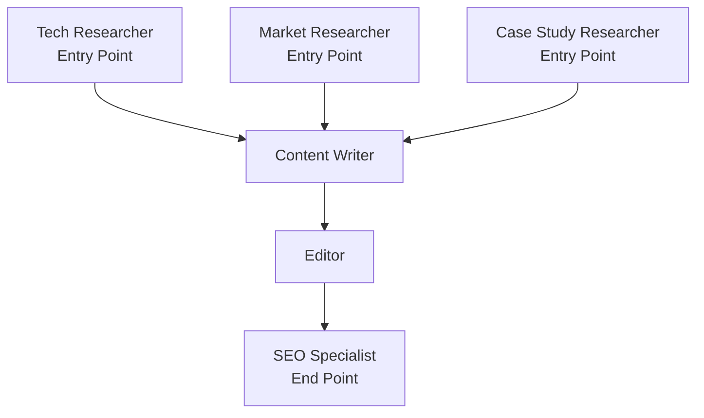

## Content Creation Pipeline with Graph Structure

This example demonstrates how to build a complex content workflow using a directed graph - perfect for workflows that need both parallel processing and sequential dependencies.

<Warning>
Premium: Graph Workflow is available only on Pro and Ultra plans. See [Pricing](/docs/documentation/resources/pricing).
</Warning>

### Step 1: Get Your API Key

1. Visit [https://swarms.world/platform/api-keys](https://swarms.world/platform/api-keys)
2. Sign in or create an account
3. Ensure you have a Pro or Ultra plan
4. Generate a new API key
5. Set it as an environment variable:

```bash
export SWARMS_API_KEY="your-api-key-here"
```

### Step 2: Setup

```python
import requests
import os

API_BASE_URL = "https://api.swarms.world"
API_KEY = os.environ.get("SWARMS_API_KEY", "your_api_key_here")

headers = {
    "x-api-key": API_KEY,
    "Content-Type": "application/json"
}
```

### Step 3: Define Your Graph Workflow

Create a content pipeline where research happens in parallel, then flows into writing, editing, and finally SEO:

```python
def create_blog_post(topic: str) -> dict:
    """
    Create a blog post using a graph workflow.

    Graph structure:
    [Research A] ──┐
    [Research B] ──┼──> [Writer] ──> [Editor] ──> [SEO Optimizer]
    [Research C] ──┘
    """

    workflow_config = {
        "name": "Blog Post Creation Pipeline",
        "description": "Graph workflow for creating SEO-optimized blog posts",
        "task": f"Create a comprehensive blog post about: {topic}",
        "agents": [
            {
                "agent_name": "Tech Researcher",
                "description": "Researches technical aspects",
                "system_prompt": "You are a technical researcher. Research technical details, innovations, and implementations related to the topic.",
                "model_name": "gpt-4o",
                "max_loops": 1,
                "temperature": 0.3
            },
            {
                "agent_name": "Market Researcher",
                "description": "Researches market trends",
                "system_prompt": "You are a market researcher. Research market trends, statistics, industry adoption, and business implications.",
                "model_name": "gpt-4o",
                "max_loops": 1,
                "temperature": 0.3
            },
            {
                "agent_name": "Case Study Researcher",
                "description": "Finds real-world examples",
                "system_prompt": "You are a case study researcher. Find real-world examples, success stories, and practical applications of the topic.",
                "model_name": "gpt-4o",
                "max_loops": 1,
                "temperature": 0.4
            },
            {
                "agent_name": "Content Writer",
                "description": "Writes the blog post",
                "system_prompt": "You are a content writer. Synthesize all research into an engaging, well-structured 1500-word blog post with clear sections and examples.",
                "model_name": "gpt-4o",
                "max_loops": 1,
                "temperature": 0.6
            },
            {
                "agent_name": "Editor",
                "description": "Edits and polishes content",
                "system_prompt": "You are an editor. Review for clarity, grammar, flow, and readability. Improve structure and ensure professional quality.",
                "model_name": "gpt-4o",
                "max_loops": 1,
                "temperature": 0.4
            },
            {
                "agent_name": "SEO Specialist",
                "description": "Optimizes for search engines",
                "system_prompt": "You are an SEO specialist. Add: meta description, keywords, optimize headings, add internal linking suggestions, and ensure SEO best practices.",
                "model_name": "gpt-4o",
                "max_loops": 1,
                "temperature": 0.3
            }
        ],
        "edges": [
            # Parallel research phase - all three researchers work independently
            {"source": "Tech Researcher", "target": "Content Writer"},
            {"source": "Market Researcher", "target": "Content Writer"},
            {"source": "Case Study Researcher", "target": "Content Writer"},

            # Sequential editing phase
            {"source": "Content Writer", "target": "Editor"},
            {"source": "Editor", "target": "SEO Specialist"}
        ],
        "entry_points": ["Tech Researcher", "Market Researcher", "Case Study Researcher"],
        "end_points": ["SEO Specialist"],
        "max_loops": 1
    }

    response = requests.post(
        f"{API_BASE_URL}/v1/graph-workflow/completions",
        headers=headers,
        json=workflow_config,
        timeout=180
    )

    return response.json()
```

### Step 4: Run the Workflow

```python
# Topic for the blog post
topic = "The Future of AI in Healthcare: Opportunities and Challenges"

# Run the graph workflow
result = create_blog_post(topic)

# Display results in execution order
print(f"Workflow: {result['name']}")
print(f"Status: {result['status']}\n")

# Show outputs by workflow stage
stages = [
    ["Tech Researcher", "Market Researcher", "Case Study Researcher"],
    ["Content Writer"],
    ["Editor"],
    ["SEO Specialist"]
]

for stage_num, stage_agents in enumerate(stages, 1):
    print(f"\n{'='*60}")
    print(f"STAGE {stage_num}: {', '.join(stage_agents)}")
    print('='*60)

    for agent_name in stage_agents:
        if agent_name in result['outputs']:
            output = result['outputs'][agent_name]

            # Handle output as string or list
            if isinstance(output, list):
                output = ' '.join(str(item) for item in output)

            print(f"\n[{agent_name}]")
            print(str(output)[:300] + "...\n")

# Display cost and timing info
usage = result.get('usage', {})
if 'billing_info' in usage:
    print(f"\nTotal cost: ${usage['billing_info']['total_cost']:.4f}")
elif 'total_cost' in usage:
    print(f"\nTotal cost: ${usage['total_cost']:.4f}")
else:
    print(f"\nTotal cost: Not available")

execution_time = result.get('execution_time')
if execution_time:
    print(f"Execution time: {execution_time}s")
```

**Expected Output:**
```
Workflow: Blog Post Creation Pipeline
Status: success

============================================================
STAGE 1: Tech Researcher, Market Researcher, Case Study Researcher
============================================================

[Tech Researcher]
Technical innovations in AI healthcare include:

1. **Diagnostic AI**: Deep learning models achieving 95%+ accuracy in medical imaging
2. **Drug Discovery**: AI reducing discovery time from 5 years to 18 months
3. **Personalized Medicine**: ML algorithms analyzing genetic data for custom treatments
4. **Robotic Surgery**: AI-assisted procedures with 40% less complications...

[Market Researcher]
Healthcare AI Market Analysis:

**Market Size**: $15.1B (2024) → $187.9B (2030) - 51.9% CAGR
**Key Drivers**: Aging population, chronic disease prevalence, physician shortages
**Top Adopters**: Radiology (68%), Pathology (54%), Oncology (49%)
**Regional Leaders**: North America (42%), Europe (28%), Asia-Pacific (23%)...

[Case Study Researcher]
Real-World AI Healthcare Success Stories:

**Case 1: Mayo Clinic - Early Disease Detection**
Implementation: AI analyzing ECG data to detect heart disease 10 years earlier
Results: 85% accuracy, 30,000+ patients screened, 15% reduction in cardiac events...

============================================================
STAGE 2: Content Writer
============================================================

[Content Writer]
# The Future of AI in Healthcare: Opportunities and Challenges

The healthcare industry stands at the cusp of a technological revolution. Artificial intelligence is not just changing how we diagnose and treat diseases—it's fundamentally transforming the entire healthcare ecosystem...

[1500-word article synthesizing all research with proper structure, examples, and citations]

============================================================
STAGE 3: Editor
============================================================

[Editor]
**Edited Version with Improvements:**

# The Future of AI in Healthcare: Opportunities and Challenges

[Refined article with improved flow, corrected grammar, enhanced readability, and professional polish. Added transition sentences, clarified technical terms, and ensured consistent tone throughout.]

Key improvements made:
- Restructured intro for stronger hook
- Clarified technical jargon
- Added transition sentences
- Improved conclusion...

============================================================
STAGE 4: SEO Specialist
============================================================

[SEO Specialist]
**SEO-Optimized Final Version:**

**Meta Title**: AI in Healthcare: 2025 Opportunities, Challenges & Future Trends

**Meta Description**: Discover how AI is transforming healthcare in 2025. Explore diagnostic AI, personalized medicine, real case studies, and future trends. Expert analysis included.

**Primary Keywords**: AI in healthcare, artificial intelligence healthcare, healthcare AI trends
**Secondary Keywords**: medical AI, diagnostic AI, personalized medicine AI

**Optimized Headings**:
H1: The Future of AI in Healthcare: Opportunities and Challenges
H2: How AI is Revolutionizing Medical Diagnostics
H2: Real-World Success Stories: AI in Action
H2: Challenges and Ethical Considerations
H2: The Road Ahead: AI Healthcare in 2030

**Internal Linking Suggestions**:
- Link to "Machine Learning in Medicine" article
- Link to "Healthcare Data Privacy" guide
- Link to "AI Ethics" resource page...

Total cost: $0.1456
Execution time: 78.3s
```

<Note>
Graph Workflow allows you to define complex dependencies:
- **Parallel execution**: Multiple researchers work simultaneously
- **Sequential dependencies**: Writer waits for all research, Editor waits for Writer
- **Clear flow**: Entry points → Processing → End points

Use edges to define how data flows between agents.
</Note>

## Graph Structure Visualization



---

## Software Code Review Pipeline

This example demonstrates a parallel code review pipeline where three specialized reviewers (code quality, security, performance) analyze code simultaneously, then a synthesizer produces a unified go/no-go recommendation.

**Graph structure:**
```
[CodeAnalyzer]       ──┐
[SecurityAuditor]    ──┼──> [ReviewSynthesizer]
[PerformanceReviewer]──┘
```

```python
def review_code(code_snippet: str) -> dict:
    """
    Run parallel code review with specialized reviewers.

    Graph structure:
    [CodeAnalyzer]       ──┐
    [SecurityAuditor]    ──┼──> [ReviewSynthesizer]
    [PerformanceReviewer]──┘
    """

    workflow_config = {
        "name": "Code-Review-Pipeline",
        "description": "Parallel code review with specialized reviewers converging into a synthesis report",
        "task": f"Review the following code:\n\n{code_snippet}",
        "agents": [
            {
                "agent_name": "CodeAnalyzer",
                "description": "Analyzes code structure, logic, and design patterns",
                "system_prompt": "You are a senior software engineer specializing in code analysis. Review code for correctness, design patterns, and maintainability. Identify potential bugs, anti-patterns, and suggest improvements.",
                "model_name": "gpt-4.1",
                "max_tokens": 4000,
                "temperature": 0.2,
                "max_loops": 1,
            },
            {
                "agent_name": "SecurityAuditor",
                "description": "Audits code for security vulnerabilities",
                "system_prompt": "You are a cybersecurity expert. Audit the code for security vulnerabilities including injection attacks, authentication flaws, data exposure, and OWASP Top 10 issues. Provide severity ratings and remediation steps.",
                "model_name": "gpt-4.1",
                "max_tokens": 4000,
                "temperature": 0.1,
                "max_loops": 1,
            },
            {
                "agent_name": "PerformanceReviewer",
                "description": "Reviews code for performance issues",
                "system_prompt": "You are a performance engineering expert. Analyze code for performance bottlenecks, memory leaks, inefficient algorithms, and scalability issues. Suggest concrete optimizations with expected impact.",
                "model_name": "gpt-4.1",
                "max_tokens": 4000,
                "temperature": 0.2,
                "max_loops": 1,
            },
            {
                "agent_name": "ReviewSynthesizer",
                "description": "Synthesizes all review findings into a unified report",
                "system_prompt": "You are a tech lead. Synthesize findings from code analysis, security audit, and performance review into a single prioritized action plan. Categorize issues by severity (critical, major, minor) and provide a clear go/no-go recommendation.",
                "model_name": "gpt-4.1",
                "max_tokens": 5000,
                "temperature": 0.3,
                "max_loops": 1,
            },
        ],
        "edges": [
            {"source": "CodeAnalyzer", "target": "ReviewSynthesizer"},
            {"source": "SecurityAuditor", "target": "ReviewSynthesizer"},
            {"source": "PerformanceReviewer", "target": "ReviewSynthesizer"},
        ],
        "entry_points": ["CodeAnalyzer", "SecurityAuditor", "PerformanceReviewer"],
        "end_points": ["ReviewSynthesizer"],
        "max_loops": 1,
    }

    response = requests.post(
        f"{API_BASE_URL}/v1/graph-workflow/completions",
        headers=headers,
        json=workflow_config,
        timeout=300
    )

    return response.json()


# Example: Review a Flask login endpoint
code = '''
import sqlite3
from flask import Flask, request, jsonify
import hashlib

app = Flask(__name__)

@app.route('/login', methods=['POST'])
def login():
    username = request.form['username']
    password = request.form['password']
    conn = sqlite3.connect('users.db')
    cursor = conn.cursor()
    query = f"SELECT * FROM users WHERE username='{username}' AND password='{hashlib.md5(password.encode()).hexdigest()}'"
    cursor.execute(query)
    user = cursor.fetchone()
    conn.close()
    if user:
        return jsonify({'status': 'success', 'token': hashlib.md5(username.encode()).hexdigest()})
    return jsonify({'status': 'failed'}), 401
'''

result = review_code(code)

print(f"Workflow: {result['name']}")
print(f"Status: {result['status']}\n")

# Show each reviewer's findings then the synthesis
reviewers = ["CodeAnalyzer", "SecurityAuditor", "PerformanceReviewer", "ReviewSynthesizer"]
for agent_name in reviewers:
    if agent_name in result['outputs']:
        output = result['outputs'][agent_name]
        if isinstance(output, list):
            output = ' '.join(str(item) for item in output)
        print(f"\n{'='*60}")
        print(f"[{agent_name}]")
        print('='*60)
        print(str(output)[:300] + "...")
```

**Expected Output:**
```
Workflow: Code-Review-Pipeline
Status: success

============================================================
[CodeAnalyzer]
============================================================
Code Analysis Report:

1. **SQL Injection (Critical)**: f-string SQL query construction allows arbitrary SQL injection
2. **Weak Hashing**: MD5 is cryptographically broken for password hashing
3. **No Input Validation**: Missing input sanitization on username/password
4. **Connection Management**: No context manager for database connection...

============================================================
[SecurityAuditor]
============================================================
Security Audit Report — OWASP Top 10 Mapping:

**CRITICAL — A03:2021 Injection (Score: 10/10)**
SQL injection via f-string query. Attacker can bypass auth with: username=' OR '1'='1

**CRITICAL — A02:2021 Cryptographic Failures (Score: 9/10)**
MD5 is broken. Use bcrypt or argon2 with salting...

============================================================
[PerformanceReviewer]
============================================================
Performance Review:

1. **Database Connection Per Request**: Creating new SQLite connection each call — use connection pooling
2. **No Index Guarantee**: Query assumes index on username column
3. **Full Row Select**: SELECT * fetches unnecessary columns...

============================================================
[ReviewSynthesizer]
============================================================
Unified Code Review — Verdict: NO-GO

**Critical Issues (must fix before merge):**
1. SQL Injection vulnerability (Security)
2. MD5 password hashing (Security)
3. Predictable session tokens (Security)

**Major Issues:**
1. No input validation (Code Quality)
2. No connection pooling (Performance)...
```

<Note>
This pattern is ideal for **automated CI/CD code review** — all three reviewers run in parallel so the total latency is only as long as the slowest reviewer, not the sum of all three.
</Note>

---

## Multi-Language Content Localization (Multiple End Points)

This example demonstrates a fan-out workflow with **multiple end points** — a content strategist creates source content, which fans out to three translators running in parallel. Each translator is an independent end point.

**Graph structure:**
```
                    ┌──> [SpanishTranslator]  (End Point)
[ContentStrategist] ┼──> [JapaneseTranslator] (End Point)
                    └──> [GermanTranslator]   (End Point)
```

```python
def localize_content(brief: str) -> dict:
    """
    Create content and localize it into multiple languages in parallel.

    Graph structure:
                        ┌──> [SpanishTranslator]
    [ContentStrategist] ┼──> [JapaneseTranslator]
                        └──> [GermanTranslator]
    """

    workflow_config = {
        "name": "Content-Localization-Pipeline",
        "description": "Fan-out localization: one source feeding multiple translators in parallel",
        "task": brief,
        "agents": [
            {
                "agent_name": "ContentStrategist",
                "description": "Creates source content and localization guidelines",
                "system_prompt": "You are a content strategist. Create clear, culturally-neutral source content and provide localization guidelines including tone, key terms to preserve, and cultural adaptation notes.",
                "model_name": "gpt-4.1",
                "max_tokens": 4000,
                "temperature": 0.4,
                "max_loops": 1,
            },
            {
                "agent_name": "SpanishTranslator",
                "description": "Translates and localizes for Spanish-speaking markets",
                "system_prompt": "You are an expert Spanish translator and localization specialist. Translate the content you receive into natural Latin American Spanish. Adapt cultural references and idioms for Spanish-speaking audiences. Output only the translated content.",
                "model_name": "gpt-4.1",
                "max_tokens": 4000,
                "temperature": 0.3,
                "max_loops": 1,
            },
            {
                "agent_name": "JapaneseTranslator",
                "description": "Translates and localizes for Japanese market",
                "system_prompt": "You are an expert Japanese translator and localization specialist. Translate the content you receive into natural Japanese, using appropriate formality levels (keigo where needed). Output only the translated content.",
                "model_name": "gpt-4.1",
                "max_tokens": 4000,
                "temperature": 0.3,
                "max_loops": 1,
            },
            {
                "agent_name": "GermanTranslator",
                "description": "Translates and localizes for German-speaking markets",
                "system_prompt": "You are an expert German translator and localization specialist. Translate the content you receive into natural German (Hochdeutsch). Handle compound nouns appropriately. Output only the translated content.",
                "model_name": "gpt-4.1",
                "max_tokens": 4000,
                "temperature": 0.3,
                "max_loops": 1,
            },
        ],
        "edges": [
            {"source": "ContentStrategist", "target": "SpanishTranslator"},
            {"source": "ContentStrategist", "target": "JapaneseTranslator"},
            {"source": "ContentStrategist", "target": "GermanTranslator"},
        ],
        "entry_points": ["ContentStrategist"],
        "end_points": ["SpanishTranslator", "JapaneseTranslator", "GermanTranslator"],
        "max_loops": 1,
    }

    response = requests.post(
        f"{API_BASE_URL}/v1/graph-workflow/completions",
        headers=headers,
        json=workflow_config,
        timeout=300
    )

    return response.json()


# Localize a product launch announcement
result = localize_content(
    "Create and localize a product launch announcement for an AI-powered project management "
    "tool called 'FlowBoard'. The tool features smart task prioritization, natural language "
    "project updates, and automated sprint planning. Target audience: tech-savvy project "
    "managers and team leads."
)

print(f"Workflow: {result['name']}")
print(f"Status: {result['status']}\n")

# Show source content then each translation
agents_order = ["ContentStrategist", "SpanishTranslator", "JapaneseTranslator", "GermanTranslator"]
labels = {"ContentStrategist": "SOURCE (English)", "SpanishTranslator": "SPANISH", "JapaneseTranslator": "JAPANESE", "GermanTranslator": "GERMAN"}

for agent_name in agents_order:
    if agent_name in result['outputs']:
        output = result['outputs'][agent_name]
        if isinstance(output, list):
            output = ' '.join(str(item) for item in output)
        print(f"\n{'='*60}")
        print(f"{labels[agent_name]}")
        print('='*60)
        print(str(output)[:400] + "...")
```

**Expected Output:**
```
Workflow: Content-Localization-Pipeline
Status: success

============================================================
SOURCE (English)
============================================================
Product Launch Announcement — FlowBoard

Subject: Introducing FlowBoard: The Smarter Way to Manage Projects

Dear Project Leaders,

We are excited to announce the launch of FlowBoard, an AI-powered project management
platform designed to transform how teams plan, track, and deliver projects...

============================================================
SPANISH
============================================================
Anuncio de Lanzamiento — FlowBoard

Asunto: Presentamos FlowBoard: La Forma Más Inteligente de Gestionar Proyectos

Estimados Líderes de Proyecto,

Nos complace anunciar el lanzamiento de FlowBoard, una plataforma de gestión de proyectos
impulsada por inteligencia artificial...

============================================================
JAPANESE
============================================================
製品発表のお知らせ — FlowBoard

件名：FlowBoard のご紹介：よりスマートなプロジェクト管理を実現

プロジェクトリーダーの皆様へ

FlowBoard の正式リリースをお知らせいたします。FlowBoard は、AI を活用した
プロジェクト管理プラットフォームです...

============================================================
GERMAN
============================================================
Produktankündigung — FlowBoard

Betreff: Wir stellen vor: FlowBoard – Die intelligentere Art, Projekte zu verwalten

Sehr geehrte Projektverantwortliche,

wir freuen uns, die Einführung von FlowBoard bekannt zu geben, einer KI-gestützten
Projektmanagement-Plattform...
```

<Note>
This pattern showcases **multiple end points** — unlike most examples where outputs converge, here the graph fans out and each translator is an independent terminal node. This is perfect for localization, A/B test generation, or multi-format content creation.
</Note>

---

## Financial Due Diligence Pipeline

This example demonstrates a multi-stage pipeline where parallel analysis feeds into sequential decision-making — two analysts work in parallel, their findings converge into a risk assessor, which then feeds an investment committee for a final recommendation.

**Graph structure:**
```
[FinancialAnalyst] ──┐
                     ├──> [RiskAssessor] ──> [InvestmentCommittee]
[MarketAnalyst]    ──┘
```

```python
def run_due_diligence(company_brief: str) -> dict:
    """
    Run investment due diligence with parallel analysis and sequential decision-making.

    Graph structure:
    [FinancialAnalyst] ──┐
                         ├──> [RiskAssessor] ──> [InvestmentCommittee]
    [MarketAnalyst]    ──┘
    """

    workflow_config = {
        "name": "Financial-Due-Diligence-Pipeline",
        "description": "Multi-stage due diligence: parallel analysis → risk assessment → investment decision",
        "task": company_brief,
        "agents": [
            {
                "agent_name": "FinancialAnalyst",
                "description": "Analyzes financial statements and metrics",
                "system_prompt": "You are a financial analyst. Analyze financial statements, calculate key ratios (P/E, debt-to-equity, ROE, profit margins), and assess financial health. Provide quantitative analysis with specific numbers.",
                "model_name": "gpt-4.1",
                "max_tokens": 4000,
                "temperature": 0.2,
                "max_loops": 1,
            },
            {
                "agent_name": "MarketAnalyst",
                "description": "Evaluates market position and competitive landscape",
                "system_prompt": "You are a market analyst. Evaluate market position, competitive landscape, TAM/SAM/SOM, market trends, and growth potential. Provide data-driven market assessment.",
                "model_name": "gpt-4.1",
                "max_tokens": 4000,
                "temperature": 0.3,
                "max_loops": 1,
            },
            {
                "agent_name": "RiskAssessor",
                "description": "Identifies and quantifies risks from financial and market analyses",
                "system_prompt": "You are a risk assessment specialist. Using the financial and market analyses, identify and quantify key risks: market risk, operational risk, regulatory risk, and concentration risk. Assign risk scores (1-10) and provide mitigation strategies.",
                "model_name": "gpt-4.1",
                "max_tokens": 4000,
                "temperature": 0.2,
                "max_loops": 1,
            },
            {
                "agent_name": "InvestmentCommittee",
                "description": "Makes final investment recommendation",
                "system_prompt": "You are an investment committee chair. Synthesize all financial analysis, market assessment, and risk evaluation into a final investment recommendation. Provide a clear BUY/HOLD/PASS verdict with target valuation range, key conditions, and monitoring triggers.",
                "model_name": "gpt-4.1",
                "max_tokens": 5000,
                "temperature": 0.3,
                "max_loops": 1,
            },
        ],
        "edges": [
            {"source": "FinancialAnalyst", "target": "RiskAssessor"},
            {"source": "MarketAnalyst", "target": "RiskAssessor"},
            {"source": "RiskAssessor", "target": "InvestmentCommittee"},
        ],
        "entry_points": ["FinancialAnalyst", "MarketAnalyst"],
        "end_points": ["InvestmentCommittee"],
        "max_loops": 1,
    }

    response = requests.post(
        f"{API_BASE_URL}/v1/graph-workflow/completions",
        headers=headers,
        json=workflow_config,
        timeout=300
    )

    return response.json()


# Run due diligence on a hypothetical company
result = run_due_diligence(
    "Conduct due diligence analysis on a Series B SaaS company 'DataSync AI' seeking $50M "
    "at a $400M valuation. The company has $12M ARR growing 120% YoY, 85% gross margins, "
    "-$3M net income, 140% net revenue retention, 1,200 enterprise customers, and operates "
    "in the data integration market competing against Fivetran and Airbyte."
)

print(f"Workflow: {result['name']}")
print(f"Status: {result['status']}\n")

# Show the pipeline stages
stages = [
    ("STAGE 1 — Parallel Analysis", ["FinancialAnalyst", "MarketAnalyst"]),
    ("STAGE 2 — Risk Assessment", ["RiskAssessor"]),
    ("STAGE 3 — Investment Decision", ["InvestmentCommittee"]),
]

for stage_label, agent_names in stages:
    print(f"\n{'='*60}")
    print(stage_label)
    print('='*60)
    for agent_name in agent_names:
        if agent_name in result['outputs']:
            output = result['outputs'][agent_name]
            if isinstance(output, list):
                output = ' '.join(str(item) for item in output)
            print(f"\n[{agent_name}]")
            print(str(output)[:300] + "...")
```

**Expected Output:**
```
Workflow: Financial-Due-Diligence-Pipeline
Status: success

============================================================
STAGE 1 — Parallel Analysis
============================================================

[FinancialAnalyst]
Financial Analysis — DataSync AI (Series B)

**Revenue Metrics:**
- ARR: $12M | YoY Growth: 120% | Implied MRR: $1M
- Net Revenue Retention: 140% (best-in-class)
- Gross Margin: 85% (strong SaaS economics)

**Profitability:**
- Net Income: -$3M | Implied Burn Rate: ~$15M/year
- Runway with $50M raise: ~3+ years at current burn...

[MarketAnalyst]
Market Assessment — Data Integration Space

**TAM/SAM/SOM:**
- TAM: $15.6B (global data integration market, 2024)
- SAM: $4.2B (cloud-native data integration)
- SOM: $840M (AI-powered segment)

**Competitive Landscape:**
- Fivetran: $1.2B+ valuation, 5,000+ customers, established leader
- Airbyte: Open-source approach, strong developer community...

============================================================
STAGE 2 — Risk Assessment
============================================================

[RiskAssessor]
Risk Assessment Matrix — DataSync AI

| Risk Category    | Score (1-10) | Key Factors                        |
|-----------------|-------------|-------------------------------------|
| Market Risk     | 5           | Strong TAM but intense competition  |
| Operational Risk| 6           | Negative net income, scaling needs  |
| Regulatory Risk | 3           | Standard SaaS data handling         |
| Concentration   | 4           | 1,200 customers, reasonable spread  |

**Overall Risk Score: 4.5/10 (Moderate)**...

============================================================
STAGE 3 — Investment Decision
============================================================

[InvestmentCommittee]
Investment Committee Recommendation — DataSync AI Series B

**Verdict: CONDITIONAL BUY**

**Valuation Assessment:**
- $400M at $12M ARR = 33x ARR multiple
- Justified by: 120% growth, 140% NRR, 85% gross margins
- Target range: $350M-$450M (fair at midpoint)

**Key Conditions:**
1. Path to profitability within 18 months
2. Customer concentration analysis (top 10 < 30% of ARR)
3. Technical differentiation audit vs. Fivetran/Airbyte...
```

<Note>
This pattern demonstrates a **multi-stage DAG** — parallel entry points feed a middle layer, which feeds the final decision node. Each stage builds on the outputs of the previous stage. The `RiskAssessor` has access to both the financial and market analyses before it runs, and the `InvestmentCommittee` sees everything.
</Note>

---

## When to Use Graph Workflow

- **Complex dependencies**: Some agents depend on multiple others
- **Parallel + Sequential**: Mix parallel and sequential processing
- **Multiple entry/exit points**: Workflows with multiple starts or ends
- **DAG structures**: Any directed acyclic graph workflow

## Pattern Comparison

| Pattern | Best For | Structure |
|---------|----------|-----------|
| **Graph** | Complex dependencies, mixed parallel/sequential | Custom directed graph with edges |
| **Hierarchical** | Coordination and oversight | Leader + Workers |
| **Sequential** | Step-by-step pipeline | Linear chain |
| **Concurrent** | Independent parallel tasks | All agents run at once |
