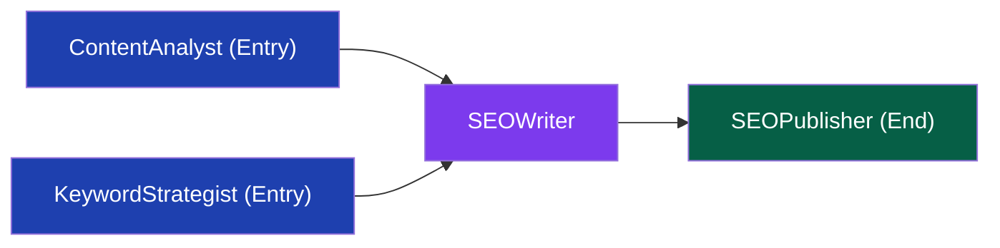

This tutorial walks you through building a complete **SEO content generation application** powered by a 4-agent graph workflow. Give it a competitor URL, your own website, or a plain-text company description — the pipeline fetches the content, researches keywords, writes a long-form SEO article, and delivers a publish-ready, fully-optimized piece.

<Warning>
**Premium Tier Required**: Graph Workflow is available on Pro and Ultra plans. [Upgrade your account](https://swarms.world/platform/account) to access this endpoint.
</Warning>

---

## What You Will Build

A fully automated content engine that:

- Accepts a **URL** (website, blog post, product page) *or* a **plain-text company description**
- Fetches and extracts readable text from any URL using `BeautifulSoup`
- Runs a **4-agent Graph Workflow** where two specialist agents work in parallel, then converge into a writer and a final SEO optimizer
- Returns a publish-ready article complete with meta title, meta description, heading hierarchy, keyword density notes, schema markup recommendations, and internal-linking suggestions

---

## Architecture

### Agent Roles

| Agent | Role | Stage |
|---|---|---|
| **ContentAnalyst** | Extracts brand voice, offerings, value props, and target audience from the source content | Entry (parallel) |
| **KeywordStrategist** | Identifies primary keywords, long-tail variations, search intent, and topic clusters | Entry (parallel) |
| **SEOWriter** | Synthesizes both analyses into a 1,500-word SEO article with optimized structure | Middle (sequential) |
| **SEOPublisher** | Adds meta tags, schema markup, heading-tag audit, internal-link suggestions, and readability score | End (sequential) |

### Graph Flow

```
[ContentAnalyst]   ──┐
                      ├──> [SEOWriter] ──> [SEOPublisher]
[KeywordStrategist]──┘
```

Both `ContentAnalyst` and `KeywordStrategist` run **in parallel** the moment the workflow starts. Once both finish, `SEOWriter` receives all their outputs and drafts the article. Finally `SEOPublisher` performs a full SEO polish and delivers the ready-to-publish result.



---

## Prerequisites

### 1. Get Your API Key

1. Visit [https://swarms.world/platform/api-keys](https://swarms.world/platform/api-keys)
2. Sign in or create an account
3. Ensure you have a **Pro or Ultra plan**
4. Generate a new API key and export it:

```bash
export SWARMS_API_KEY="your-api-key-here"
```

### 2. Install Dependencies

```bash
pip install requests beautifulsoup4 lxml
```

---

## Full Application Code

### `seo_pipeline.py`

```python
"""
SEO Content Generation Pipeline
================================
Uses a 4-agent Graph Workflow to generate publish-ready SEO articles from
a URL or a plain-text company description.

Usage:
    python seo_pipeline.py --url https://example.com
    python seo_pipeline.py --description "We build AI-powered CRM software..."
    python seo_pipeline.py --url https://example.com --keyword "ai crm software"
"""

import os
import sys
import argparse
import requests
from bs4 import BeautifulSoup

# ── Configuration ──────────────────────────────────────────────────────────────

API_BASE_URL = "https://api.swarms.world"
API_KEY = os.environ.get("SWARMS_API_KEY", "your_api_key_here")
MODEL = "gpt-5.4"

HEADERS = {
    "x-api-key": API_KEY,
    "Content-Type": "application/json",
}


# ── Step 1: Content Fetching ───────────────────────────────────────────────────

def fetch_url_content(url: str, max_chars: int = 8000) -> str:
    """
    Fetch a URL and return clean readable text extracted from the page body.
    Strips navigation, scripts, and boilerplate; keeps paragraphs, headings,
    and list items to preserve meaningful context for the AI agents.
    """
    try:
        response = requests.get(url, timeout=20, headers={
            "User-Agent": (
                "Mozilla/5.0 (compatible; SEO-Pipeline/1.0; "
                "+https://swarms.world)"
            )
        })
        response.raise_for_status()
    except requests.RequestException as exc:
        raise SystemExit(f"[ERROR] Could not fetch '{url}': {exc}") from exc

    soup = BeautifulSoup(response.text, "lxml")

    for tag in soup(["script", "style", "nav", "footer", "header",
                      "aside", "form", "noscript", "iframe"]):
        tag.decompose()

    text_parts = []
    for element in soup.find_all(
        ["h1", "h2", "h3", "h4", "p", "li", "td", "blockquote", "article"]
    ):
        text = element.get_text(separator=" ", strip=True)
        if len(text) > 30:
            text_parts.append(text)

    raw_text = "\n\n".join(text_parts)

    if len(raw_text) > max_chars:
        raw_text = raw_text[:max_chars] + "\n\n[...content truncated for length...]"

    return raw_text


def get_source_content(url, description):
    """
    Returns (source_text, source_label) from either a URL or a description.
    """
    if url:
        print(f"[INFO] Fetching content from: {url}")
        text = fetch_url_content(url)
        label = f"Website URL: {url}"
        print(f"[INFO] Extracted {len(text):,} characters from the page.")
        return text, label

    if description:
        return description.strip(), "Company description provided by user"

    raise ValueError("Provide either --url or --description.")


# ── Step 2: Graph Workflow Definition ─────────────────────────────────────────

def build_workflow(source_content: str, source_label: str,
                   focus_keyword: str = "") -> dict:
    """
    Build the 4-agent SEO Graph Workflow payload.

    Graph structure:
    [ContentAnalyst]   ──┐
                          ├──> [SEOWriter] ──> [SEOPublisher]
    [KeywordStrategist]──┘
    """
    keyword_hint = (
        f"\nThe primary keyword to target is: **{focus_keyword}**"
        if focus_keyword else ""
    )

    task = (
        f"Generate a complete, publish-ready SEO article based on the "
        f"following source material.\n\n"
        f"Source: {source_label}{keyword_hint}\n\n"
        f"--- SOURCE CONTENT ---\n{source_content}\n--- END OF SOURCE ---"
    )

    return {
        "name": "SEO-Content-Generation-Pipeline",
        "description": (
            "4-agent graph workflow: parallel content analysis + keyword "
            "research → SEO article writing → full SEO optimization"
        ),
        "task": task,
        "agents": [
            {
                "agent_name": "ContentAnalyst",
                "description": "Extracts brand identity and content strategy signals",
                "system_prompt": (
                    "You are a senior content strategist and brand analyst. "
                    "Analyze the provided source material and extract:\n\n"
                    "1. **Company / Brand Overview** — What does the company do?\n"
                    "2. **Core Products & Services** — List and briefly describe each.\n"
                    "3. **Target Audience** — Industry, role, pain points.\n"
                    "4. **Unique Value Propositions** — What differentiates this brand?\n"
                    "5. **Brand Voice & Tone** — Formal, conversational, technical?\n"
                    "6. **Key Topics & Themes** — Recurring subjects in the content.\n"
                    "7. **Content Gaps** — Important unanswered questions.\n\n"
                    "Be thorough. Your analysis feeds directly into an SEO article writer."
                ),
                "model_name": MODEL,
                "max_loops": 1,
                "temperature": 0.3,
                "max_tokens": 4000,
            },
            {
                "agent_name": "KeywordStrategist",
                "description": "Builds a data-informed keyword and topic strategy",
                "system_prompt": (
                    "You are an expert SEO keyword strategist. Analyze the source material "
                    "and produce a comprehensive keyword strategy including:\n\n"
                    "1. **Primary Keyword** — The single most relevant, high-intent phrase.\n"
                    "2. **Secondary Keywords** — 5-8 supporting keyword phrases.\n"
                    "3. **Long-Tail Keywords** — 8-12 specific, lower-competition phrases.\n"
                    "4. **LSI / Semantic Keywords** — 10-15 related terms.\n"
                    "5. **Search Intent Mapping** — Informational, Navigational, Commercial, or Transactional.\n"
                    "6. **Topic Clusters** — 3-5 content pillars.\n"
                    "7. **Competitor Content Gaps** — Angles competitors miss.\n"
                    "8. **Featured Snippet Opportunities** — 3-5 question-format headings.\n\n"
                    "Your keyword strategy will be used to write the article."
                ),
                "model_name": MODEL,
                "max_loops": 1,
                "temperature": 0.3,
                "max_tokens": 4000,
            },
            {
                "agent_name": "SEOWriter",
                "description": "Writes a full-length, keyword-optimized SEO article",
                "system_prompt": (
                    "You are a world-class SEO content writer. You will receive:\n"
                    "- A brand/content analysis from a Content Analyst\n"
                    "- A keyword strategy from a Keyword Strategist\n\n"
                    "Write a comprehensive SEO article following these requirements:\n\n"
                    "**Structure Requirements:**\n"
                    "- Length: 1,400-1,800 words\n"
                    "- H1 title (include primary keyword naturally)\n"
                    "- Compelling intro paragraph (hook + problem statement)\n"
                    "- 4-6 H2 sections, each with 2-3 supporting paragraphs\n"
                    "- At least 2 H3 subsections within any complex H2 section\n"
                    "- Use numbered lists or bullet points where appropriate\n"
                    "- A strong conclusion with a clear call-to-action (CTA)\n\n"
                    "**SEO Writing Requirements:**\n"
                    "- Place the primary keyword in: title, first paragraph, at least one H2, and the conclusion\n"
                    "- Weave secondary keywords naturally throughout\n"
                    "- Write in active voice; keep sentences under 25 words where possible\n"
                    "- Output the complete article in Markdown format."
                ),
                "model_name": MODEL,
                "max_loops": 1,
                "temperature": 0.55,
                "max_tokens": 6000,
            },
            {
                "agent_name": "SEOPublisher",
                "description": "Applies final SEO optimizations and generates publish metadata",
                "system_prompt": (
                    "You are an SEO technical editor. Take the completed article and produce "
                    "a complete publish package with these sections:\n\n"
                    "1. PUBLISH METADATA\n"
                    "   - Meta Title (50-60 chars, includes primary keyword)\n"
                    "   - Meta Description (145-160 chars, includes primary + secondary keyword)\n"
                    "   - URL Slug (lowercase, hyphenated, keyword-rich)\n"
                    "   - Primary Keyword, Secondary Keywords, Estimated Read Time, Word Count\n\n"
                    "2. SCHEMA MARKUP\n"
                    "   Provide ready-to-use JSON-LD schema (Article, HowTo, or FAQPage).\n\n"
                    "3. HEADING AUDIT\n"
                    "   List all headings with a pass or flag. Suggest improvements.\n\n"
                    "4. INTERNAL LINKING SUGGESTIONS\n"
                    "   Suggest 5-7 anchor text phrases with the type of page to link to.\n\n"
                    "5. READABILITY REPORT\n"
                    "   - Estimated Flesch Reading Ease score\n"
                    "   - Passive voice instances to fix\n\n"
                    "6. OPTIMIZED ARTICLE\n"
                    "   The final, fully-optimized version of the article in Markdown."
                ),
                "model_name": MODEL,
                "max_loops": 1,
                "temperature": 0.3,
                "max_tokens": 8000,
            },
        ],
        "edges": [
            {"source": "ContentAnalyst",    "target": "SEOWriter"},
            {"source": "KeywordStrategist", "target": "SEOWriter"},
            {"source": "SEOWriter",         "target": "SEOPublisher"},
        ],
        "entry_points": ["ContentAnalyst", "KeywordStrategist"],
        "end_points": ["SEOPublisher"],
        "max_loops": 1,
    }


# ── Step 3: Run the Workflow ───────────────────────────────────────────────────

def run_seo_pipeline(workflow_config: dict) -> dict:
    print("[INFO] Submitting workflow to Swarms API...")
    response = requests.post(
        f"{API_BASE_URL}/v1/graph-workflow/completions",
        headers=HEADERS,
        json=workflow_config,
        timeout=300,
    )

    if response.status_code != 200:
        raise SystemExit(
            f"[ERROR] API returned {response.status_code}: {response.text}"
        )

    return response.json()


# ── Step 4: Display Results ────────────────────────────────────────────────────

PIPELINE_STAGES = [
    ("STAGE 1 — PARALLEL ANALYSIS", ["ContentAnalyst", "KeywordStrategist"]),
    ("STAGE 2 — SEO ARTICLE DRAFT", ["SEOWriter"]),
    ("STAGE 3 — PUBLISH PACKAGE",   ["SEOPublisher"]),
]


def display_results(result: dict) -> None:
    print(f"\n{'='*70}")
    print(f"  WORKFLOW: {result.get('name', 'SEO Pipeline')}")
    print(f"  STATUS:   {result.get('status', 'unknown').upper()}")
    print(f"{'='*70}")

    outputs = result.get("outputs", {})

    for stage_label, agent_names in PIPELINE_STAGES:
        print(f"\n{'─'*70}")
        print(f"  {stage_label}")
        print(f"{'─'*70}")

        for agent_name in agent_names:
            if agent_name not in outputs:
                print(f"\n  [{agent_name}] — no output received")
                continue

            output = outputs[agent_name]
            if isinstance(output, list):
                output = "\n".join(str(item) for item in output)

            print(f"\n  [{agent_name}]")
            lines = str(output).splitlines()
            for line in lines[:120]:
                print(f"  {line}")
            if len(lines) > 120:
                print(f"\n  ... [{len(lines) - 120} more lines] ...")

    usage = result.get("usage", {})
    billing = usage.get("billing_info", usage)
    total_cost = billing.get("total_cost") or usage.get("token_cost", "N/A")
    total_tokens = usage.get("total_tokens", "N/A")
    exec_time = result.get("execution_time", "N/A")

    print(f"\n{'='*70}")
    print(f"  Total Tokens : {total_tokens}")
    print(f"  Total Cost   : ${total_cost}")
    print(f"  Exec Time    : {exec_time}s")
    print(f"{'='*70}\n")


# ── Step 5: Save Output ────────────────────────────────────────────────────────

def save_article(result: dict, output_file: str = "seo_article.md") -> None:
    outputs = result.get("outputs", {})
    publisher_output = outputs.get("SEOPublisher", "")

    if isinstance(publisher_output, list):
        publisher_output = "\n".join(str(i) for i in publisher_output)

    if not publisher_output:
        print("[WARN] SEOPublisher produced no output — nothing saved.")
        return

    with open(output_file, "w", encoding="utf-8") as fh:
        fh.write(publisher_output)

    print(f"[INFO] Full publish package saved to: {output_file}")


# ── CLI Entry Point ────────────────────────────────────────────────────────────

def parse_args():
    parser = argparse.ArgumentParser(
        description="Generate SEO content from a URL or company description."
    )
    group = parser.add_mutually_exclusive_group(required=True)
    group.add_argument("--url", metavar="URL")
    group.add_argument("--description", metavar="TEXT")
    parser.add_argument("--keyword", metavar="KEYWORD", default="")
    parser.add_argument("--output", metavar="FILE", default="seo_article.md")
    return parser.parse_args()


def main() -> None:
    args = parse_args()
    source_text, source_label = get_source_content(args.url, args.description)
    workflow = build_workflow(source_text, source_label, args.keyword)
    result = run_seo_pipeline(workflow)
    display_results(result)
    save_article(result, args.output)


if __name__ == "__main__":
    main()
```

---

## Running the Application

### Option A — Analyze a Website URL

```bash
python seo_pipeline.py --url https://yourcompany.com
```

### Option B — Analyze a Specific Page

```bash
python seo_pipeline.py \
  --url https://yourcompany.com/product/ai-crm \
  --keyword "ai crm software for startups"
```

### Option C — Use a Company Description

```bash
python seo_pipeline.py \
  --description "Acme Corp builds AI-powered CRM software for B2B SaaS companies. Our product automates lead scoring, meeting scheduling, and follow-up emails." \
  --keyword "ai crm for small business"
```

### Option D — Save to a Custom File

```bash
python seo_pipeline.py \
  --url https://yourcompany.com \
  --output articles/homepage-seo.md
```

---

## How the Graph Executes

```
Timeline (approximate):

t=0s   ├── ContentAnalyst   starts ──────────────────┐
       │                                              │ (parallel)
t=0s   └── KeywordStrategist starts ─────────────────┤
                                                      │
t=15s  Both complete ─────────────────────────────────┤
                                                      │
t=15s  SEOWriter receives both outputs, starts ───────┤
                                                      │
t=40s  SEOWriter completes ───────────────────────────┤
                                                      │
t=40s  SEOPublisher receives article, starts ─────────┤
                                                      │
t=60s  SEOPublisher completes ────────────────────────┘

Total: ~60-90 seconds for a complete publish package
```

---

## Using the API Directly (No URL Fetching)

<Tabs>
<Tab title="Python (requests)">
```python
import os
import requests

API_KEY = os.environ.get("SWARMS_API_KEY")
MODEL = "gpt-5.4"

workflow = {
    "name": "SEO-Content-Generation-Pipeline",
    "description": "4-agent SEO content factory",
    "task": (
        "Generate a publish-ready SEO article for: Acme Corp — AI-powered CRM for B2B SaaS startups.\n"
        "Products: LeadScore AI, MeetBot, FollowUp Engine.\n"
        "Primary keyword to target: 'ai crm for small business'"
    ),
    "agents": [
        {
            "agent_name": "ContentAnalyst",
            "system_prompt": (
                "You are a senior content strategist. Analyze the source material "
                "and extract: company overview, products/services, target audience, "
                "unique value propositions, brand voice, key themes, and content gaps."
            ),
            "model_name": MODEL,
            "max_loops": 1,
            "temperature": 0.3,
            "max_tokens": 4000,
        },
        {
            "agent_name": "KeywordStrategist",
            "system_prompt": (
                "You are an SEO keyword strategist. Produce: primary keyword, "
                "5-8 secondary keywords, 8-12 long-tail phrases, LSI terms, "
                "search intent mapping, topic clusters, and featured snippet opportunities."
            ),
            "model_name": MODEL,
            "max_loops": 1,
            "temperature": 0.3,
            "max_tokens": 4000,
        },
        {
            "agent_name": "SEOWriter",
            "system_prompt": (
                "You are an SEO content writer. Using the brand analysis and keyword "
                "strategy from previous agents, write a 1,400-1,800 word SEO article "
                "in Markdown with H1, H2/H3 structure, bullet lists, and a CTA conclusion."
            ),
            "model_name": MODEL,
            "max_loops": 1,
            "temperature": 0.55,
            "max_tokens": 6000,
        },
        {
            "agent_name": "SEOPublisher",
            "system_prompt": (
                "You are an SEO technical editor. Produce a full publish package: "
                "meta title/description/slug, JSON-LD schema, heading audit, "
                "internal linking suggestions, readability report, and final optimized article."
            ),
            "model_name": MODEL,
            "max_loops": 1,
            "temperature": 0.3,
            "max_tokens": 8000,
        },
    ],
    "edges": [
        {"source": "ContentAnalyst",    "target": "SEOWriter"},
        {"source": "KeywordStrategist", "target": "SEOWriter"},
        {"source": "SEOWriter",         "target": "SEOPublisher"},
    ],
    "entry_points": ["ContentAnalyst", "KeywordStrategist"],
    "end_points":   ["SEOPublisher"],
    "max_loops": 1,
}

response = requests.post(
    "https://api.swarms.world/v1/graph-workflow/completions",
    headers={"x-api-key": API_KEY, "Content-Type": "application/json"},
    json=workflow,
    timeout=300,
)

result = response.json()
print(result["outputs"]["SEOPublisher"])
```
</Tab>
<Tab title="Shell (curl)">
```bash
curl -X POST "https://api.swarms.world/v1/graph-workflow/completions" \
  -H "x-api-key: $SWARMS_API_KEY" \
  -H "Content-Type: application/json" \
  -d '{
    "name": "SEO-Content-Generation-Pipeline",
    "description": "4-agent SEO content factory",
    "task": "Generate a publish-ready SEO article for: Acme Corp — AI-powered CRM for B2B SaaS startups. Primary keyword: ai crm for small business",
    "agents": [
      {
        "agent_name": "ContentAnalyst",
        "system_prompt": "You are a senior content strategist. Extract company overview, products, audience, value props, brand voice, and content gaps.",
        "model_name": "gpt-5.4",
        "max_loops": 1,
        "temperature": 0.3,
        "max_tokens": 4000
      },
      {
        "agent_name": "KeywordStrategist",
        "system_prompt": "You are an SEO keyword strategist. Produce primary keyword, secondary keywords, long-tail phrases, LSI terms, search intent mapping, and featured snippet opportunities.",
        "model_name": "gpt-5.4",
        "max_loops": 1,
        "temperature": 0.3,
        "max_tokens": 4000
      },
      {
        "agent_name": "SEOWriter",
        "system_prompt": "You are an SEO content writer. Write a 1,400-1,800 word article in Markdown using the brand analysis and keyword strategy from previous agents.",
        "model_name": "gpt-5.4",
        "max_loops": 1,
        "temperature": 0.55,
        "max_tokens": 6000
      },
      {
        "agent_name": "SEOPublisher",
        "system_prompt": "You are an SEO technical editor. Produce: meta tags, JSON-LD schema, heading audit, internal linking suggestions, readability report, and final optimized article.",
        "model_name": "gpt-5.4",
        "max_loops": 1,
        "temperature": 0.3,
        "max_tokens": 8000
      }
    ],
    "edges": [
      {"source": "ContentAnalyst",    "target": "SEOWriter"},
      {"source": "KeywordStrategist", "target": "SEOWriter"},
      {"source": "SEOWriter",         "target": "SEOPublisher"}
    ],
    "entry_points": ["ContentAnalyst", "KeywordStrategist"],
    "end_points":   ["SEOPublisher"],
    "max_loops": 1
  }'
```
</Tab>
<Tab title="JavaScript (fetch)">
```javascript
const API_KEY = process.env.SWARMS_API_KEY;
const MODEL = "gpt-5.4";

const workflow = {
  name: "SEO-Content-Generation-Pipeline",
  description: "4-agent SEO content factory",
  task: "Generate a publish-ready SEO article for: Acme Corp — AI-powered CRM for B2B SaaS startups. Primary keyword: 'ai crm for small business'",
  agents: [
    {
      agent_name: "ContentAnalyst",
      system_prompt: "You are a senior content strategist. Extract company overview, products, audience, value props, brand voice, and content gaps.",
      model_name: MODEL,
      max_loops: 1,
      temperature: 0.3,
      max_tokens: 4000,
    },
    {
      agent_name: "KeywordStrategist",
      system_prompt: "You are an SEO keyword strategist. Produce primary keyword, secondary keywords, long-tail phrases, LSI terms, search intent mapping, and featured snippet opportunities.",
      model_name: MODEL,
      max_loops: 1,
      temperature: 0.3,
      max_tokens: 4000,
    },
    {
      agent_name: "SEOWriter",
      system_prompt: "You are an SEO content writer. Write a 1,400-1,800 word article in Markdown using the brand analysis and keyword strategy from previous agents.",
      model_name: MODEL,
      max_loops: 1,
      temperature: 0.55,
      max_tokens: 6000,
    },
    {
      agent_name: "SEOPublisher",
      system_prompt: "You are an SEO technical editor. Produce: meta tags, JSON-LD schema, heading audit, internal linking suggestions, readability report, and final optimized article.",
      model_name: MODEL,
      max_loops: 1,
      temperature: 0.3,
      max_tokens: 8000,
    },
  ],
  edges: [
    { source: "ContentAnalyst",    target: "SEOWriter" },
    { source: "KeywordStrategist", target: "SEOWriter" },
    { source: "SEOWriter",         target: "SEOPublisher" },
  ],
  entry_points: ["ContentAnalyst", "KeywordStrategist"],
  end_points:   ["SEOPublisher"],
  max_loops: 1,
};

const response = await fetch(
  "https://api.swarms.world/v1/graph-workflow/completions",
  {
    method: "POST",
    headers: { "x-api-key": API_KEY, "Content-Type": "application/json" },
    body: JSON.stringify(workflow),
  }
);

const result = await response.json();
console.log(result.outputs.SEOPublisher);
```
</Tab>
</Tabs>

---

## Customization Guide

### Scaling to Multiple Articles

```python
targets = [
    {"url": "https://yoursite.com/product/crm",    "keyword": "ai crm software"},
    {"url": "https://yoursite.com/product/email",  "keyword": "ai email automation"},
    {"url": "https://yoursite.com/product/leads",  "keyword": "ai lead generation tool"},
]

for target in targets:
    source_text, source_label = get_source_content(target.get("url"), None)
    workflow = build_workflow(source_text, source_label, target.get("keyword", ""))
    result = run_seo_pipeline(workflow)
    slug = target["keyword"].replace(" ", "-")
    save_article(result, f"articles/{slug}.md")
    print(f"[DONE] Saved article for keyword: {target['keyword']}")
```

### Adjusting Article Tone

```python
# For a technical/developer audience
"Write in a direct, technically precise voice. Use code snippets where appropriate."

# For an executive/business audience
"Write in a confident, business-focused voice. Emphasize ROI and strategic value."

# For a conversational/consumer audience
"Write in a warm, conversational tone. Use 'you' directly. Short paragraphs."
```

### Adding a Competitor Analysis Agent

```python
# Add to agents list:
{
    "agent_name": "CompetitorAnalyst",
    "system_prompt": (
        "You are a competitive SEO analyst. Describe what the top 3-5 competitor articles "
        "on this topic typically cover, what they do well, and what differentiation angles "
        "a new article could exploit to outrank them."
    ),
    "model_name": "gpt-5.4",
    "max_loops": 1,
    "temperature": 0.4,
    "max_tokens": 3000,
},

# Add to edges:
{"source": "CompetitorAnalyst", "target": "SEOWriter"},

# Add to entry_points:
"entry_points": ["ContentAnalyst", "KeywordStrategist", "CompetitorAnalyst"],
```

---

## Troubleshooting

| Issue | Cause | Fix |
|---|---|---|
| `403 Forbidden` | Free plan account | Upgrade to Pro or Ultra at [swarms.world/platform/account](https://swarms.world/platform/account) |
| `timeout` on URL fetch | Target site is slow or blocks bots | Increase `timeout` in `fetch_url_content`, or use `--description` instead |
| Empty `SEOPublisher` output | Article exceeded context window | Lower `max_tokens` on `SEOWriter` to 4,000 |
| `beautifulsoup4` not found | Missing dependency | Run `pip install beautifulsoup4 lxml` |
| `lxml` parser warning | lxml not installed | Run `pip install lxml` or change `"lxml"` to `"html.parser"` |

---

## Related Resources

- [Graph Workflow API Reference](/docs/documentation/multi-agent/graph_workflow)
- [Graph Workflow Examples](/docs/examples/examples/graph-workflow)
- [Sequential Workflow](/docs/documentation/multi-agent/sequential_workflow)
- [Concurrent Workflow](/docs/documentation/multi-agent/concurrent_workflow)
- [Available Models](/docs/examples/examples/models-available)
- [Pricing](/docs/documentation/resources/pricing)
