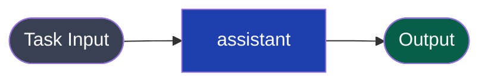
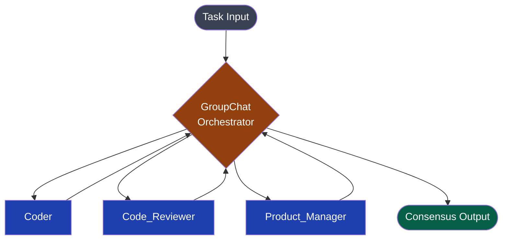
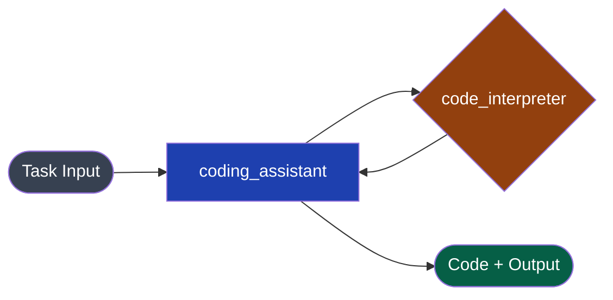
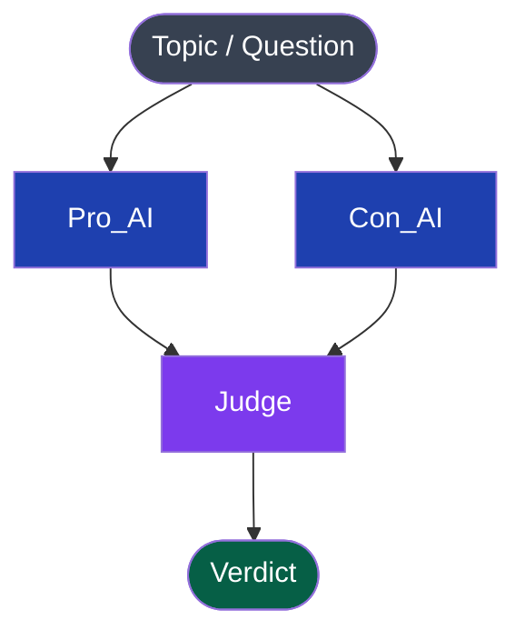

AutoGen models multi-agent collaboration as a **conversation** — agents exchange messages until a termination condition is met. The Swarms API maps this same collaborative pattern onto structured workflows with a clean REST interface, eliminating the need to manage conversation loops, termination strings, and local LLM configuration.

| AutoGen | Swarms API |
|---|---|
| `AssistantAgent(name, system_message, llm_config)` | `agent` with `agent_name`, `system_prompt`, `model_name` |
| `UserProxyAgent` | Not needed; task input is the top-level `task` field |
| `GroupChat(agents, messages, max_round)` | `GroupChat` swarm type |
| `GroupChatManager(groupchat, llm_config)` | Managed by the API |
| `agent.initiate_chat(recipient, message)` | `POST` request with `task` field |
| `ConversableAgent` | Any agent with `system_prompt` |
| `llm_config = {"model": "gpt-4o", "api_key": ...}` | `"model_name": "gpt-4o"` on agent spec |
| `max_consecutive_auto_reply` | `max_loops` on agent spec |
| `is_termination_msg` | Handled by workflow `max_loops` |
| `code_execution_config` | `"tools": ["code_interpreter"]` on agent spec |

---

## Side-by-Side: Basic Two-Agent Chat



### AutoGen

```python
import autogen

config_list = [{"model": "gpt-4o", "api_key": "sk-..."}]

assistant = autogen.AssistantAgent(
    name="assistant",
    system_message="You are a helpful AI assistant.",
    llm_config={"config_list": config_list},
)

user_proxy = autogen.UserProxyAgent(
    name="user_proxy",
    human_input_mode="NEVER",
    max_consecutive_auto_reply=3,
    is_termination_msg=lambda x: x.get("content", "").rstrip().endswith("TERMINATE"),
    code_execution_config=False,
)

user_proxy.initiate_chat(
    assistant,
    message="Explain the difference between supervised and unsupervised learning.",
)
```

### Swarms API

```python
import os
import requests

result = requests.post(
    "https://api.swarms.world/v1/agent/completions",
    headers={"x-api-key": os.environ["SWARMS_API_KEY"], "Content-Type": "application/json"},
    json={
        "agent_name": "assistant",
        "system_prompt": "You are a helpful AI assistant.",
        "task": "Explain the difference between supervised and unsupervised learning.",
        "model_name": "gpt-4o",
        "max_loops": 1,
        "temperature": 0.5,
    },
    timeout=60,
).json()

print(result["outputs"])
```

For a simple two-agent conversation where `UserProxy` only relays a message and `Assistant` responds, a single agent completion is all you need. The `UserProxyAgent` is not an AI agent — it just passes the task.

---

## Side-by-Side: GroupChat



### AutoGen

```python
import autogen

config_list = [{"model": "gpt-4o", "api_key": "sk-..."}]
llm_config = {"config_list": config_list, "cache_seed": 42}

coder = autogen.AssistantAgent(
    name="Coder",
    system_message="You are an expert software engineer. Write clean, efficient code.",
    llm_config=llm_config,
)

reviewer = autogen.AssistantAgent(
    name="Code_Reviewer",
    system_message="You are a senior code reviewer. Review code for bugs and best practices.",
    llm_config=llm_config,
)

product_manager = autogen.AssistantAgent(
    name="Product_Manager",
    system_message="You are a product manager. Ensure solutions meet business requirements.",
    llm_config=llm_config,
)

user_proxy = autogen.UserProxyAgent(
    name="User_Proxy",
    human_input_mode="NEVER",
    max_consecutive_auto_reply=0,
    code_execution_config=False,
)

groupchat = autogen.GroupChat(
    agents=[user_proxy, coder, reviewer, product_manager],
    messages=[],
    max_round=5,
)
manager = autogen.GroupChatManager(groupchat=groupchat, llm_config=llm_config)

user_proxy.initiate_chat(
    manager,
    message="Build a Python function that rates the readability of a text on a 1-10 scale.",
)
```

### Swarms API

```python
import os
import requests

result = requests.post(
    "https://api.swarms.world/v1/swarms/completions",
    headers={"x-api-key": os.environ["SWARMS_API_KEY"], "Content-Type": "application/json"},
    json={
        "name": "Software Development GroupChat",
        "description": "Collaborative group: coder, reviewer, and PM",
        "swarm_type": "GroupChat",
        "task": "Build a Python function that rates the readability of a text on a 1-10 scale.",
        "agents": [
            {
                "agent_name": "Coder",
                "system_prompt": "You are an expert software engineer. Write clean, efficient, well-documented code.",
                "model_name": "gpt-4o",
                "max_loops": 1,
                "temperature": 0.3,
            },
            {
                "agent_name": "Code_Reviewer",
                "system_prompt": "You are a senior code reviewer. Review code for bugs, edge cases, and best practices. Provide specific, actionable feedback.",
                "model_name": "gpt-4o",
                "max_loops": 1,
                "temperature": 0.2,
            },
            {
                "agent_name": "Product_Manager",
                "system_prompt": "You are a product manager. Ensure solutions meet business requirements, are maintainable, and deliver real user value.",
                "model_name": "gpt-4o",
                "max_loops": 1,
                "temperature": 0.3,
            },
        ],
        "max_loops": 5,
    },
    timeout=180,
).json()

print(result["outputs"])
```

**What changed:**
- `UserProxyAgent` → removed; the `task` field replaces it
- `GroupChatManager` → managed by the API
- `max_round=5` → `"max_loops": 5` at the top level
- `cache_seed` → not needed; the API is stateless
- `llm_config` per agent → `"model_name"` per agent

---

## Side-by-Side: Code Execution Agent



### AutoGen

```python
import autogen

config_list = [{"model": "gpt-4o", "api_key": "sk-..."}]

assistant = autogen.AssistantAgent(
    name="assistant",
    llm_config={"config_list": config_list},
)

user_proxy = autogen.UserProxyAgent(
    name="user_proxy",
    human_input_mode="NEVER",
    code_execution_config={
        "work_dir": "coding",
        "use_docker": False,
    },
)

user_proxy.initiate_chat(
    assistant,
    message="Write and execute a Python script that calculates the first 20 Fibonacci numbers.",
)
```

### Swarms API

```python
import os
import requests

result = requests.post(
    "https://api.swarms.world/v1/agent/completions",
    headers={"x-api-key": os.environ["SWARMS_API_KEY"], "Content-Type": "application/json"},
    json={
        "agent_name": "coding_assistant",
        "system_prompt": "You are an expert programmer. Write correct, efficient Python code and explain what it does.",
        "task": "Write a Python script that calculates the first 20 Fibonacci numbers.",
        "model_name": "gpt-4o",
        "tools": ["code_interpreter"],
        "max_loops": 1,
        "temperature": 0.2,
    },
    timeout=90,
).json()

print(result["outputs"])
```

---

## Side-by-Side: Multi-Agent Debate Pattern

AutoGen is often used for debate-style workflows where agents argue positions. The Swarms API has a dedicated `DebateWithJudge` architecture for this.



### AutoGen

```python
import autogen

config_list = [{"model": "gpt-4o", "api_key": "sk-..."}]

pro_agent = autogen.AssistantAgent(
    name="Pro_AI",
    system_message="You argue FOR AI replacing human jobs. Present strong evidence.",
    llm_config={"config_list": config_list},
)

con_agent = autogen.AssistantAgent(
    name="Con_AI",
    system_message="You argue AGAINST AI replacing human jobs. Present strong evidence.",
    llm_config={"config_list": config_list},
)

judge = autogen.AssistantAgent(
    name="Judge",
    system_message="You are a neutral judge. After both sides present, give a balanced verdict.",
    llm_config={"config_list": config_list},
)

groupchat = autogen.GroupChat(
    agents=[pro_agent, con_agent, judge],
    messages=[],
    max_round=6,
)
manager = autogen.GroupChatManager(groupchat=groupchat, llm_config={"config_list": config_list})
pro_agent.initiate_chat(manager, message="Will AI replace most human jobs in the next 20 years?")
```

### Swarms API

```python
import os
import requests

result = requests.post(
    "https://api.swarms.world/v1/swarms/completions",
    headers={"x-api-key": os.environ["SWARMS_API_KEY"], "Content-Type": "application/json"},
    json={
        "name": "AI Jobs Debate",
        "description": "Two agents debate, a judge decides",
        "swarm_type": "DebateWithJudge",
        "task": "Will AI replace most human jobs in the next 20 years?",
        "agents": [
            {
                "agent_name": "Pro_AI",
                "system_prompt": "You argue FOR AI replacing most human jobs in the next 20 years. Present compelling evidence, statistics, and historical precedents.",
                "model_name": "gpt-4o",
                "max_loops": 1,
                "temperature": 0.6,
            },
            {
                "agent_name": "Con_AI",
                "system_prompt": "You argue AGAINST AI replacing most human jobs. Present economic theory, counterexamples, and evidence for human adaptability.",
                "model_name": "gpt-4o",
                "max_loops": 1,
                "temperature": 0.6,
            },
            {
                "agent_name": "Judge",
                "system_prompt": "You are a neutral judge and critical thinker. After both sides present their arguments, evaluate the quality of evidence, logical coherence, and give a balanced, reasoned verdict.",
                "model_name": "gpt-4o",
                "max_loops": 1,
                "temperature": 0.3,
            },
        ],
        "max_loops": 3,
    },
    timeout=180,
).json()

print(result["outputs"])
```

---

## LLM Configuration Migration

AutoGen requires per-agent `llm_config` dicts with API keys and model lists. The Swarms API handles all authentication — you just specify the model name.

### AutoGen

```python
config_list = [
    {
        "model": "gpt-4o",
        "api_key": os.environ["OPENAI_API_KEY"],
        "base_url": "https://api.openai.com/v1",
    }
]

llm_config = {
    "config_list": config_list,
    "temperature": 0.7,
    "max_tokens": 2000,
    "cache_seed": 42,
    "timeout": 120,
}

agent = autogen.AssistantAgent(
    name="my_agent",
    llm_config=llm_config,
)
```

### Swarms API

```python
# No API keys per model, no config_list, no cache_seed
{
    "agent_name": "my_agent",
    "system_prompt": "...",
    "model_name": "gpt-4o",
    "temperature": 0.7,
    "max_tokens": 2000,
    "max_loops": 1,
}
```

The Swarms API supports 300+ models. See [Available Models](/docs/examples/examples/models-available) for the full list.

---

## Termination Conditions

AutoGen uses `is_termination_msg` callbacks to stop conversations. The Swarms API uses `max_loops` to bound execution.

### AutoGen

```python
def termination_check(msg):
    return msg.get("content", "").rstrip().endswith("TERMINATE")

agent = autogen.UserProxyAgent(
    name="user",
    is_termination_msg=termination_check,
    max_consecutive_auto_reply=10,
)
```

### Swarms API

```python
{
    "swarm_type": "GroupChat",
    "task": "...",
    "agents": [...],
    "max_loops": 5,
}
```

---

## Key Differences to Keep in Mind

| Concern | AutoGen | Swarms API |
|---|---|---|
| Conversation history | Managed in-memory per session | Stateless; each request is independent |
| Human input | `human_input_mode="ALWAYS"` | Not supported in API mode |
| Code execution | Docker or local subprocess | Cloud sandbox via `"tools": ["code_interpreter"]` |
| Function calling | `register_function()` | `"tools"` array with built-in tool names |
| Nested chats | `register_nested_chats()` | Use `HierarchicalSwarm` or `GraphWorkflow` |
| Cost / token tracking | Via OpenAI usage logs | `usage.token_cost` in every response |
| Caching | `cache_seed` on `llm_config` | Not applicable; no local cache |

---

## Related Resources

- [GroupChat](/docs/documentation/multi-agent/group_chat)
- [Debate with Judge](/docs/documentation/multi-agent/debate_with_judge)
- [Hierarchical Swarm](/docs/documentation/multi-agent/hierarchical_swarm)
- [Migration Overview](/docs/guides/migration/overview)
