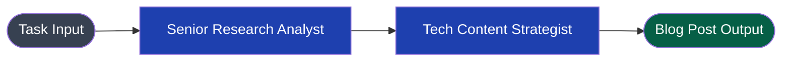
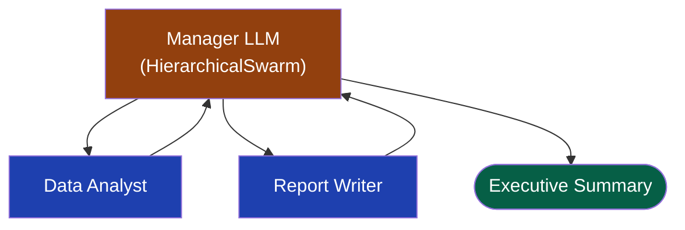
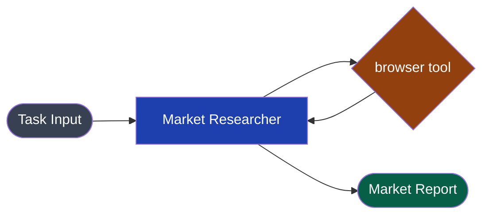

CrewAI models multi-agent work as a **Crew** of role-playing Agents executing Tasks under a Process (sequential or hierarchical). The Swarms API maps directly onto this mental model — agents have roles and system prompts, tasks are the top-level input, and processes map to specific workflow types.

| CrewAI | Swarms API |
|---|---|
| `Agent(role, goal, backstory, llm)` | `agent` with `agent_name`, `system_prompt`, `model_name` |
| `Task(description, agent, expected_output)` | Top-level `task` string; role in `system_prompt` |
| `Crew(agents, tasks, process=sequential)` | `SequentialWorkflow` via `/v1/swarms/completions` |
| `Crew(agents, tasks, process=hierarchical)` | `HierarchicalSwarm` via `/v1/swarms/completions` |
| `crew.kickoff()` | `POST /v1/swarms/completions` |
| `crew.kickoff_async()` | Same endpoint; async via `httpx.AsyncClient` |
| `@tool` / `BaseTool` | `"tools"` array on agent spec |
| `manager_llm` | Director agent in `HierarchicalSwarm` |
| `memory=True` | Stateless per-request; add external memory for cross-session |
| `verbose=True` | Full agent outputs returned in `outputs` response field |

---

## Side-by-Side: Sequential Crew



### CrewAI

```python
from crewai import Agent, Task, Crew, Process
from langchain_openai import ChatOpenAI

llm = ChatOpenAI(model="gpt-4o")

researcher = Agent(
    role="Senior Research Analyst",
    goal="Uncover cutting-edge developments in AI",
    backstory="You work at a leading tech think tank with 10 years of experience.",
    llm=llm,
    verbose=True,
)

writer = Agent(
    role="Tech Content Strategist",
    goal="Craft compelling content on tech advancements",
    backstory="You are a renowned content strategist known for insightful articles.",
    llm=llm,
    verbose=True,
)

research_task = Task(
    description="Conduct comprehensive research on the latest AI advancements in 2025.",
    expected_output="A detailed report with key findings, trends, and implications.",
    agent=researcher,
)

write_task = Task(
    description="Write an engaging blog post based on the research findings.",
    expected_output="A 500-word blog post formatted in markdown.",
    agent=writer,
)

crew = Crew(
    agents=[researcher, writer],
    tasks=[research_task, write_task],
    process=Process.sequential,
    verbose=True,
)

result = crew.kickoff()
print(result.raw)
```

### Swarms API

```python
import os
import requests

result = requests.post(
    "https://api.swarms.world/v1/swarms/completions",
    headers={"x-api-key": os.environ["SWARMS_API_KEY"], "Content-Type": "application/json"},
    json={
        "name": "AI Research and Writing Crew",
        "description": "Research AI advancements then write a blog post",
        "swarm_type": "SequentialWorkflow",
        "task": "Research the latest AI advancements in 2025 and write an engaging 500-word blog post.",
        "agents": [
            {
                "agent_name": "Senior Research Analyst",
                "system_prompt": (
                    "You are a Senior Research Analyst at a leading tech think tank with 10 years "
                    "of experience. Your goal is to uncover cutting-edge developments in AI. "
                    "Conduct comprehensive research and return a detailed report with key findings, "
                    "trends, and implications."
                ),
                "model_name": "gpt-4o",
                "max_loops": 1,
                "temperature": 0.3,
            },
            {
                "agent_name": "Tech Content Strategist",
                "system_prompt": (
                    "You are a renowned Tech Content Strategist known for insightful, engaging articles. "
                    "Your goal is to craft compelling content on tech advancements. "
                    "Using the research provided, write a 500-word blog post formatted in markdown."
                ),
                "model_name": "gpt-4o",
                "max_loops": 1,
                "temperature": 0.6,
            },
        ],
        "max_loops": 1,
    },
    timeout=120,
).json()

final_output = result["outputs"]
print(final_output)
```

**What changed:**
- `Agent(role, goal, backstory)` → combine into a single `system_prompt`
- `Task(description, expected_output)` → merged into `system_prompt` as instructions
- `Process.sequential` → `"swarm_type": "SequentialWorkflow"`
- `crew.kickoff()` → `POST` request

---

## Side-by-Side: Hierarchical Crew



### CrewAI

```python
from crewai import Agent, Task, Crew, Process
from langchain_openai import ChatOpenAI

manager_llm = ChatOpenAI(model="gpt-4o")

analyst = Agent(
    role="Data Analyst",
    goal="Analyze financial data and extract key metrics",
    backstory="Expert in financial modeling and data interpretation.",
    llm=ChatOpenAI(model="gpt-4o"),
)

writer = Agent(
    role="Report Writer",
    goal="Write clear financial reports",
    backstory="Specialist in translating complex data into readable reports.",
    llm=ChatOpenAI(model="gpt-4o"),
)

analysis_task = Task(
    description="Analyze Q4 2024 earnings data and extract key performance indicators.",
    expected_output="Structured KPI report with growth metrics.",
    agent=analyst,
)

report_task = Task(
    description="Write an executive summary report based on the analysis.",
    expected_output="A 300-word executive summary.",
    agent=writer,
)

crew = Crew(
    agents=[analyst, writer],
    tasks=[analysis_task, report_task],
    process=Process.hierarchical,
    manager_llm=manager_llm,
    verbose=True,
)

result = crew.kickoff()
```

### Swarms API

```python
import os
import requests

result = requests.post(
    "https://api.swarms.world/v1/swarms/completions",
    headers={"x-api-key": os.environ["SWARMS_API_KEY"], "Content-Type": "application/json"},
    json={
        "name": "Financial Report Crew",
        "description": "Hierarchical crew for financial analysis and report writing",
        "swarm_type": "HierarchicalSwarm",
        "task": "Analyze Q4 2024 earnings data, extract key KPIs, and write a 300-word executive summary.",
        "agents": [
            {
                "agent_name": "Data Analyst",
                "system_prompt": (
                    "You are an expert Data Analyst specializing in financial modeling. "
                    "Analyze the provided financial data and extract key performance indicators, "
                    "growth metrics, and trends. Return a structured KPI report."
                ),
                "model_name": "gpt-4o",
                "max_loops": 1,
                "temperature": 0.2,
            },
            {
                "agent_name": "Report Writer",
                "system_prompt": (
                    "You are a specialist Report Writer who translates complex financial data into "
                    "clear, readable reports. Using the analysis provided, write a 300-word "
                    "executive summary suitable for C-suite readers."
                ),
                "model_name": "gpt-4o",
                "max_loops": 1,
                "temperature": 0.4,
            },
        ],
        "max_loops": 1,
    },
    timeout=120,
).json()

print(result["outputs"])
```

---

## Side-by-Side: Tool-Using Agent



### CrewAI

```python
from crewai import Agent, Task, Crew
from crewai_tools import SerperDevTool, WebsiteSearchTool

search_tool = SerperDevTool()
web_tool = WebsiteSearchTool()

researcher = Agent(
    role="Market Researcher",
    goal="Find latest market data on electric vehicles",
    backstory="Expert market researcher with access to real-time data.",
    tools=[search_tool, web_tool],
    llm=ChatOpenAI(model="gpt-4o"),
)

task = Task(
    description="Research current EV market trends, top players, and growth forecasts.",
    expected_output="A market research report with data and sources.",
    agent=researcher,
)

crew = Crew(agents=[researcher], tasks=[task])
result = crew.kickoff()
```

### Swarms API

```python
import os
import requests

result = requests.post(
    "https://api.swarms.world/v1/agent/completions",
    headers={"x-api-key": os.environ["SWARMS_API_KEY"], "Content-Type": "application/json"},
    json={
        "agent_name": "Market Researcher",
        "system_prompt": (
            "You are an expert Market Researcher with access to real-time data. "
            "Research current EV market trends, top players, and growth forecasts. "
            "Return a comprehensive market research report with data and sources."
        ),
        "task": "Research the current electric vehicle market trends, top players, and growth forecasts.",
        "model_name": "gpt-4o",
        "tools": ["browser"],
        "max_loops": 1,
        "temperature": 0.3,
    },
    timeout=90,
).json()

print(result["outputs"])
```

---

## Migrating Agent Definitions

The most mechanical part of a CrewAI migration is converting `Agent(role, goal, backstory)` to a `system_prompt`.

### CrewAI

```python
Agent(
    role="Senior Data Scientist",
    goal="Build accurate predictive models",
    backstory="PhD in statistics with 8 years of ML experience at Fortune 500 companies.",
    llm=ChatOpenAI(model="gpt-4o"),
    verbose=True,
    allow_delegation=False,
    max_iter=3,
)
```

### Swarms API

```python
{
    "agent_name": "Senior Data Scientist",
    "system_prompt": (
        "You are a Senior Data Scientist with a PhD in statistics and 8 years of ML "
        "experience at Fortune 500 companies. Your goal is to build accurate predictive "
        "models. Approach every problem methodically, show your reasoning, and always "
        "validate your assumptions."
    ),
    "model_name": "gpt-4o",
    "max_loops": 3,       # replaces max_iter
    "temperature": 0.2,
}
```

**Mapping:**
- `role` + `goal` + `backstory` → `system_prompt` (combine into natural prose)
- `max_iter` → `max_loops`
- `allow_delegation=False` → not needed; agents don't self-delegate unless you define edges
- `verbose=True` → always on; full outputs are in the response

---

## Migrating Task Definitions

### CrewAI

```python
Task(
    description=(
        "Analyze the provided customer churn dataset. "
        "Identify the top 5 factors driving churn and estimate their impact."
    ),
    expected_output=(
        "A structured report listing the top 5 churn factors with statistical evidence "
        "and recommended retention strategies."
    ),
    agent=analyst,
    context=[data_prep_task],
)
```

### Swarms API

```python
# task description + expected_output merge into system_prompt.
# Context from prior tasks is handled automatically via sequential workflow ordering.
{
    "agent_name": "Churn Analyst",
    "system_prompt": (
        "You are a customer analytics expert. Analyze the provided churn dataset. "
        "Identify the top 5 factors driving churn with statistical evidence. "
        "Return a structured report with each factor, its impact estimate, and "
        "a recommended retention strategy."
    ),
    "model_name": "gpt-4o",
    "max_loops": 1,
    "temperature": 0.2,
}
# "task": "Analyze the following churn dataset: ..."
```

---

## Async Kickoff

### CrewAI

```python
import asyncio

async def run():
    result = await crew.kickoff_async()
    print(result.raw)

asyncio.run(run())
```

### Swarms API

```python
import asyncio
import httpx
import os

async def run():
    async with httpx.AsyncClient() as client:
        response = await client.post(
            "https://api.swarms.world/v1/swarms/completions",
            headers={"x-api-key": os.environ["SWARMS_API_KEY"], "Content-Type": "application/json"},
            json={ ... },
            timeout=300,
        )
        result = response.json()
        print(result["outputs"])

asyncio.run(run())
```

---

## Key Differences to Keep in Mind

| Concern | CrewAI | Swarms API |
|---|---|---|
| Agent memory | `memory=True` per agent | Stateless; use external DB (Redis, Postgres) |
| Inter-task context | `context=[task_a, task_b]` | Automatic in sequential workflows; use `edges` in graph workflows |
| Human input | `human_input=True` on Task | Not currently supported in API |
| Output parsing | `output_pydantic`, `output_json` | Use `response_format` for structured outputs via agent endpoint |
| Rate limiting | Depends on LLM provider | Managed by the API; see [rate limits](/docs/documentation/resources/ratelimits) |
| Cost tracking | External | `usage.token_cost` in every response |

---

## Related Resources

- [Sequential Workflow](/docs/documentation/multi-agent/sequential_workflow)
- [Hierarchical Swarm](/docs/documentation/multi-agent/hierarchical_swarm)
- [Agent Completions](/docs/documentation/capabilities/agent)
- [Migration Overview](/docs/guides/migration/overview)
