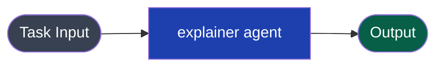
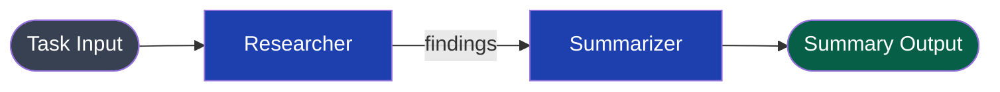
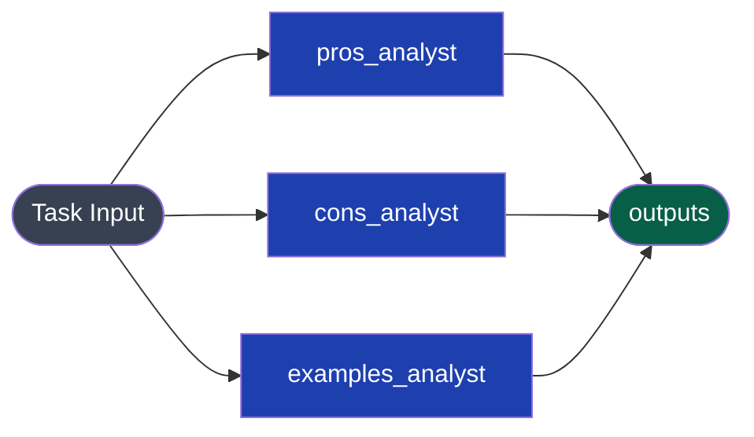
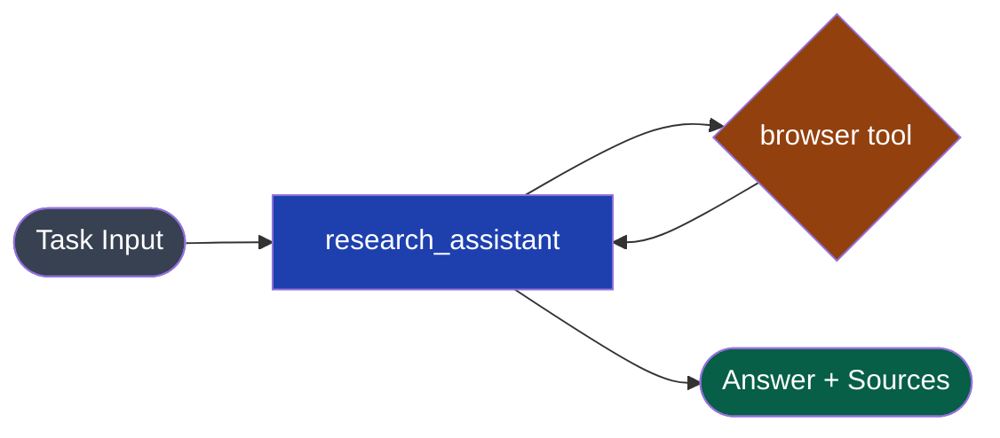

LangChain provides Python building blocks — `LLMChain`, `AgentExecutor`, LCEL pipes — for constructing AI workflows locally. The Swarms API replaces this entire stack with a single REST endpoint: you describe your agents and workflow in JSON and the API handles orchestration, model routing, retries, and billing.

| LangChain | Swarms API |
|---|---|
| `LLMChain(llm, prompt)` | Single agent completion via `/v1/agent/completions` |
| `SequentialChain([chain_a, chain_b])` | `SequentialWorkflow` via `/v1/swarms/completions` |
| `RunnableParallel({a: chain_a, b: chain_b})` | `ConcurrentWorkflow` via `/v1/swarms/completions` |
| `AgentExecutor(agent, tools)` | Agent with `"tools"` array |
| `ChatPromptTemplate.from_messages([...])` | `system_prompt` + `task` fields |
| `chain_a | chain_b` (LCEL pipe) | `SequentialWorkflow` with agents in order |
| `chain.invoke({"input": "..."})` | `POST` request with `"task": "..."` |
| `chain.stream({"input": "..."})` | Streaming endpoint (see [Streaming](/docs/examples/examples/streaming)) |
| `chain.batch([input1, input2])` | `ConcurrentWorkflow` or batch endpoint |
| `ConversationBufferMemory` | Stateless; manage conversation history externally |
| `Tool(name, func, description)` | `"tools"` array with built-in tool names |
| `ChatOpenAI(model="gpt-4o")` | `"model_name": "gpt-4o"` on agent spec |

---

## Side-by-Side: Simple LLMChain



### LangChain

```python
from langchain_openai import ChatOpenAI
from langchain_core.prompts import ChatPromptTemplate
from langchain_core.output_parsers import StrOutputParser

llm = ChatOpenAI(model="gpt-4o", temperature=0.5)

prompt = ChatPromptTemplate.from_messages([
    ("system", "You are a helpful assistant that explains complex topics simply."),
    ("human", "{topic}"),
])

chain = prompt | llm | StrOutputParser()
result = chain.invoke({"topic": "How does transformer attention work?"})
print(result)
```

### Swarms API

```python
import os
import requests

result = requests.post(
    "https://api.swarms.world/v1/agent/completions",
    headers={"x-api-key": os.environ["SWARMS_API_KEY"], "Content-Type": "application/json"},
    json={
        "agent_name": "explainer",
        "system_prompt": "You are a helpful assistant that explains complex topics simply.",
        "task": "How does transformer attention work?",
        "model_name": "gpt-4o",
        "max_loops": 1,
        "temperature": 0.5,
    },
    timeout=60,
).json()

print(result["outputs"])
```

---

## Side-by-Side: SequentialChain (LCEL Pipe)



### LangChain

```python
from langchain_openai import ChatOpenAI
from langchain_core.prompts import ChatPromptTemplate
from langchain_core.output_parsers import StrOutputParser

llm = ChatOpenAI(model="gpt-4o")

research_prompt = ChatPromptTemplate.from_messages([
    ("system", "You are a research specialist. Research the topic thoroughly."),
    ("human", "Research this topic: {topic}"),
])

summary_prompt = ChatPromptTemplate.from_messages([
    ("system", "You are a skilled summarizer. Create a concise summary."),
    ("human", "Summarize this research:\n\n{research}"),
])

research_chain = research_prompt | llm | StrOutputParser()
summary_chain = summary_prompt | llm | StrOutputParser()

full_chain = research_chain | (lambda x: {"research": x}) | summary_chain

result = full_chain.invoke({"topic": "Quantum computing applications in cryptography"})
print(result)
```

### Swarms API

```python
import os
import requests

result = requests.post(
    "https://api.swarms.world/v1/swarms/completions",
    headers={"x-api-key": os.environ["SWARMS_API_KEY"], "Content-Type": "application/json"},
    json={
        "name": "Research and Summarize",
        "description": "Research a topic then produce a concise summary",
        "swarm_type": "SequentialWorkflow",
        "task": "Research quantum computing applications in cryptography",
        "agents": [
            {
                "agent_name": "Researcher",
                "system_prompt": "You are a research specialist. Research the given topic thoroughly and return detailed findings with key facts, current developments, and important context.",
                "model_name": "gpt-4o",
                "max_loops": 1,
                "temperature": 0.3,
            },
            {
                "agent_name": "Summarizer",
                "system_prompt": "You are a skilled summarizer. Read the research provided and produce a clear, concise 3-paragraph summary that captures the essential points.",
                "model_name": "gpt-4o",
                "max_loops": 1,
                "temperature": 0.4,
            },
        ],
        "max_loops": 1,
    },
    timeout=120,
).json()

print(result["outputs"])
```

No lambdas or output-passing glue code needed — the sequential workflow passes each agent's output to the next automatically.

---

## Side-by-Side: RunnableParallel



### LangChain

```python
from langchain_core.runnables import RunnableParallel
from langchain_openai import ChatOpenAI
from langchain_core.prompts import ChatPromptTemplate
from langchain_core.output_parsers import StrOutputParser

llm = ChatOpenAI(model="gpt-4o")

pros_chain = (
    ChatPromptTemplate.from_template("List the pros of {topic}") | llm | StrOutputParser()
)
cons_chain = (
    ChatPromptTemplate.from_template("List the cons of {topic}") | llm | StrOutputParser()
)
examples_chain = (
    ChatPromptTemplate.from_template("Give real-world examples of {topic}") | llm | StrOutputParser()
)

parallel_chain = RunnableParallel(
    pros=pros_chain,
    cons=cons_chain,
    examples=examples_chain,
)

result = parallel_chain.invoke({"topic": "remote work"})
print(result["pros"])
print(result["cons"])
print(result["examples"])
```

### Swarms API

```python
import os
import requests

result = requests.post(
    "https://api.swarms.world/v1/swarms/completions",
    headers={"x-api-key": os.environ["SWARMS_API_KEY"], "Content-Type": "application/json"},
    json={
        "name": "Parallel Analysis",
        "description": "Three perspectives on remote work in parallel",
        "swarm_type": "ConcurrentWorkflow",
        "task": "Analyze remote work from your specific perspective.",
        "agents": [
            {
                "agent_name": "pros_analyst",
                "system_prompt": "You analyze ONLY the pros and benefits of the given topic. List them clearly with brief explanations.",
                "model_name": "gpt-4o",
                "max_loops": 1,
                "temperature": 0.4,
            },
            {
                "agent_name": "cons_analyst",
                "system_prompt": "You analyze ONLY the cons and drawbacks of the given topic. List them clearly with brief explanations.",
                "model_name": "gpt-4o",
                "max_loops": 1,
                "temperature": 0.4,
            },
            {
                "agent_name": "examples_analyst",
                "system_prompt": "You provide ONLY real-world examples and case studies related to the given topic. Be specific with company names and outcomes.",
                "model_name": "gpt-4o",
                "max_loops": 1,
                "temperature": 0.3,
            },
        ],
        "max_loops": 1,
    },
    timeout=90,
).json()

outputs = result["outputs"]
print(outputs["pros_analyst"])
print(outputs["cons_analyst"])
print(outputs["examples_analyst"])
```

---

## Side-by-Side: AgentExecutor with Tools



### LangChain

```python
from langchain_openai import ChatOpenAI
from langchain.agents import AgentExecutor, create_openai_tools_agent
from langchain_core.prompts import ChatPromptTemplate, MessagesPlaceholder
from langchain_community.tools.tavily_search import TavilySearchResults
from langchain_core.tools import tool

llm = ChatOpenAI(model="gpt-4o", temperature=0)
search = TavilySearchResults(max_results=3)

@tool
def get_word_length(word: str) -> int:
    """Returns the number of characters in a word."""
    return len(word)

tools = [search, get_word_length]

prompt = ChatPromptTemplate.from_messages([
    ("system", "You are a helpful research assistant."),
    ("human", "{input}"),
    MessagesPlaceholder(variable_name="agent_scratchpad"),
])

agent = create_openai_tools_agent(llm, tools, prompt)
executor = AgentExecutor(agent=agent, tools=tools, verbose=True)

result = executor.invoke({"input": "What is the current population of Japan?"})
print(result["output"])
```

### Swarms API

```python
import os
import requests

result = requests.post(
    "https://api.swarms.world/v1/agent/completions",
    headers={"x-api-key": os.environ["SWARMS_API_KEY"], "Content-Type": "application/json"},
    json={
        "agent_name": "research_assistant",
        "system_prompt": "You are a helpful research assistant. Use available tools to find accurate, up-to-date information.",
        "task": "What is the current population of Japan?",
        "model_name": "gpt-4o",
        "tools": ["browser"],
        "max_loops": 3,
        "temperature": 0.2,
    },
    timeout=90,
).json()

print(result["outputs"])
```

See [Available Tools](/docs/examples/examples/available-tools) for the full list of built-in tools.

---

## Side-by-Side: Streaming


### LangChain

```python
from langchain_openai import ChatOpenAI
from langchain_core.prompts import ChatPromptTemplate

llm = ChatOpenAI(model="gpt-4o", streaming=True)
prompt = ChatPromptTemplate.from_template("Tell me a short story about {topic}")
chain = prompt | llm

for chunk in chain.stream({"topic": "a robot learning to paint"}):
    print(chunk.content, end="", flush=True)
```

### Swarms API

```python
import os
import requests

with requests.post(
    "https://api.swarms.world/v1/agent/completions/stream",
    headers={"x-api-key": os.environ["SWARMS_API_KEY"], "Content-Type": "application/json"},
    json={
        "agent_name": "storyteller",
        "system_prompt": "You are a creative storyteller.",
        "task": "Tell me a short story about a robot learning to paint.",
        "model_name": "gpt-4o",
        "max_loops": 1,
        "temperature": 0.7,
        "stream": True,
    },
    stream=True,
    timeout=120,
) as response:
    for chunk in response.iter_content(chunk_size=None):
        print(chunk.decode(), end="", flush=True)
```

See the [Streaming guide](/docs/examples/examples/streaming) for full details.

---

## Prompt Templates → System Prompts

LangChain's `ChatPromptTemplate` separates system messages from human messages. In the Swarms API, system instructions go in `system_prompt` and the user's request goes in `task`.

### LangChain

```python
prompt = ChatPromptTemplate.from_messages([
    ("system", "You are an expert {role}. Always respond in {language}."),
    ("human", "{question}"),
])

chain = prompt | llm | StrOutputParser()
result = chain.invoke({
    "role": "Python developer",
    "language": "English",
    "question": "What is a decorator?",
})
```

### Swarms API

```python
result = requests.post(
    "https://api.swarms.world/v1/agent/completions",
    headers={"x-api-key": os.environ["SWARMS_API_KEY"], "Content-Type": "application/json"},
    json={
        "agent_name": "python_expert",
        "system_prompt": "You are an expert Python developer. Always respond clearly and concisely in English.",
        "task": "What is a decorator?",
        "model_name": "gpt-4o",
        "max_loops": 1,
        "temperature": 0.3,
    },
    timeout=60,
).json()

print(result["outputs"])
```

Variables that were filled in via `ChatPromptTemplate` are simply inlined into the `system_prompt` string.

---

## Structured Output

### LangChain

```python
from langchain_openai import ChatOpenAI
from pydantic import BaseModel, Field

class Sentiment(BaseModel):
    label: str = Field(description="positive, negative, or neutral")
    score: float = Field(description="confidence score 0-1")
    reasoning: str = Field(description="brief explanation")

llm = ChatOpenAI(model="gpt-4o")
structured_llm = llm.with_structured_output(Sentiment)

result = structured_llm.invoke("I absolutely love this product!")
print(result.label, result.score)
```

### Swarms API

```python
import os, json, requests

result = requests.post(
    "https://api.swarms.world/v1/agent/completions",
    headers={"x-api-key": os.environ["SWARMS_API_KEY"], "Content-Type": "application/json"},
    json={
        "agent_name": "sentiment_analyzer",
        "system_prompt": "You are a sentiment analysis model. Always respond with valid JSON only.",
        "task": "Analyze the sentiment of: 'I absolutely love this product!'",
        "model_name": "gpt-4o",
        "max_loops": 1,
        "temperature": 0.1,
        "response_format": {"type": "json_object"},
    },
    timeout=60,
).json()

sentiment = json.loads(result["outputs"])
print(sentiment["label"], sentiment["score"])
```

See [Structured Outputs](/docs/examples/examples/structured-outputs) for full details.

---

## Memory and Conversation History

LangChain's `ConversationBufferMemory` persists chat history between chain calls. The Swarms API is stateless — maintain history externally and pass it in the `task` field.

### LangChain

```python
from langchain.memory import ConversationBufferMemory
from langchain.chains import ConversationChain
from langchain_openai import ChatOpenAI

memory = ConversationBufferMemory()
chain = ConversationChain(llm=ChatOpenAI(model="gpt-4o"), memory=memory)

chain.predict(input="Hi, my name is Alice.")
chain.predict(input="What is my name?")
```

### Swarms API

```python
import os
import requests

conversation_history = []

def chat(user_message: str) -> str:
    conversation_history.append(f"User: {user_message}")
    context = "\n".join(conversation_history)

    result = requests.post(
        "https://api.swarms.world/v1/agent/completions",
        headers={"x-api-key": os.environ["SWARMS_API_KEY"], "Content-Type": "application/json"},
        json={
            "agent_name": "conversational_agent",
            "system_prompt": "You are a friendly conversational assistant. Use the conversation history provided to give contextually aware responses.",
            "task": f"Conversation so far:\n{context}\n\nRespond to the last user message.",
            "model_name": "gpt-4o",
            "max_loops": 1,
            "temperature": 0.5,
        },
        timeout=60,
    ).json()

    reply = result["outputs"]
    conversation_history.append(f"Assistant: {reply}")
    return reply

print(chat("Hi, my name is Alice."))
print(chat("What is my name?"))
```

---

## Key Differences to Keep in Mind

| Concern | LangChain | Swarms API |
|---|---|---|
| LCEL composition | `chain_a | chain_b` pipe syntax | `SequentialWorkflow` with agents in order |
| Memory | `ConversationBufferMemory`, `VectorStoreRetriever` | Stateless; manage externally |
| Streaming | `.stream()` / `.astream()` | Dedicated `/stream` endpoint |
| Callbacks | `callbacks=[...]` on chain/agent | Not needed; all outputs returned in response |
| Retry logic | `with_retry()` | Handled server-side |
| Fallbacks | `with_fallbacks([...])` | `model_name` can be swapped per agent |
| Output parsers | `StrOutputParser`, `PydanticOutputParser` | `response_format: {type: "json_object"}` |
| Vector stores / RAG | `VectorStoreRetriever` | Pass retrieved context directly in `task` |
| Embeddings | `OpenAIEmbeddings`, etc. | Not needed in the API; use external embedding service |

---

## Related Resources

- [Sequential Workflow](/docs/documentation/multi-agent/sequential_workflow)
- [Concurrent Workflow](/docs/documentation/multi-agent/concurrent_workflow)
- [Agent Completions](/docs/documentation/capabilities/agent)
- [Streaming](/docs/examples/examples/streaming)
- [Structured Outputs](/docs/examples/examples/structured-outputs)
- [Migration Overview](/docs/guides/migration/overview)
