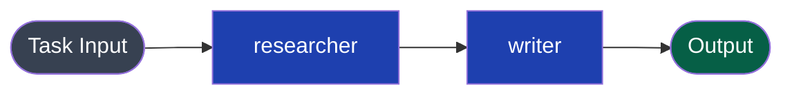
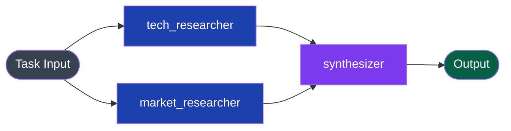
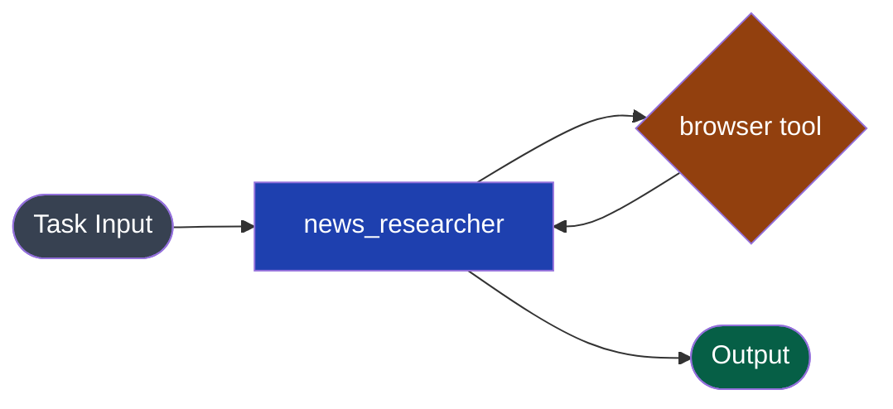
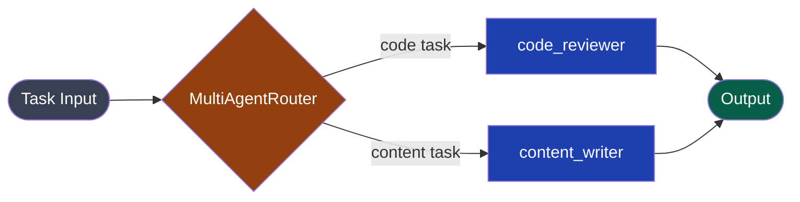

LangGraph lets you define multi-agent workflows as a compiled `StateGraph` where nodes are Python callables and edges define control flow. The Swarms API exposes the same directed-graph model as a REST endpoint — no Python environment required, no graph compilation step, and parallel execution is handled server-side.

| LangGraph | Swarms API |
|---|---|
| `StateGraph` | `GraphWorkflow` via `/v1/graph-workflow/completions` |
| Node (callable / Runnable) | `agent` object in `agents` array |
| `graph.add_edge(a, b)` | `{"source": "a", "target": "b"}` in `edges` |
| `graph.add_conditional_edges` | Use `MultiAgentRouter` for routing logic |
| `graph.set_entry_point(node)` | `"entry_points": ["node_name"]` |
| State dict (`TypedDict`) | Outputs from each agent automatically forwarded downstream |
| `graph.compile()` | Not needed — configuration is declarative JSON |
| `graph.invoke({"messages": [...]})` | `"task": "..."` top-level field in the request body |
| `ToolNode` / `bind_tools` | `"tools": ["browser", "code_interpreter"]` on agent |

---

## Side-by-Side: Simple Two-Node Chain



### LangGraph

```python
from langgraph.graph import StateGraph, END
from langchain_openai import ChatOpenAI
from typing import TypedDict

llm = ChatOpenAI(model="gpt-4o")

class State(TypedDict):
    messages: list

def researcher(state: State) -> State:
    response = llm.invoke(state["messages"])
    return {"messages": state["messages"] + [response]}

def writer(state: State) -> State:
    response = llm.invoke(state["messages"])
    return {"messages": state["messages"] + [response]}

graph = StateGraph(State)
graph.add_node("researcher", researcher)
graph.add_node("writer", writer)
graph.add_edge("researcher", "writer")
graph.add_edge("writer", END)
graph.set_entry_point("researcher")

app = graph.compile()
result = app.invoke({"messages": [{"role": "user", "content": "Research and write about AI trends"}]})
```

### Swarms API

```python
import os
import requests

result = requests.post(
    "https://api.swarms.world/v1/graph-workflow/completions",
    headers={"x-api-key": os.environ["SWARMS_API_KEY"], "Content-Type": "application/json"},
    json={
        "name": "Research and Write",
        "description": "Research a topic then write about it",
        "task": "Research and write about AI trends",
        "agents": [
            {
                "agent_name": "researcher",
                "system_prompt": "You are a research specialist. Investigate the topic thoroughly and return detailed findings.",
                "model_name": "gpt-4o",
                "max_loops": 1,
                "temperature": 0.3,
            },
            {
                "agent_name": "writer",
                "system_prompt": "You are a professional writer. Using the research provided, write an engaging, well-structured article.",
                "model_name": "gpt-4o",
                "max_loops": 1,
                "temperature": 0.6,
            },
        ],
        "edges": [
            {"source": "researcher", "target": "writer"},
        ],
        "entry_points": ["researcher"],
        "end_points": ["writer"],
        "max_loops": 1,
    },
    timeout=120,
).json()

print(result["outputs"]["writer"])
```

---

## Side-by-Side: Parallel Fan-in Graph

The pattern of running multiple nodes in parallel and merging their outputs into a single node is directly supported.



### LangGraph

```python
from langgraph.graph import StateGraph, END
from langchain_openai import ChatOpenAI
from typing import TypedDict, Annotated
import operator

llm = ChatOpenAI(model="gpt-4o")

class State(TypedDict):
    topic: str
    tech_research: str
    market_research: str
    final_report: str

def tech_researcher(state: State) -> State:
    result = llm.invoke(f"Research technical aspects of: {state['topic']}")
    return {"tech_research": result.content}

def market_researcher(state: State) -> State:
    result = llm.invoke(f"Research market trends for: {state['topic']}")
    return {"market_research": result.content}

def synthesizer(state: State) -> State:
    prompt = f"Synthesize these findings:\nTech: {state['tech_research']}\nMarket: {state['market_research']}"
    result = llm.invoke(prompt)
    return {"final_report": result.content}

graph = StateGraph(State)
graph.add_node("tech_researcher", tech_researcher)
graph.add_node("market_researcher", market_researcher)
graph.add_node("synthesizer", synthesizer)
graph.set_entry_point("tech_researcher")
graph.add_edge("tech_researcher", "synthesizer")
graph.add_edge("market_researcher", "synthesizer")
graph.add_edge("synthesizer", END)

# Need to run market_researcher in parallel separately or use Send API
app = graph.compile()
```

### Swarms API

```python
import os
import requests

result = requests.post(
    "https://api.swarms.world/v1/graph-workflow/completions",
    headers={"x-api-key": os.environ["SWARMS_API_KEY"], "Content-Type": "application/json"},
    json={
        "name": "Parallel Research Pipeline",
        "description": "Two researchers run in parallel, results merge into a synthesizer",
        "task": "Research and synthesize: The future of autonomous vehicles",
        "agents": [
            {
                "agent_name": "tech_researcher",
                "system_prompt": "You are a technical researcher. Investigate engineering, hardware, and software aspects of the topic.",
                "model_name": "gpt-4o",
                "max_loops": 1,
                "temperature": 0.3,
            },
            {
                "agent_name": "market_researcher",
                "system_prompt": "You are a market analyst. Research market size, adoption trends, key players, and business dynamics.",
                "model_name": "gpt-4o",
                "max_loops": 1,
                "temperature": 0.3,
            },
            {
                "agent_name": "synthesizer",
                "system_prompt": "You are a strategic analyst. Synthesize technical and market research into a comprehensive, actionable report.",
                "model_name": "gpt-4o",
                "max_loops": 1,
                "temperature": 0.4,
            },
        ],
        "edges": [
            {"source": "tech_researcher",  "target": "synthesizer"},
            {"source": "market_researcher", "target": "synthesizer"},
        ],
        "entry_points": ["tech_researcher", "market_researcher"],
        "end_points": ["synthesizer"],
        "max_loops": 1,
    },
    timeout=180,
).json()

print(result["outputs"]["synthesizer"])
```

Both `tech_researcher` and `market_researcher` start simultaneously. `synthesizer` receives both outputs before it runs. This is the `Send` API pattern in LangGraph, handled automatically by the Swarms API.

---

## Side-by-Side: Tool-Using Agent



### LangGraph

```python
from langgraph.prebuilt import create_react_agent
from langchain_openai import ChatOpenAI
from langchain_community.tools.tavily_search import TavilySearchResults

llm = ChatOpenAI(model="gpt-4o")
tools = [TavilySearchResults(max_results=3)]

agent = create_react_agent(llm, tools)
result = agent.invoke({"messages": [{"role": "user", "content": "What are the latest AI news?"}]})
print(result["messages"][-1].content)
```

### Swarms API

```python
import os
import requests

result = requests.post(
    "https://api.swarms.world/v1/agent/completions",
    headers={"x-api-key": os.environ["SWARMS_API_KEY"], "Content-Type": "application/json"},
    json={
        "agent_name": "news_researcher",
        "system_prompt": "You are a research assistant. Search for and summarize the latest AI news.",
        "task": "What are the latest AI news?",
        "model_name": "gpt-4o",
        "tools": ["browser"],
        "max_loops": 1,
        "temperature": 0.3,
    },
    timeout=60,
).json()

print(result["outputs"])
```

---

## Conditional Routing

LangGraph's `add_conditional_edges` routes to different nodes based on a function's return value. The Swarms API equivalent is `MultiAgentRouter`, which uses an LLM to intelligently route the task to the most appropriate agent.



### LangGraph

```python
def route(state: State) -> str:
    if "code" in state["messages"][-1].content.lower():
        return "code_reviewer"
    return "content_writer"

graph.add_conditional_edges("classifier", route, {
    "code_reviewer": "code_reviewer",
    "content_writer": "content_writer",
})
```

### Swarms API

```python
result = requests.post(
    "https://api.swarms.world/v1/swarms/completions",
    headers={"x-api-key": os.environ["SWARMS_API_KEY"], "Content-Type": "application/json"},
    json={
        "name": "Smart Router",
        "description": "Route tasks to the right specialist",
        "swarm_type": "MultiAgentRouter",
        "task": "Review this Python function for bugs: def add(a, b): return a - b",
        "agents": [
            {
                "agent_name": "code_reviewer",
                "system_prompt": "You are a senior software engineer. Review code for bugs, style, and correctness.",
                "model_name": "gpt-4o",
                "max_loops": 1,
            },
            {
                "agent_name": "content_writer",
                "system_prompt": "You are a professional content writer. Write clear, engaging content on any topic.",
                "model_name": "gpt-4o",
                "max_loops": 1,
            },
        ],
        "max_loops": 1,
    },
    timeout=60,
).json()
```

---

## State Management

In LangGraph you define an explicit `State` TypedDict and every node receives and returns state updates. In the Swarms API, **you don't manage state** — each agent's full output is automatically appended to the context window of all downstream agents via the graph edges.

### LangGraph state pattern

```python
class State(TypedDict):
    messages: Annotated[list, operator.add]
    research_notes: str
    draft: str
    final: str

def writer(state: State) -> State:
    # Must explicitly read state["research_notes"]
    prompt = f"Using these notes: {state['research_notes']}, write a draft."
    ...
    return {"draft": result.content}
```

### Swarms API equivalent

```python
# No state class needed.
# The writer agent's system_prompt tells it what to do with upstream context.
{
    "agent_name": "writer",
    "system_prompt": (
        "You are a professional writer. You will receive research notes from "
        "upstream agents. Use all of that context to write a polished draft."
    ),
    "model_name": "gpt-4o",
    "max_loops": 1,
}
```

---

## Key Differences to Keep in Mind

| Concern | LangGraph | Swarms API |
|---|---|---|
| Graph compilation | Required (`graph.compile()`) | Not needed — JSON is declarative |
| State persistence | Explicit `TypedDict` with reducers | Outputs automatically forwarded via edges |
| Streaming | `astream_events()` | Dedicated `/stream` endpoint |
| Human-in-the-loop | `interrupt_before` / `interrupt_after` | Not currently supported |
| Memory / checkpointing | `MemorySaver`, `SqliteSaver` | Stateless per-request; use external DB for cross-request memory |
| Local dev | `langgraph dev` server | No local setup; call the REST API directly |

---

## Related Resources

- [Graph Workflow Reference](/docs/documentation/multi-agent/graph_workflow)
- [Graph Workflow Examples](/docs/examples/examples/graph-workflow)
- [MultiAgentRouter](/docs/documentation/multi-agent/multi_agent_router)
- [Migration Overview](/docs/guides/migration/overview)
