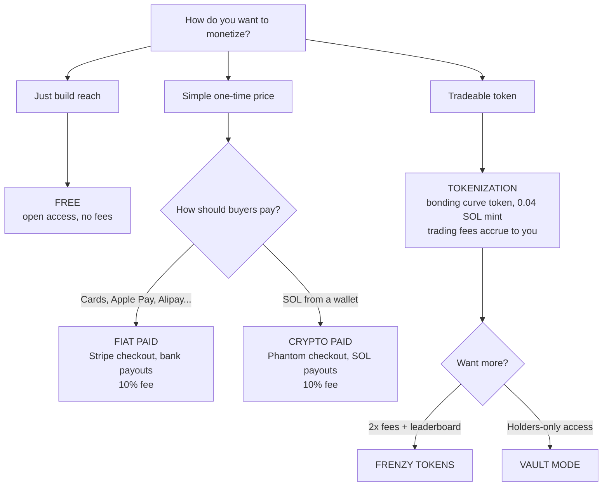

The Swarms Marketplace supports multiple business models for publishing agents and prompts. Every listing picks its model at launch time on [swarms.world/launch](https://swarms.world/launch), from simple one-time purchases in fiat or crypto, to fully tokenized products with tradeable tokens, boosted fees, and holder-gated access.

## Comparison table

| | **Free** | **Crypto Paid** | **Fiat Paid** | **Tokenization** | **Frenzy Tokens** | **Vault Mode** |
| --- | --- | --- | --- | --- | --- | --- |
| **What it is** | Open access for everyone | One-time purchase paid in SOL | One-time purchase paid by card via Stripe | Product gets its own tradeable token on a bonding curve | Tokenization upgrade with 2× trading fees | Token-gated access: holders only |
| **Buyer pays with** | Nothing | SOL (Phantom wallet) | Cards, Apple Pay, Google Pay, Alipay, crypto & more | SOL or USDC (buys the token) | SOL or USDC (buys the token) | Any amount of the product's token |
| **How the creator earns** | None | 90% of each sale in SOL | 90% of each sale, paid out to bank | Bonding curve trading fees on every buy/sell | **Double** bonding curve fees on every trade | Token demand + trading fees |
| **Platform fee** | None | 10% per sale | 10% per sale | Volume-based trading fees | Volume-based trading fees (2×) | Volume-based trading fees |
| **Launch cost** | Free | Free | Free | 0.04 SOL mint fee | 0.04 SOL mint fee | 0.04 SOL mint fee |
| **Creator needs** | Nothing | Solana wallet | Stripe seller account | Solana wallet | Solana wallet | Solana wallet |
| **Buyer needs** | Nothing | Phantom wallet | Nothing, normal checkout | Solana wallet | Solana wallet | Solana wallet holding the token |
| **Access model** | Everyone | Lifetime after purchase | Lifetime after purchase | Open listing, tradeable token | Open listing, tradeable token | Holders only, unlocked while holding |
| **Payouts** | None | Instant SOL to your wallet | Automatic bank payouts via Stripe | Claimable creator fees | Claimable creator fees (2×) | Claimable creator fees |
| **Extra perks** | Reach & reputation | None | 100+ countries, multi-currency | Price discovery, community ownership | Frenzy leaderboard + FRENZY badge | Built-in Buy $TICKER widget, creator bypass |
| **Configured via** | Launch page | Launch page → Paid → Crypto (SOL) | Launch page → Paid → Card / Fiat | Launch page → Tokenization | Tokenization → Frenzy (`fee_selection: "frenzy"`) | Tokenization → Vault Mode |

## Choosing a model

## The models in depth

### Free

Open access for every visitor. No fees for creators or users. The fastest way to build reputation, reviews, and reach on the marketplace, and the required pricing for Vault Mode listings, since the token itself is the gate.

### Crypto Paid (SOL)

A fixed USD price paid in SOL. Buyers connect a Phantom wallet and pay in one transaction; the seller's share (90%) lands directly in their Solana wallet and the platform retains a 10% commission. Requires a Solana wallet address on the listing.

### Fiat Paid (Stripe)

The same fixed-price model, powered by Stripe. Buyers in **100+ countries** check out with cards, **Apple Pay, Google Pay, Alipay, crypto**, and more, in 100+ currencies, with no wallet required. Sellers onboard once via the [Seller tab](https://swarms.world/platform/account?tab=seller) and receive automatic bank payouts of 90% per sale; the platform fee is the same 10% as crypto. See the [Fiat Payments Overview](/docs/marketplace/fiat-payments).

### Tokenization

Instead of a fixed price, the product launches its own token on a bonding curve (SOL- or USDC-denominated) for a one-time 0.04 SOL mint fee. Anyone can trade the token; the creator earns trading fees on every buy and sell, claimable from the [Creator Fees](/docs/marketplace/creator-fees) dashboard. Tokenization can also be **combined with paid pricing**: the product carries a token *and* a USD access price. See [Tokenization](/docs/marketplace/tokenization_details).

### Frenzy Tokens

A tokenization upgrade: the token launches on a 2× fee configuration, doubling the bonding curve fees collected on every trade, and earns a spot on the high-visibility **Frenzy leaderboard** with an animated FRENZY badge. Launch cost is unchanged (0.04 SOL). See [Frenzy Mode](/docs/marketplace/frenzy-mode).

### Vault Mode

Token-gated distribution: the full listing (system prompt, code, metadata) is blurred for anyone who doesn't hold the product's token, with a built-in **Buy $TICKER** widget to unlock it. Any non-zero balance unlocks the page; the creator always has access. Requires tokenization, and pricing stays Free; the token *is* the price. See [Vault Mode](/docs/marketplace/vault-mode).

## Combining models

Some models stack; others are exclusive:

| Combination | Supported? | Notes |
| --- | --- | --- |
| Paid + choice of Crypto or Fiat | ✅ | Every paid listing picks exactly one payment rail |
| Paid + Tokenization | ✅ | USD access price *and* a tradeable token |
| Tokenization + Frenzy | ✅ | Frenzy is a launch-time fee upgrade |
| Tokenization + Vault Mode | ✅ | Vault requires a token to gate with |
| Frenzy + Vault Mode | ✅ | Who can access (Vault) × how much trades earn (Frenzy) |
| Paid + Vault Mode | ❌ | Vault already gates access via holdings; pricing must be Free |
| Fiat + Tokenization | ❌ | Tokenized payouts are on-chain; paid+tokenized uses the crypto rail |

## Next steps

- [Fiat Payments Overview](/docs/marketplace/fiat-payments): the newest way to sell
- [Vendor Tutorial](/docs/marketplace/fiat-payments-vendor-tutorial): set up card payments
- [Tokenization Details](/docs/marketplace/tokenization_details): launch a token
- [Revenue & Fees](/docs/marketplace/revenue-fees): the full fee structure
- [Launch Checklist](/docs/marketplace/launch-checklist): publish with confidence
