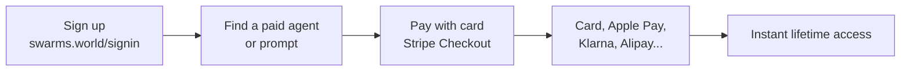

Buying a paid agent or prompt takes under a minute: pick a product, pay through Stripe with whatever method you prefer, and the content unlocks instantly with lifetime access. No wallet, no setup.

<Steps>
  <Step title="Sign up">
    Create your account (or sign in) at [swarms.world/signin](https://swarms.world/signin).
  </Step>
  <Step title="Choose a paid agent or prompt">
    Browse the [marketplace registry](https://swarms.world/platform/registry) and open any paid product; they carry a **Premium** badge and show their price in USD. Card-payable listings are sold by vendors who accept fiat.
  </Step>
  <Step title="Pay with card">
    Click the purchase button and then **Pay with card**. You'll be redirected to Stripe's secure checkout showing the product and price.
  </Step>
  <Step title="Complete checkout with your preferred method">
    Pay with a bank card, Apple Pay, Google Pay, Klarna, Alipay, and many other methods, in 100+ supported currencies, exactly like any online store. Swarms never sees your card details; the payment is handled entirely by Stripe.
  </Step>
  <Step title="Enjoy your purchase">
    As soon as the payment completes you're redirected back to the product with full access unlocked: the complete prompt or agent content, code, and configuration. Access is lifetime, with no recurring fees.
  </Step>
</Steps>

## What you get

<CardGroup cols={2}>
  <Card title="Full content access" icon="unlock">
    The complete prompt text or agent code and configuration, immediately after payment.
  </Card>
  <Card title="Lifetime access" icon="infinity">
    One-time payment, no subscriptions, no recurring fees.
  </Card>
  <Card title="Familiar checkout" icon="credit-card">
    Stripe's secure checkout with the payment methods you already use.
  </Card>
  <Card title="Purchase history" icon="receipt">
    Every purchase is tracked in your account's Purchases tab, labeled "· Card".
  </Card>
</CardGroup>

## Where to find your purchases

Everything you've bought lives in your account:

- **Purchases tab**: [swarms.world/platform/account?tab=purchases](https://swarms.world/platform/account?tab=purchases) shows your recent activity; card purchases display in USD with a `· Card` label.
- **Transaction history**: [swarms.world/platform/account/transactions](https://swarms.world/platform/account/transactions) is the full, filterable, exportable ledger. Click any row to jump back to the product.

## Frequently asked questions

**I paid but the product looks locked.**
Refresh the product page; access is recorded the moment Stripe confirms payment. If it still doesn't unlock, contact [support](https://swarms.world/support) with your purchase time and the product name.

**Can I pay with crypto instead?**
Yes. Listings sold on the crypto rail accept SOL from a Phantom wallet. Each product's purchase dialog shows which method it accepts.

**Do I need a crypto wallet to buy with card?**
No. Card purchases are pure fiat; no wallet is ever involved.

**Are refunds supported?**
Purchases grant instant access to digital content, so refunds are handled case-by-case; reach out to [support](https://swarms.world/support).

## Next steps

- [Fiat Payments Overview](/docs/marketplace/fiat-payments): how the marketplace payments work
- [Vendor Tutorial](/docs/marketplace/fiat-payments-vendor-tutorial): start selling your own agents
- [Share & Discover](/docs/marketplace/share_and_discover): find the best products on the marketplace
