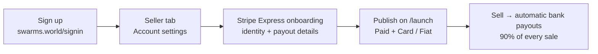

This tutorial takes you from a fresh account to your first fiat-paid listing. Onboarding takes a few minutes; after that, every card sale pays out **90% to your bank account** automatically (Swarms retains a 10% transaction fee, the same as crypto sales).

<Steps>
  <Step title="Sign up">
    Create your account (or sign in) at [swarms.world/signin](https://swarms.world/signin).
  </Step>
  <Step title="Open the Seller tab">
    Go to your account settings and open the **Seller** tab:
    [swarms.world/platform/account?tab=seller](https://swarms.world/platform/account?tab=seller)
  </Step>
  <Step title="Register on Stripe">
    Select your country and click **Set up seller account**. You'll be redirected to Stripe's hosted onboarding to provide:

    - Payout details (your bank account)
    - Business or personal information
    - Any required identity verification

    When Stripe finishes verifying, the Seller tab shows **Your seller account is active**. If you leave onboarding partway, come back and click **Continue onboarding** — your progress is saved.

    <Note>
    The country you select cannot be changed after the account is created. Verification is usually instant, but Stripe may take longer in some regions.
    </Note>
  </Step>
  <Step title="Publish a paid agent or prompt">
    Head to [swarms.world/launch](https://swarms.world/launch) and create your agent or prompt as usual. In the **Pricing** section at the bottom of the page:

    1. Select **Paid**
    2. Under *How do you want to get paid?*, choose **Card / Fiat (Stripe)**
    3. Set your price in USD
    4. Publish

    The form confirms your Stripe seller account is connected — no crypto wallet is needed for fiat listings. If your account isn't onboarded yet, the form links you back to the Seller tab.
  </Step>
  <Step title="Get paid">
    That's it. Buyers pay by card, Apple Pay, Google Pay, and more; Stripe transfers your 90% share automatically and pays out to your bank on Stripe's standard payout schedule.
  </Step>
</Steps>

## Tracking your sales

- **Seller tab** — [swarms.world/platform/account?tab=seller](https://swarms.world/platform/account?tab=seller) lists every card sale with the sale amount, platform fee, and your earnings.
- **Stripe Express dashboard** — click **Open Stripe dashboard** on the Seller tab to see payouts, balances, and transaction details on Stripe's side.
- **Purchases tab** — your sales also appear in the account transaction history, labeled `· Card`.

## Fees at a glance

| Sale price | Platform fee (10%) | You receive |
| --- | --- | --- |
| $5.00 | $0.50 | $4.50 |
| $20.00 | $2.00 | $18.00 |
| $100.00 | $10.00 | $90.00 |

## Troubleshooting

**The Card / Fiat option says a seller account is required.**
Your Stripe onboarding isn't complete. Open the Seller tab, click **Continue onboarding**, and finish the remaining steps — then click *"I've finished — re-check"* on the launch page.

**Can I switch an existing crypto listing to fiat?**
Publish-time rail selection applies to new listings. For existing listings, edit the listing or contact support.

**Where's my crypto wallet input?**
Fiat listings don't use one — payouts go through Stripe to your bank. The wallet input only appears for Crypto (SOL) listings and tokenized launches.

## Next steps

- [Fiat Payments Overview](/docs/marketplace/fiat-payments) — how the money flows
- [Buyer Tutorial](/docs/marketplace/fiat-payments-buyer-tutorial) — what your customers experience
- [Launch Checklist](/docs/marketplace/launch-checklist) — polish your listing before publishing
