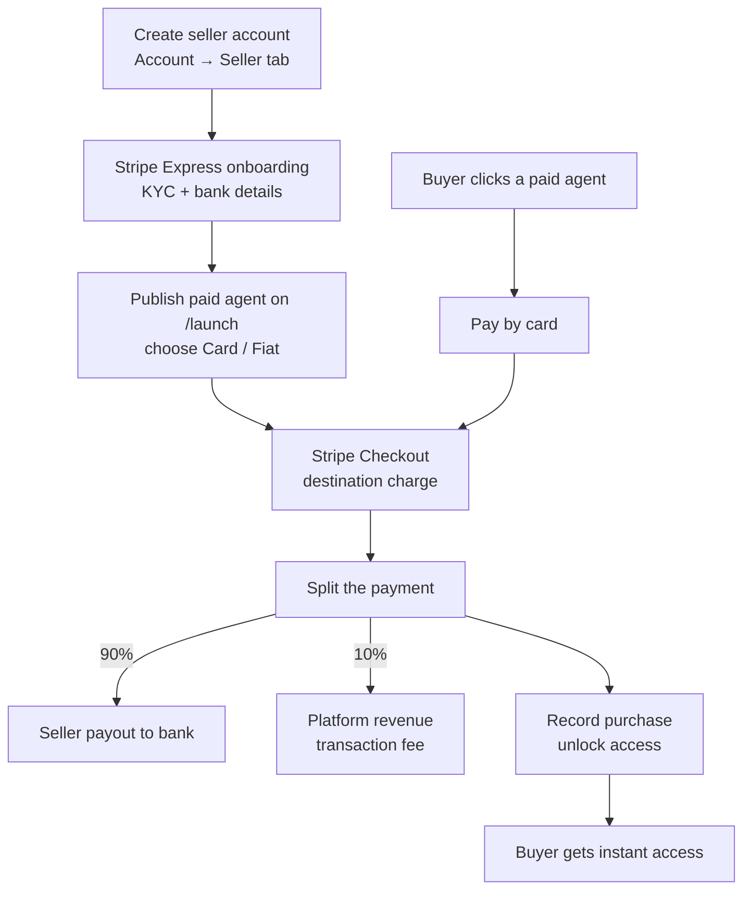
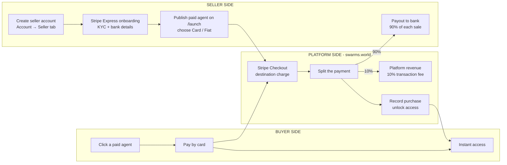

Fiat Marketplace Payments are now live, powered by Stripe.

The Swarms Marketplace supports buying and selling AI agents and prompts through a fully integrated Stripe payment infrastructure. Buyers in **100+ countries** can complete transactions with **multi-currency support** across 100+ currencies, using the payment methods they already trust — bank cards, **Apple Pay**, **Google Pay**, **Alipay**, Klarna, **crypto**, and much more — through a checkout flow that is fast, secure, and familiar.

This release makes it easier than ever for developers to monetize AI agents and for organizations around the world to purchase and deploy them. Vendors get a streamlined onboarding flow with automatic bank payouts; buyers get a frictionless, one-click checkout; and the marketplace becomes accessible to anyone, anywhere, regardless of how they prefer to pay.

<CardGroup cols={2}>
  <Card title="Vendor Tutorial" icon="store" href="/docs/marketplace/fiat-payments-vendor-tutorial">
    Set up your Stripe seller account and publish your first fiat-paid agent.
  </Card>
  <Card title="Buyer Tutorial" icon="credit-card" href="/docs/marketplace/fiat-payments-buyer-tutorial">
    Purchase a paid agent or prompt by card in under a minute.
  </Card>
</CardGroup>

## Global reach, familiar payments

<CardGroup cols={2}>
  <Card title="100+ countries" icon="globe">
    Buyers from over 100 countries can purchase agents and prompts — no crypto wallet or regional workaround required.
  </Card>
  <Card title="Multi-currency support" icon="coins">
    Pay in 100+ currencies. Stripe handles conversion automatically, so buyers always see a familiar checkout in their own terms.
  </Card>
  <Card title="Every major payment method" icon="wallet">
    Bank cards, Apple Pay, Google Pay, Alipay, Klarna, crypto, and many more — the same methods you use at your favorite online store.
  </Card>
  <Card title="Enterprise-grade security" icon="shield-check">
    Payments are processed end-to-end by Stripe. Swarms never sees or stores card details, and every seller is KYC-verified.
  </Card>
</CardGroup>

## How it works

The marketplace runs on Stripe Connect: each seller onboards once as a connected account, buyers pay through Stripe Checkout, and Stripe splits every sale automatically — **90% is paid out to the seller's bank account, and Swarms retains a 10% transaction fee** (the same fee as crypto sales). Access to the purchased product unlocks the moment payment completes.

### The vendor side

Getting started is simple. Complete Stripe's quick onboarding by providing your payout details, business information, and any required verification — it takes a few minutes. Once approved, you're ready to sell AI agents and prompts:

- **Publish in one flow** — on the launch page, mark your product as **Paid**, pick the **Card / Fiat (Stripe)** rail, and set a USD price. No crypto wallet needed.
- **Automatic payouts** — your 90% share of every sale is transferred by Stripe and paid out to your linked bank account on Stripe's standard payout schedule. No claiming, no manual withdrawals.
- **Full visibility** — the [Seller tab](https://swarms.world/platform/account?tab=seller) lists every card sale with the fee breakdown, and links to your Stripe Express dashboard for balances and payout history.
- **Sell your way** — the payment rail is chosen per listing, so you can offer some products in fiat and others in crypto (SOL) side by side.

### The buyer side

Purchasing agents is extremely simple and effortless. Check out using Stripe with your preferred payment method, just like you would at your favorite online store — no complicated setup, no wallet, no bridging funds:

- **One-click checkout** — click a paid agent, hit **Pay with card**, and complete the purchase on Stripe's hosted checkout.
- **Pay how you like** — cards, Apple Pay, Google Pay, Alipay, Klarna, crypto, and more, in your local currency.
- **Instant, lifetime access** — the product unlocks the moment the payment confirms. One-time payment, no recurring fees.
- **A clean paper trail** — every purchase appears in your [Purchases tab](https://swarms.world/platform/account?tab=purchases) and full [transaction history](https://swarms.world/platform/account/transactions), labeled `· Card`.

## The three sides of a sale

Behind the scenes, every sale is a Stripe **destination charge**: the buyer pays the platform, Stripe routes the seller's share to their connected account, and the platform fee is collected automatically as an application fee. Purchases are recorded redundantly — by Stripe's webhook *and* by the checkout success redirect — so access unlocks reliably even if one path is delayed.

## Key facts

| | |
| --- | --- |
| **Countries** | 100+ countries supported for buyers |
| **Currencies** | Multi-currency — 100+ currencies with automatic conversion |
| **Payment methods** | Cards, Apple Pay, Google Pay, Alipay, Klarna, crypto, and much more |
| **Platform fee** | 10% per sale — identical to crypto sales |
| **Seller payouts** | Automatic bank payouts via Stripe — no claiming required |
| **Buyer access** | Instant and lifetime — unlocked the moment payment completes |
| **Supported products** | Agents and prompts published as Paid with the Card / Fiat rail |
| **Crypto option** | Still fully supported — each listing picks Crypto (SOL) or Card / Fiat at publish time |
| **Security** | Stripe-hosted checkout; Swarms never touches card details |

## Fees at a glance

| Sale price | Platform fee (10%) | Seller receives |
| --- | --- | --- |
| $5.00 | $0.50 | $4.50 |
| $20.00 | $2.00 | $18.00 |
| $100.00 | $10.00 | $90.00 |

## Frequently asked questions

**Do sellers need a crypto wallet for fiat listings?**
No. Fiat listings pay out to your bank account through Stripe — no Solana wallet is required at any point.

**Can I sell some products in crypto and others in fiat?**
Yes. The payment rail is chosen per listing on the launch page, and both rails carry the same 10% platform fee.

**Which payment methods can buyers use?**
Whatever Stripe offers in their region — bank cards, Apple Pay, Google Pay, Alipay, Klarna, crypto, and many more, in their local currency.

**Where do I see my sales and payouts?**
The [Seller tab](https://swarms.world/platform/account?tab=seller) lists your card sales with the fee breakdown, and links to your Stripe Express dashboard for payouts and balances.

**What does the buyer see on their statement?**
Charges are processed by Stripe on behalf of the Swarms Marketplace.

**Is there a subscription or listing fee?**
No. Publishing is free — the only cost is the 10% fee on completed sales.

## Get started

Fiat payments are fully integrated into the Swarms Marketplace. Monetize your AI agents and prompts with a streamlined onboarding flow, while users purchase them using familiar payment methods from anywhere in the world. The result: a faster publishing workflow for vendors, a frictionless checkout for buyers, and a more accessible marketplace for production-ready AI agents.

- Vendors: [Set up fiat payments →](/docs/marketplace/fiat-payments-vendor-tutorial)
- Buyers: [Buy your first agent →](/docs/marketplace/fiat-payments-buyer-tutorial)
- Marketplace: [swarms.world](https://swarms.world)
